# TicketBox — Database Design

## 0. Mục tiêu tài liệu

Tài liệu này mô tả thiết kế cơ sở dữ liệu PostgreSQL của TicketBox theo trình tự triển khai, gồm:

- nhóm bảng theo domain;
- ý nghĩa từng bảng;
- toàn bộ trường dữ liệu đã thiết kế;
- quan hệ giữa các bảng;
- ràng buộc nghiệp vụ quan trọng;
- gate-zone validation cho check-in online/offline;
- vai trò của Redis, SQLite mobile, object storage và message broker.

Phạm vi tài liệu: thiết kế dữ liệu. Tài liệu không thay thế `schema.sql`, nhưng phải đồng bộ với schema khi triển khai migration.

## 1. Nguyên tắc thiết kế

1. **PostgreSQL là source of truth** cho user, role, concert, order, payment, ticket, check-in result, guest list, AI job, notification log và audit log.
2. **Redis không thay PostgreSQL**. Redis chỉ dùng cho cache, rate limit, idempotency key ngắn hạn, inventory read model TTL ngắn.
3. **SQLite chỉ nằm trên mobile app**. Khi check-in offline, mobile ghi SQLite local; khi có mạng, mobile gọi Sync API; backend validate rồi ghi PostgreSQL.
4. **Object Storage lưu file lớn** như PDF/Press Kit, ảnh concert, CSV, SVG. PostgreSQL chỉ lưu URL/metadata.
5. **Check-in là một chiều**:
   - Vé thường: `tickets.status: ISSUED -> CHECKED_IN`.
   - Guest: `guest_list.status: INVITED -> CHECKED_IN`.
   - `checkin_logs` chỉ là audit mọi lần scan, không phải source of truth cuối cùng.
6. **Gate-zone validation là bắt buộc**. Vé/guest thuộc khu nào thì chỉ được vào cổng được mapping với khu đó.
7. **Order/payment/ticket phải idempotent**. Retry hoặc webhook lặp không được tạo thêm order/payment/ticket trùng.
8. **Không dùng text tự do cho trạng thái**. Các trạng thái nghiệp vụ được quản lý bằng enum hoặc check constraint.

## 2. Lựa chọn database

Database chính: **PostgreSQL**.

Lý do:

- dữ liệu có quan hệ chặt: user, concert, zone, ticket type, order, payment, ticket, check-in;
- cần ACID transaction cho luồng giữ vé và thanh toán;
- cần row-level locking để chống oversell;
- cần unique constraint để chống QR trùng, webhook trùng, idempotency key trùng, guest trùng;
- cần foreign key để giữ toàn vẹn dữ liệu;
- phù hợp cho audit, payment, ticket, check-in và import CSV.

Thành phần hỗ trợ:

| Thành phần | Vai trò | Không dùng để |
|---|---|---|
| Redis | Cache catalog/inventory, rate limit, idempotency key ngắn hạn | Không làm source of truth cho order/payment/ticket |
| SQLite mobile | Lưu local valid tickets/guests và scan offline | Không ghi trực tiếp vào PostgreSQL |
| Object Storage | Lưu PDF, CSV, ảnh, SVG | Không lưu binary lớn trong PostgreSQL |
| Message Broker | Worker notification, AI bio, CSV import | Không quyết định trạng thái tài chính cuối cùng |

## 3. Danh mục enum / trạng thái


| Enum | Giá trị | Mục đích |
| --- | --- | --- |
| user_status | ACTIVE, LOCKED, DISABLED | Trạng thái tài khoản. |
| concert_status | DRAFT, PUBLISHED, CANCELLED, COMPLETED | Trạng thái concert. |
| ticket_type_status | DRAFT, ON_SALE, SOLD_OUT, CLOSED | Trạng thái loại vé. |
| order_status | PENDING, HELD, PAID, CANCELLED, EXPIRED, FAILED, REFUNDED | Vòng đời order. |
| payment_provider | VNPAY, MOMO | Cổng thanh toán. |
| payment_status | PENDING, SUCCEEDED, FAILED, CANCELLED, REFUNDED | Trạng thái payment. |
| ticket_status | ISSUED, CHECKED_IN, CANCELLED, REFUNDED | Trạng thái vé. |
| checkin_result | SUCCESS, ALREADY_CHECKED_IN, INVALID_TICKET, INVALID_GUEST, WRONG_CONCERT, WRONG_GATE, CONFLICT, ERROR | Kết quả scan online/offline. |
| offline_batch_status | PENDING, SYNCING, DONE, FAILED | Trạng thái batch sync. |
| offline_item_status | PENDING, ACCEPTED, CONFLICT, INVALID, WRONG_GATE, ERROR | Kết quả xử lý item offline. |
| notification_channel | APP, EMAIL, SMS, ZALO_OA | Kênh thông báo. |
| notification_status | PENDING, SENT, FAILED, RETRYING | Trạng thái gửi thông báo. |
| job_status | PENDING, PROCESSING, DONE, FAILED | Trạng thái AI job. |
| import_status | PENDING, PROCESSING, DONE, FAILED, PARTIAL | Trạng thái import CSV. |
| guest_status | INVITED, CHECKED_IN, CANCELLED | Trạng thái guest. |
| idempotency_status | PROCESSING, SUCCEEDED, FAILED | Trạng thái idempotency key. |
| device_status | ACTIVE, REVOKED, LOST | Trạng thái thiết bị soát vé. |
| inventory_event_type | HOLD, RELEASE, PAYMENT_CONFIRMED, REFUND, ADMIN_ADJUST | Loại event thay đổi tồn kho. |

## 4. Nhóm bảng theo domain

### 4.1. Người dùng và phân quyền

Quản lý tài khoản, vai trò và RBAC.

Bảng: `users`, `roles`, `user_roles`

### 4.2. Concert, địa điểm và khu vực

Quản lý concert, venue, seat zone và thông tin hiển thị catalog.

Bảng: `venues`, `concerts`, `seat_zones`

### 4.3. Cổng soát vé và gate-zone validation

Quản lý cổng vào và mapping cổng-khu để không cho vé sai khu vào nhầm cổng.

Bảng: `checkin_gates`, `checkin_gate_zones`

### 4.4. Ticketing và tồn kho

Quản lý loại vé, tồn kho, giới hạn per-user và lịch sử thay đổi tồn kho.

Bảng: `ticket_types`, `user_ticket_type_counters`, `ticket_inventory_events`

### 4.5. Order, payment và idempotency

Quản lý đơn hàng, dòng đơn hàng, thanh toán, webhook và request lặp.

Bảng: `orders`, `order_items`, `payments`, `payment_webhook_events`, `idempotency_keys`

### 4.6. Vé điện tử và check-in

Quản lý QR ticket, thiết bị check-in, log quét, offline batch và item sync.

Bảng: `tickets`, `checkin_devices`, `checkin_logs`, `offline_checkin_batches`, `offline_checkin_items`

### 4.7. Thông báo

Quản lý template, log gửi và dead letter queue.

Bảng: `notification_templates`, `notification_logs`, `notification_dead_letters`

### 4.8. AI Artist Bio

Quản lý job xử lý PDF/Press Kit và kết quả bio.

Bảng: `artist_bio_jobs`, `artist_bios`

### 4.9. Guest List VIP và CSV

Quản lý import CSV và danh sách khách mời VIP.

Bảng: `guest_import_jobs`, `guest_list`, `guest_import_errors`

### 4.10. Audit và truy vết

Ghi nhận thao tác quan trọng phục vụ bảo mật/debug.

Bảng: `audit_logs`

## 5. Sơ đồ phụ thuộc triển khai

Thứ tự đọc và triển khai nên đi từ bảng nền tảng đến bảng nghiệp vụ:

```text
users, roles, user_roles
→ venues, concerts, seat_zones
→ checkin_gates, checkin_gate_zones
→ ticket_types, user_ticket_type_counters, ticket_inventory_events
→ orders, order_items, payments, payment_webhook_events, idempotency_keys
→ tickets
→ checkin_devices, checkin_logs, offline_checkin_batches, offline_checkin_items
→ notification_templates, notification_logs, notification_dead_letters
→ artist_bio_jobs, artist_bios
→ guest_import_jobs, guest_list, guest_import_errors
→ audit_logs
```

## 6. Mô tả chi tiết từng bảng


### 6.1. `users`


**Nhóm:** Người dùng và phân quyền


**Mục đích:** Lưu tài khoản người dùng của hệ thống: khán giả, ban tổ chức, nhân sự soát vé, admin.


| Trường | Kiểu dữ liệu | Ràng buộc | Ý nghĩa / mục đích sử dụng |
| --- | --- | --- | --- |
| id | UUID | PK, DEFAULT gen_random_uuid() | Định danh duy nhất của user; dùng làm khóa liên kết sang orders, tickets, roles, audit/check-in. |
| email | VARCHAR(255) | NOT NULL, UNIQUE, CHECK chứa @ | Email đăng nhập và nhận thông báo; chống trùng tài khoản. |
| password_hash | TEXT | NOT NULL | Mật khẩu đã băm; không lưu mật khẩu thô. |
| full_name | VARCHAR(255) | NOT NULL | Họ tên hiển thị trên tài khoản, vé, admin/check-in. |
| phone | VARCHAR(20) | UNIQUE, CHECK định dạng hoặc NULL | Số điện thoại liên hệ; hỗ trợ tra cứu/đối soát khi cần. |
| status | user_status | NOT NULL, DEFAULT ACTIVE | Trạng thái tài khoản: ACTIVE/LOCKED/DISABLED. |
| created_at | TIMESTAMPTZ | NOT NULL, DEFAULT now() | Thời điểm tạo tài khoản. |
| updated_at | TIMESTAMPTZ | NOT NULL, DEFAULT now(), trigger update | Thời điểm cập nhật gần nhất. |


**Quan hệ chính:**

- 1-n `orders` qua `orders.user_id`.

- n-n `roles` qua `user_roles`.

- 1-n `tickets` qua `tickets.user_id`.

- 1-n `checkin_logs` qua `staff_id` nếu user là nhân sự soát vé.

- 1-n `audit_logs` qua `actor_user_id`.


### 6.2. `roles`


**Nhóm:** Người dùng và phân quyền


**Mục đích:** Lưu danh mục role cho RBAC. Logic phân quyền dùng `code`, không dùng mô tả tự do.


| Trường | Kiểu dữ liệu | Ràng buộc | Ý nghĩa / mục đích sử dụng |
| --- | --- | --- | --- |
| id | UUID | PK, DEFAULT gen_random_uuid() | Định danh role. |
| code | VARCHAR(50) | NOT NULL, UNIQUE, CHECK IN CUSTOMER/ORGANIZER/CHECKIN_STAFF/ADMIN | Mã role dùng trong backend/API Gateway để kiểm tra quyền. |
| name | VARCHAR(100) | NOT NULL | Tên hiển thị của role trên admin. |
| created_at | TIMESTAMPTZ | NOT NULL, DEFAULT now() | Thời điểm tạo role. |


**Quan hệ chính:**

- n-n `users` qua `user_roles`.

- `GUEST` không lưu trong DB; đó là trạng thái chưa đăng nhập.


### 6.3. `user_roles`


**Nhóm:** Người dùng và phân quyền


**Mục đích:** Bảng nối user-role, cho phép một user có nhiều vai trò nếu cần.


| Trường | Kiểu dữ liệu | Ràng buộc | Ý nghĩa / mục đích sử dụng |
| --- | --- | --- | --- |
| user_id | UUID | PK, FK users(id), ON DELETE CASCADE | User được gán role. |
| role_id | UUID | PK, FK roles(id), ON DELETE CASCADE | Role được gán. |
| assigned_at | TIMESTAMPTZ | NOT NULL, DEFAULT now() | Thời điểm gán quyền. |


**Quan hệ chính:**

- Nối `users` n-n `roles`.

- Xóa user hoặc role thì xóa bản ghi nối tương ứng.


### 6.4. `venues`


**Nhóm:** Concert, địa điểm và khu vực


**Mục đích:** Lưu địa điểm tổ chức concert.


| Trường | Kiểu dữ liệu | Ràng buộc | Ý nghĩa / mục đích sử dụng |
| --- | --- | --- | --- |
| id | UUID | PK, DEFAULT gen_random_uuid() | Định danh venue. |
| name | VARCHAR(255) | NOT NULL | Tên địa điểm. |
| address | TEXT | NOT NULL | Địa chỉ cụ thể. |
| city | VARCHAR(100) | NOT NULL | Thành phố/tỉnh. |
| capacity | INTEGER | NOT NULL, CHECK > 0 | Sức chứa tối đa; dùng kiểm tra hợp lý tổng số vé/khu. |
| map_url | TEXT | NULL | Link bản đồ hoặc sơ đồ địa điểm. |
| created_at | TIMESTAMPTZ | NOT NULL, DEFAULT now() | Thời điểm tạo. |
| updated_at | TIMESTAMPTZ | NOT NULL, DEFAULT now(), trigger update | Thời điểm cập nhật. |


**Quan hệ chính:**

- 1-n `concerts` qua `concerts.venue_id`.

- `ON DELETE RESTRICT` từ concerts để không xóa venue khi còn concert tham chiếu.


### 6.5. `concerts`


**Nhóm:** Concert, địa điểm và khu vực


**Mục đích:** Lưu thông tin chính của concert/sự kiện.


| Trường | Kiểu dữ liệu | Ràng buộc | Ý nghĩa / mục đích sử dụng |
| --- | --- | --- | --- |
| id | UUID | PK, DEFAULT gen_random_uuid() | Định danh concert. |
| venue_id | UUID | NOT NULL, FK venues(id), ON DELETE RESTRICT | Địa điểm tổ chức. |
| organizer_id | UUID | FK users(id), ON DELETE SET NULL | Ban tổ chức phụ trách; có thể null nếu user bị xóa. |
| title | VARCHAR(255) | NOT NULL | Tên concert hiển thị. |
| slug | VARCHAR(255) | NOT NULL, UNIQUE | Định danh URL thân thiện. |
| description | TEXT | NULL | Mô tả concert. |
| artist_name | VARCHAR(255) | NULL | Tên nghệ sĩ/lineup chính. |
| starts_at | TIMESTAMPTZ | NOT NULL | Thời điểm bắt đầu. |
| ends_at | TIMESTAMPTZ | NOT NULL, CHECK ends_at > starts_at | Thời điểm kết thúc. |
| status | concert_status | NOT NULL, DEFAULT DRAFT | DRAFT/PUBLISHED/CANCELLED/COMPLETED. |
| cover_image_url | TEXT | NULL | Ảnh bìa lưu ở object storage/CDN. |
| created_at | TIMESTAMPTZ | NOT NULL, DEFAULT now() | Thời điểm tạo. |
| updated_at | TIMESTAMPTZ | NOT NULL, DEFAULT now(), trigger update | Thời điểm cập nhật. |


**Quan hệ chính:**

- n-1 `venues`, n-1 `users` qua `organizer_id`.

- 1-n `seat_zones`, `checkin_gates`, `ticket_types`, `orders`, `tickets`, `checkin_logs`, `guest_list`, `artist_bio_jobs`, `guest_import_jobs`.

- Concert không nên bị xóa vật lý khi đã có giao dịch; dùng `status = CANCELLED`.


### 6.6. `seat_zones`


**Nhóm:** Concert, địa điểm và khu vực


**Mục đích:** Lưu khu vực chỗ ngồi/khu đứng trong một concert: GA, SVIP, VIP, CAT1, CAT2.


| Trường | Kiểu dữ liệu | Ràng buộc | Ý nghĩa / mục đích sử dụng |
| --- | --- | --- | --- |
| id | UUID | PK, DEFAULT gen_random_uuid() | Định danh zone. |
| concert_id | UUID | NOT NULL, FK concerts(id), ON DELETE CASCADE | Concert sở hữu zone. |
| code | VARCHAR(50) | NOT NULL, UNIQUE theo (concert_id, code) | Mã zone: GA/SVIP/VIP/CAT1/CAT2. |
| name | VARCHAR(100) | NOT NULL | Tên hiển thị của zone. |
| description | TEXT | NULL | Mô tả khu vực. |
| capacity | INTEGER | NOT NULL, CHECK > 0 | Sức chứa của zone. |
| svg_path | TEXT | NULL | Đường path SVG hoặc metadata vị trí trên sơ đồ. |
| sort_order | INTEGER | NOT NULL, DEFAULT 0 | Thứ tự hiển thị. |
| created_at | TIMESTAMPTZ | NOT NULL, DEFAULT now() | Thời điểm tạo. |
| updated_at | TIMESTAMPTZ | NOT NULL, DEFAULT now(), trigger update | Thời điểm cập nhật. |


**Quan hệ chính:**

- 1-n `ticket_types` qua `ticket_types.seat_zone_id`.

- n-n `checkin_gates` qua `checkin_gate_zones` để xác định cổng nào được phép cho zone nào.

- 1-n `tickets` và `guest_list` để xác định vé/guest thuộc khu nào.


### 6.7. `checkin_gates`


**Nhóm:** Cổng soát vé và gate-zone validation


**Mục đích:** Lưu cổng soát vé của một concert. Mỗi cổng có thể cho phép một hoặc nhiều khu vực.


| Trường | Kiểu dữ liệu | Ràng buộc | Ý nghĩa / mục đích sử dụng |
| --- | --- | --- | --- |
| id | UUID | PK, DEFAULT gen_random_uuid() | Định danh cổng. |
| concert_id | UUID | NOT NULL, FK concerts(id), ON DELETE CASCADE | Concert mà cổng thuộc về. |
| code | VARCHAR(50) | NOT NULL, UNIQUE theo (concert_id, code) | Mã cổng: GA_GATE, SVIP_GATE, VIP_GATE, CAT1_GATE, CAT2_GATE. |
| name | VARCHAR(255) | NOT NULL | Tên hiển thị của cổng. |
| is_active | BOOLEAN | NOT NULL, DEFAULT TRUE | Bật/tắt cổng mà không xóa dữ liệu. |
| created_at | TIMESTAMPTZ | NOT NULL, DEFAULT now() | Thời điểm tạo. |
| updated_at | TIMESTAMPTZ | NOT NULL, DEFAULT now(), trigger update | Thời điểm cập nhật. |


**Quan hệ chính:**

- n-1 `concerts`.

- n-n `seat_zones` qua `checkin_gate_zones`.

- 1-n `checkin_devices`, `checkin_logs`, `offline_checkin_batches`, `offline_checkin_items`.

- Cổng chỉ hợp lệ khi `is_active = TRUE`.


### 6.8. `checkin_gate_zones`


**Nhóm:** Cổng soát vé và gate-zone validation


**Mục đích:** Bảng mapping cổng soát vé với các khu vực được phép vào ở cổng đó.


| Trường | Kiểu dữ liệu | Ràng buộc | Ý nghĩa / mục đích sử dụng |
| --- | --- | --- | --- |
| gate_id | UUID | PK, FK checkin_gates(id), ON DELETE CASCADE | Cổng soát vé. |
| seat_zone_id | UUID | PK, FK seat_zones(id), ON DELETE CASCADE | Khu vực được cổng này cho phép. |
| created_at | TIMESTAMPTZ | NOT NULL, DEFAULT now() | Thời điểm tạo mapping. |


**Quan hệ chính:**

- Nối `checkin_gates` n-n `seat_zones`.

- Khi check-in, `ticket.seat_zone_id` hoặc `guest_list.seat_zone_id` phải tồn tại trong mapping của `gate_id` hiện tại.

- Nếu không khớp thì kết quả scan là `WRONG_GATE`.


### 6.9. `ticket_types`


**Nhóm:** Ticketing và tồn kho


**Mục đích:** Cấu hình loại vé bán cho từng khu vực trong concert.


| Trường | Kiểu dữ liệu | Ràng buộc | Ý nghĩa / mục đích sử dụng |
| --- | --- | --- | --- |
| id | UUID | PK, DEFAULT gen_random_uuid() | Định danh loại vé. |
| concert_id | UUID | NOT NULL, FK concerts(id), ON DELETE CASCADE | Concert bán loại vé này. |
| seat_zone_id | UUID | NOT NULL, FK seat_zones(id), ON DELETE RESTRICT | Khu vực mà loại vé cho phép vào. |
| name | VARCHAR(100) | NOT NULL, UNIQUE theo (concert_id, name) | Tên loại vé: SVIP Early Bird, CAT1, GA... |
| description | TEXT | NULL | Mô tả quyền lợi vé. |
| price | NUMERIC(12,2) | NOT NULL, CHECK >= 0 | Giá vé. |
| currency | CHAR(3) | NOT NULL, DEFAULT VND | Đơn vị tiền tệ. |
| total_quantity | INTEGER | NOT NULL, CHECK >= 0 | Tổng số vé mở bán. |
| available_quantity | INTEGER | NOT NULL, CHECK >= 0 | Số lượng còn có thể giữ/bán. |
| held_quantity | INTEGER | NOT NULL, DEFAULT 0, CHECK >= 0 | Số lượng đang giữ trong order chưa thanh toán. |
| sold_quantity | INTEGER | NOT NULL, DEFAULT 0, CHECK >= 0 | Số lượng đã bán/paid. |
| max_per_user | INTEGER | NOT NULL, CHECK > 0 | Giới hạn vé tối đa mỗi tài khoản cho loại vé này. |
| sale_start_at | TIMESTAMPTZ | NOT NULL | Thời điểm mở bán. |
| sale_end_at | TIMESTAMPTZ | NOT NULL, CHECK > sale_start_at | Thời điểm kết thúc bán. |
| status | ticket_type_status | NOT NULL, DEFAULT DRAFT | DRAFT/ON_SALE/SOLD_OUT/CLOSED. |
| created_at | TIMESTAMPTZ | NOT NULL, DEFAULT now() | Thời điểm tạo. |
| updated_at | TIMESTAMPTZ | NOT NULL, DEFAULT now(), trigger update | Thời điểm cập nhật. |


**Quan hệ chính:**

- n-1 `concerts`, n-1 `seat_zones`.

- 1-n `order_items`, `tickets`, `user_ticket_type_counters`, `ticket_inventory_events`.

- Ràng buộc tổng: `total_quantity = available_quantity + held_quantity + sold_quantity`.

- Backend lock dòng `ticket_types` bằng transaction khi giữ/trừ vé.


### 6.10. `user_ticket_type_counters`


**Nhóm:** Ticketing và tồn kho


**Mục đích:** Counter theo user và ticket type để enforce `max_per_user` dưới tải cao.


| Trường | Kiểu dữ liệu | Ràng buộc | Ý nghĩa / mục đích sử dụng |
| --- | --- | --- | --- |
| user_id | UUID | PK, FK users(id), ON DELETE CASCADE | User được kiểm soát giới hạn. |
| ticket_type_id | UUID | PK, FK ticket_types(id), ON DELETE CASCADE | Loại vé được kiểm soát. |
| held_quantity | INTEGER | NOT NULL, DEFAULT 0, CHECK >= 0 | Số vé user đang giữ cho loại vé này. |
| paid_quantity | INTEGER | NOT NULL, DEFAULT 0, CHECK >= 0 | Số vé user đã mua thành công cho loại vé này. |
| updated_at | TIMESTAMPTZ | NOT NULL, DEFAULT now() | Thời điểm cập nhật counter. |


**Quan hệ chính:**

- Nối `users` với `ticket_types` theo khóa chính `(user_id, ticket_type_id)`.

- Transaction đặt vé lock dòng counter này cùng với `ticket_types`.

- Điều kiện nghiệp vụ: `held_quantity + paid_quantity + requested_quantity <= ticket_types.max_per_user`.


### 6.11. `orders`


**Nhóm:** Order, payment và idempotency


**Mục đích:** Lưu đơn đặt vé ở cấp header.


| Trường | Kiểu dữ liệu | Ràng buộc | Ý nghĩa / mục đích sử dụng |
| --- | --- | --- | --- |
| id | UUID | PK, DEFAULT gen_random_uuid() | Định danh order. |
| user_id | UUID | NOT NULL, FK users(id), ON DELETE RESTRICT | Người đặt vé. |
| concert_id | UUID | NOT NULL, FK concerts(id), ON DELETE RESTRICT | Concert của order. |
| status | order_status | NOT NULL, DEFAULT PENDING | PENDING/HELD/PAID/CANCELLED/EXPIRED/FAILED/REFUNDED. |
| total_amount | NUMERIC(12,2) | NOT NULL, DEFAULT 0, CHECK >= 0 | Tổng tiền order. |
| currency | CHAR(3) | NOT NULL, DEFAULT VND | Đơn vị tiền tệ. |
| hold_expires_at | TIMESTAMPTZ | NULL, bắt buộc khi status = HELD | Thời điểm hết hạn giữ vé. |
| cancelled_reason | TEXT | NULL | Lý do hủy/thất bại/hết hạn nếu có. |
| created_at | TIMESTAMPTZ | NOT NULL, DEFAULT now() | Thời điểm tạo order. |
| updated_at | TIMESTAMPTZ | NOT NULL, DEFAULT now(), trigger update | Thời điểm cập nhật. |


**Quan hệ chính:**

- n-1 `users`, n-1 `concerts`.

- 1-n `order_items`, `payments`, `tickets`, `idempotency_keys`, `ticket_inventory_events`.

- State machine hợp lệ: `PENDING -> HELD -> PAID`, `HELD -> EXPIRED/CANCELLED`, `PAID -> REFUNDED`, `PENDING/HELD -> FAILED`.


### 6.12. `order_items`


**Nhóm:** Order, payment và idempotency


**Mục đích:** Lưu từng dòng vé trong một order.


| Trường | Kiểu dữ liệu | Ràng buộc | Ý nghĩa / mục đích sử dụng |
| --- | --- | --- | --- |
| id | UUID | PK, DEFAULT gen_random_uuid() | Định danh dòng order. |
| order_id | UUID | NOT NULL, FK orders(id), ON DELETE CASCADE | Order cha. |
| ticket_type_id | UUID | NOT NULL, FK ticket_types(id), ON DELETE RESTRICT | Loại vé được chọn. |
| quantity | INTEGER | NOT NULL, CHECK > 0 | Số lượng vé đặt cho loại này. |
| unit_price | NUMERIC(12,2) | NOT NULL, CHECK >= 0 | Đơn giá tại thời điểm mua. |
| line_total | NUMERIC(12,2) | GENERATED ALWAYS AS (quantity * unit_price) STORED | Thành tiền của dòng order. |
| created_at | TIMESTAMPTZ | NOT NULL, DEFAULT now() | Thời điểm tạo dòng. |


**Quan hệ chính:**

- n-1 `orders`, n-1 `ticket_types`.

- 1-n `tickets` khi payment thành công và phát hành vé cụ thể.


### 6.13. `ticket_inventory_events`


**Nhóm:** Ticketing và tồn kho


**Mục đích:** Audit mọi biến động tồn kho để truy vết oversell/hold/release/refund/admin adjust.


| Trường | Kiểu dữ liệu | Ràng buộc | Ý nghĩa / mục đích sử dụng |
| --- | --- | --- | --- |
| id | UUID | PK, DEFAULT gen_random_uuid() | Định danh event. |
| ticket_type_id | UUID | NOT NULL, FK ticket_types(id), ON DELETE CASCADE | Loại vé bị tác động. |
| order_id | UUID | FK orders(id), ON DELETE SET NULL | Order liên quan nếu có. |
| event_type | inventory_event_type | NOT NULL | HOLD/RELEASE/PAYMENT_CONFIRMED/REFUND/ADMIN_ADJUST. |
| quantity | INTEGER | NOT NULL, CHECK > 0 | Số lượng thay đổi. |
| before_available | INTEGER | NULL, CHECK >= 0 nếu có | Available trước thay đổi. |
| after_available | INTEGER | NULL, CHECK >= 0 nếu có | Available sau thay đổi. |
| before_held | INTEGER | NULL, CHECK >= 0 nếu có | Held trước thay đổi. |
| after_held | INTEGER | NULL, CHECK >= 0 nếu có | Held sau thay đổi. |
| before_sold | INTEGER | NULL, CHECK >= 0 nếu có | Sold trước thay đổi. |
| after_sold | INTEGER | NULL, CHECK >= 0 nếu có | Sold sau thay đổi. |
| metadata | JSONB | NULL | Thông tin bổ sung như worker/request/user/context. |
| created_at | TIMESTAMPTZ | NOT NULL, DEFAULT now() | Thời điểm ghi event. |


**Quan hệ chính:**

- n-1 `ticket_types`, n-1 `orders`.

- Không quyết định tồn kho hiện tại; chỉ là lịch sử audit.


### 6.14. `payments`


**Nhóm:** Order, payment và idempotency


**Mục đích:** Lưu giao dịch thanh toán cho order.


| Trường | Kiểu dữ liệu | Ràng buộc | Ý nghĩa / mục đích sử dụng |
| --- | --- | --- | --- |
| id | UUID | PK, DEFAULT gen_random_uuid() | Định danh payment. |
| order_id | UUID | NOT NULL, FK orders(id), ON DELETE RESTRICT | Order được thanh toán. |
| provider | payment_provider | NOT NULL | Cổng thanh toán: VNPAY/MOMO. |
| provider_transaction_id | VARCHAR(255) | UNIQUE theo (provider, provider_transaction_id) nếu không null | Mã giao dịch từ provider. |
| amount | NUMERIC(12,2) | NOT NULL, CHECK > 0 | Số tiền thanh toán. |
| currency | CHAR(3) | NOT NULL, DEFAULT VND | Đơn vị tiền tệ. |
| status | payment_status | NOT NULL, DEFAULT PENDING | PENDING/SUCCEEDED/FAILED/CANCELLED/REFUNDED. |
| provider_payload | JSONB | NULL | Payload trả về từ provider để đối soát/debug. |
| paid_at | TIMESTAMPTZ | NULL, bắt buộc khi status = SUCCEEDED | Thời điểm thanh toán thành công. |
| failure_reason | TEXT | NULL | Lý do thất bại/hủy. |
| created_at | TIMESTAMPTZ | NOT NULL, DEFAULT now() | Thời điểm tạo payment. |
| updated_at | TIMESTAMPTZ | NOT NULL, DEFAULT now(), trigger update | Thời điểm cập nhật. |


**Quan hệ chính:**

- n-1 `orders`.

- 1-n `payment_webhook_events`.

- Webhook trùng không được tạo giao dịch trùng nhờ unique provider transaction id.


### 6.15. `payment_webhook_events`


**Nhóm:** Order, payment và idempotency


**Mục đích:** Lưu raw webhook/IPN từ VNPAY/MoMo để chống replay và debug payment.


| Trường | Kiểu dữ liệu | Ràng buộc | Ý nghĩa / mục đích sử dụng |
| --- | --- | --- | --- |
| id | UUID | PK, DEFAULT gen_random_uuid() | Định danh webhook event. |
| provider | payment_provider | NOT NULL | Nguồn webhook: VNPAY/MOMO. |
| provider_event_id | VARCHAR(255) | UNIQUE theo provider nếu không null | Mã event từ provider. |
| provider_transaction_id | VARCHAR(255) | UNIQUE theo provider nếu không null | Mã giao dịch provider báo về. |
| order_id | UUID | FK orders(id), ON DELETE SET NULL | Order liên quan sau khi resolve. |
| payment_id | UUID | FK payments(id), ON DELETE SET NULL | Payment liên quan sau khi resolve. |
| raw_payload | JSONB | NOT NULL | Payload gốc để verify/debug/audit. |
| signature_valid | BOOLEAN | NOT NULL, DEFAULT FALSE | Kết quả verify chữ ký webhook. |
| processed | BOOLEAN | NOT NULL, DEFAULT FALSE | Đã xử lý cập nhật payment/order hay chưa. |
| processed_at | TIMESTAMPTZ | NULL, bắt buộc khi processed = TRUE | Thời điểm xử lý xong. |
| error_message | TEXT | NULL | Lỗi xử lý webhook nếu có. |
| received_at | TIMESTAMPTZ | NOT NULL, DEFAULT now() | Thời điểm server nhận webhook. |


**Quan hệ chính:**

- n-1 `orders`, n-1 `payments`.

- Dùng để xử lý webhook retry/replay idempotently.


### 6.16. `idempotency_keys`


**Nhóm:** Order, payment và idempotency


**Mục đích:** Lưu idempotency key để request đặt vé/payment retry không tạo order/payment trùng.


| Trường | Kiểu dữ liệu | Ràng buộc | Ý nghĩa / mục đích sử dụng |
| --- | --- | --- | --- |
| id | UUID | PK, DEFAULT gen_random_uuid() | Định danh bản ghi idempotency. |
| user_id | UUID | FK users(id), ON DELETE SET NULL | User gửi request nếu có. |
| key | VARCHAR(128) | NOT NULL, UNIQUE | Idempotency key từ client/header. |
| request_hash | VARCHAR(128) | NOT NULL | Hash payload để chống dùng lại key với nội dung khác. |
| status | idempotency_status | NOT NULL, DEFAULT PROCESSING | PROCESSING/SUCCEEDED/FAILED. |
| response_code | INTEGER | NULL | HTTP status đã trả ở lần xử lý đầu. |
| response_body | JSONB | NULL | Response đã trả ở lần xử lý đầu. |
| order_id | UUID | FK orders(id), ON DELETE SET NULL | Order được tạo bởi key này. |
| locked_until | TIMESTAMPTZ | NULL | Khóa xử lý tạm để tránh song song. |
| expires_at | TIMESTAMPTZ | NOT NULL, CHECK > created_at | Thời điểm hết hạn lưu key. |
| created_at | TIMESTAMPTZ | NOT NULL, DEFAULT now() | Thời điểm tạo key. |
| updated_at | TIMESTAMPTZ | NOT NULL, DEFAULT now(), trigger update | Thời điểm cập nhật. |


**Quan hệ chính:**

- n-1 `users`, n-1 `orders`.

- Redis có thể giữ key ngắn hạn; PostgreSQL là fallback bền vững.


### 6.17. `tickets`


**Nhóm:** Vé điện tử và check-in


**Mục đích:** Lưu từng e-ticket QR cụ thể được phát hành sau payment thành công.


| Trường | Kiểu dữ liệu | Ràng buộc | Ý nghĩa / mục đích sử dụng |
| --- | --- | --- | --- |
| id | UUID | PK, DEFAULT gen_random_uuid() | Định danh vé. |
| order_id | UUID | NOT NULL, FK orders(id), ON DELETE RESTRICT | Order phát hành vé. |
| order_item_id | UUID | NOT NULL, FK order_items(id), ON DELETE RESTRICT | Dòng order sinh ra vé. |
| user_id | UUID | NOT NULL, FK users(id), ON DELETE RESTRICT | Chủ sở hữu vé. |
| concert_id | UUID | NOT NULL, FK concerts(id), ON DELETE RESTRICT | Concert của vé. |
| ticket_type_id | UUID | NOT NULL, FK ticket_types(id), ON DELETE RESTRICT | Loại vé. |
| seat_zone_id | UUID | NOT NULL, FK seat_zones(id), ON DELETE RESTRICT | Khu vực được phép vào. |
| qr_token | VARCHAR(255) | NOT NULL, UNIQUE | Token QR duy nhất. |
| qr_signature | TEXT | NOT NULL | Chữ ký QR để mobile verify offline. |
| status | ticket_status | NOT NULL, DEFAULT ISSUED | ISSUED/CHECKED_IN/CANCELLED/REFUNDED. |
| issued_at | TIMESTAMPTZ | NOT NULL, DEFAULT now() | Thời điểm phát hành vé. |
| checked_in_at | TIMESTAMPTZ | NULL, bắt buộc khi status = CHECKED_IN | Thời điểm vào cổng. |
| checked_in_by | UUID | FK users(id), ON DELETE SET NULL | Nhân sự quét thành công. |
| created_at | TIMESTAMPTZ | NOT NULL, DEFAULT now() | Thời điểm tạo bản ghi. |
| updated_at | TIMESTAMPTZ | NOT NULL, DEFAULT now(), trigger update | Thời điểm cập nhật. |


**Quan hệ chính:**

- n-1 `orders`, `order_items`, `users`, `concerts`, `ticket_types`, `seat_zones`.

- 1-n `checkin_logs`, `offline_checkin_items`.

- `tickets` là source of truth cho trạng thái check-in vé thường.

- Check-in là một chiều: `ISSUED -> CHECKED_IN`.


### 6.18. `checkin_devices`


**Nhóm:** Vé điện tử và check-in


**Mục đích:** Lưu thiết bị mobile được cấp quyền quét vé theo concert/gate.


| Trường | Kiểu dữ liệu | Ràng buộc | Ý nghĩa / mục đích sử dụng |
| --- | --- | --- | --- |
| id | UUID | PK, DEFAULT gen_random_uuid() | Định danh thiết bị. |
| device_code | VARCHAR(100) | NOT NULL, UNIQUE | Mã thiết bị vật lý/app install. |
| staff_id | UUID | FK users(id), ON DELETE SET NULL | Nhân sự đang được gán thiết bị. |
| concert_id | UUID | FK concerts(id), ON DELETE CASCADE | Concert được phép quét. |
| gate_id | UUID | FK checkin_gates(id), ON DELETE SET NULL | Cổng thiết bị được gán. |
| public_key | TEXT | NULL | Khóa public của thiết bị nếu dùng ký batch/offline. |
| status | device_status | NOT NULL, DEFAULT ACTIVE | ACTIVE/REVOKED/LOST. |
| last_sync_at | TIMESTAMPTZ | NULL | Lần sync cuối. |
| revoked_at | TIMESTAMPTZ | NULL, bắt buộc khi status = REVOKED | Thời điểm revoke. |
| created_at | TIMESTAMPTZ | NOT NULL, DEFAULT now() | Thời điểm đăng ký thiết bị. |
| updated_at | TIMESTAMPTZ | NOT NULL, DEFAULT now(), trigger update | Thời điểm cập nhật. |


**Quan hệ chính:**

- n-1 `users` qua `staff_id`, n-1 `concerts`, n-1 `checkin_gates`.

- 1-n `offline_checkin_batches`, `checkin_logs`.

- Mobile offline preload allowed zones theo `gate_id`.


### 6.19. `checkin_logs`


**Nhóm:** Vé điện tử và check-in


**Mục đích:** Audit mọi lần quét vé/guest, bao gồm thành công, sai cổng, vé giả, vé đã dùng và conflict.


| Trường | Kiểu dữ liệu | Ràng buộc | Ý nghĩa / mục đích sử dụng |
| --- | --- | --- | --- |
| id | UUID | PK, DEFAULT gen_random_uuid() | Định danh log. |
| ticket_id | UUID | FK tickets(id), ON DELETE SET NULL | Vé được quét; null nếu QR không resolve được hoặc scan guest. |
| guest_id | UUID | FK guest_list(id), ON DELETE SET NULL | Guest được check-in; null nếu vé thường/invalid. |
| concert_id | UUID | NOT NULL, FK concerts(id), ON DELETE RESTRICT | Concert trong context quét. |
| staff_id | UUID | FK users(id), ON DELETE SET NULL | Nhân sự quét. |
| device_id | UUID | FK checkin_devices(id), ON DELETE SET NULL | Thiết bị quét. |
| gate_id | UUID | FK checkin_gates(id), ON DELETE SET NULL | Cổng phát sinh scan. |
| seat_zone_id | UUID | FK seat_zones(id), ON DELETE SET NULL | Khu vực của vé/guest hoặc khu được resolve. |
| scan_token | TEXT | NULL | Token/QR raw hoặc hash phục vụ audit. |
| result | checkin_result | NOT NULL | SUCCESS/ALREADY_CHECKED_IN/INVALID_TICKET/INVALID_GUEST/WRONG_CONCERT/WRONG_GATE/CONFLICT/ERROR. |
| reason | TEXT | NULL | Lý do chi tiết cho scan thất bại/conflict. |
| scanned_at | TIMESTAMPTZ | NOT NULL, DEFAULT now() | Thời điểm quét theo server hoặc thời điểm sync. |
| synced_at | TIMESTAMPTZ | NULL | Thời điểm đồng bộ lên server nếu scan offline. |
| metadata | JSONB | NULL | Thông tin bổ sung: app version, IP, batch, tọa độ nếu có. |
| created_at | TIMESTAMPTZ | NOT NULL, DEFAULT now() | Thời điểm ghi DB. |


**Quan hệ chính:**

- `checkin_logs` không phải source of truth cuối cùng; `tickets.status` và `guest_list.status` mới quyết định đã vào hay chưa.

- Partial unique index chỉ cho phép một log `SUCCESS` trên mỗi ticket/guest.

- Gate-zone validation: nếu `seat_zone_id` không thuộc `gate_id`, ghi `WRONG_GATE`.


### 6.20. `offline_checkin_batches`


**Nhóm:** Vé điện tử và check-in


**Mục đích:** Lưu một đợt đồng bộ từ SQLite local của mobile app lên PostgreSQL qua Sync API.


| Trường | Kiểu dữ liệu | Ràng buộc | Ý nghĩa / mục đích sử dụng |
| --- | --- | --- | --- |
| id | UUID | PK, DEFAULT gen_random_uuid() | Định danh batch. |
| concert_id | UUID | NOT NULL, FK concerts(id), ON DELETE RESTRICT | Concert của batch. |
| staff_id | UUID | FK users(id), ON DELETE SET NULL | Nhân sự tạo batch. |
| device_id | UUID | NOT NULL, FK checkin_devices(id), ON DELETE RESTRICT | Thiết bị tạo batch. |
| gate_id | UUID | FK checkin_gates(id), ON DELETE SET NULL | Cổng đang làm việc khi offline. |
| batch_token | VARCHAR(128) | NOT NULL, UNIQUE | Mã batch để chống gửi trùng. |
| status | offline_batch_status | NOT NULL, DEFAULT PENDING | PENDING/SYNCING/DONE/FAILED. |
| item_count | INTEGER | NOT NULL, DEFAULT 0, CHECK >= 0 | Số item trong batch. |
| conflict_count | INTEGER | NOT NULL, DEFAULT 0, CHECK >= 0 | Số item conflict. |
| started_at | TIMESTAMPTZ | NOT NULL | Thời điểm thiết bị bắt đầu offline/check-in batch. |
| synced_at | TIMESTAMPTZ | NULL | Thời điểm server nhận sync. |
| created_at | TIMESTAMPTZ | NOT NULL, DEFAULT now() | Thời điểm tạo trên server. |
| updated_at | TIMESTAMPTZ | NOT NULL, DEFAULT now(), trigger update | Thời điểm cập nhật. |


**Quan hệ chính:**

- n-1 `concerts`, `users`, `checkin_devices`, `checkin_gates`.

- 1-n `offline_checkin_items`.

- SQLite local không ghi PostgreSQL trực tiếp; mobile gửi batch qua API, backend validate và ghi DB.


### 6.21. `offline_checkin_items`


**Nhóm:** Vé điện tử và check-in


**Mục đích:** Lưu từng lượt scan offline trong batch và kết quả server xử lý khi sync.


| Trường | Kiểu dữ liệu | Ràng buộc | Ý nghĩa / mục đích sử dụng |
| --- | --- | --- | --- |
| id | UUID | PK, DEFAULT gen_random_uuid() | Định danh item. |
| batch_id | UUID | NOT NULL, FK offline_checkin_batches(id), ON DELETE CASCADE | Batch cha. |
| ticket_id | UUID | FK tickets(id), ON DELETE SET NULL | Vé resolve được khi sync. |
| guest_id | UUID | FK guest_list(id), ON DELETE SET NULL | Guest resolve được khi sync. |
| qr_token | TEXT | NULL, UNIQUE theo (batch_id, qr_token) | QR token/hash từ SQLite local. |
| gate_id | UUID | FK checkin_gates(id), ON DELETE SET NULL | Cổng local khi scan. |
| seat_zone_id | UUID | FK seat_zones(id), ON DELETE SET NULL | Khu vực local/resolve được. |
| local_scanned_at | TIMESTAMPTZ | NOT NULL | Thời điểm quét trên thiết bị. |
| sync_result | offline_item_status | NOT NULL, DEFAULT PENDING | PENDING/ACCEPTED/CONFLICT/INVALID/WRONG_GATE/ERROR. |
| conflict_reason | TEXT | NULL | Lý do conflict/sai cổng/vé đã dùng. |
| created_at | TIMESTAMPTZ | NOT NULL, DEFAULT now() | Thời điểm server ghi item. |


**Quan hệ chính:**

- n-1 `offline_checkin_batches`, n-1 `tickets`, n-1 `guest_list`, n-1 `checkin_gates`, n-1 `seat_zones`.

- Server xử lý từng item idempotently; kết quả có thể là accepted hoặc conflict.


### 6.22. `notification_templates`


**Nhóm:** Thông báo


**Mục đích:** Lưu mẫu thông báo theo kênh để dễ mở rộng app/email/SMS/Zalo OA.


| Trường | Kiểu dữ liệu | Ràng buộc | Ý nghĩa / mục đích sử dụng |
| --- | --- | --- | --- |
| id | UUID | PK, DEFAULT gen_random_uuid() | Định danh template. |
| code | VARCHAR(100) | NOT NULL, UNIQUE theo (code, channel) | Mã nghiệp vụ template. |
| channel | notification_channel | NOT NULL | Kênh gửi: APP/EMAIL/SMS/ZALO_OA. |
| subject | VARCHAR(255) | NULL | Tiêu đề email/push. |
| body | TEXT | NOT NULL | Nội dung template. |
| is_active | BOOLEAN | NOT NULL, DEFAULT TRUE | Bật/tắt template. |
| created_at | TIMESTAMPTZ | NOT NULL, DEFAULT now() | Thời điểm tạo. |
| updated_at | TIMESTAMPTZ | NOT NULL, DEFAULT now(), trigger update | Thời điểm cập nhật. |


**Quan hệ chính:**

- 1-n `notification_logs`.


### 6.23. `notification_logs`


**Nhóm:** Thông báo


**Mục đích:** Lưu lịch sử gửi thông báo và trạng thái retry.


| Trường | Kiểu dữ liệu | Ràng buộc | Ý nghĩa / mục đích sử dụng |
| --- | --- | --- | --- |
| id | UUID | PK, DEFAULT gen_random_uuid() | Định danh log. |
| template_id | UUID | FK notification_templates(id), ON DELETE SET NULL | Template được dùng. |
| user_id | UUID | FK users(id), ON DELETE SET NULL | Người nhận. |
| concert_id | UUID | FK concerts(id), ON DELETE SET NULL | Concert liên quan. |
| ticket_id | UUID | FK tickets(id), ON DELETE SET NULL | Vé liên quan nếu là e-ticket. |
| channel | notification_channel | NOT NULL | Kênh gửi. |
| destination | VARCHAR(255) | NOT NULL | Địa chỉ nhận: email, token app, phone. |
| status | notification_status | NOT NULL, DEFAULT PENDING | PENDING/SENT/FAILED/RETRYING. |
| provider_message_id | VARCHAR(255) | NULL | Mã message từ provider. |
| error_message | TEXT | NULL | Lỗi gửi nếu có. |
| retry_count | INTEGER | NOT NULL, DEFAULT 0, CHECK >= 0 | Số lần retry. |
| scheduled_at | TIMESTAMPTZ | NULL | Lịch gửi, ví dụ nhắc trước 24 giờ. |
| sent_at | TIMESTAMPTZ | NULL, bắt buộc khi status = SENT | Thời điểm gửi thành công. |
| created_at | TIMESTAMPTZ | NOT NULL, DEFAULT now() | Thời điểm tạo log. |


**Quan hệ chính:**

- n-1 `notification_templates`, `users`, `concerts`, `tickets`.

- 1-n `notification_dead_letters` nếu xử lý thất bại sau retry.


### 6.24. `notification_dead_letters`


**Nhóm:** Thông báo


**Mục đích:** Lưu notification job thất bại sau retry để xử lý lại hoặc audit.


| Trường | Kiểu dữ liệu | Ràng buộc | Ý nghĩa / mục đích sử dụng |
| --- | --- | --- | --- |
| id | UUID | PK, DEFAULT gen_random_uuid() | Định danh DLQ record. |
| notification_log_id | UUID | FK notification_logs(id), ON DELETE SET NULL | Log thông báo gốc. |
| payload | JSONB | NOT NULL | Payload đã gửi worker/provider. |
| error_message | TEXT | NOT NULL, CHECK không rỗng | Lỗi cuối cùng sau retry. |
| failed_at | TIMESTAMPTZ | NOT NULL, DEFAULT now() | Thời điểm đưa vào DLQ. |
| resolved_at | TIMESTAMPTZ | NULL, CHECK >= failed_at nếu có | Thời điểm xử lý xong DLQ. |


**Quan hệ chính:**

- n-1 `notification_logs`.

- Không chặn order/ticket; chỉ phục vụ retry/audit.


### 6.25. `artist_bio_jobs`


**Nhóm:** AI Artist Bio


**Mục đích:** Lưu job xử lý PDF/Press Kit để AI sinh artist bio.


| Trường | Kiểu dữ liệu | Ràng buộc | Ý nghĩa / mục đích sử dụng |
| --- | --- | --- | --- |
| id | UUID | PK, DEFAULT gen_random_uuid() | Định danh job. |
| concert_id | UUID | NOT NULL, FK concerts(id), ON DELETE CASCADE | Concert cần bio. |
| uploaded_by | UUID | FK users(id), ON DELETE SET NULL | Người upload file. |
| source_file_url | TEXT | NOT NULL | URL file trong object storage. |
| file_name | VARCHAR(255) | NOT NULL | Tên file gốc. |
| file_size_bytes | BIGINT | NOT NULL, CHECK > 0 | Kích thước file. |
| status | job_status | NOT NULL, DEFAULT PENDING | PENDING/PROCESSING/DONE/FAILED. |
| error_message | TEXT | NULL | Lỗi xử lý nếu fail. |
| created_at | TIMESTAMPTZ | NOT NULL, DEFAULT now() | Thời điểm tạo job. |
| updated_at | TIMESTAMPTZ | NOT NULL, DEFAULT now(), trigger update | Thời điểm cập nhật. |
| completed_at | TIMESTAMPTZ | NULL | Thời điểm hoàn tất. |


**Quan hệ chính:**

- n-1 `concerts`, n-1 `users`.

- 1-n `artist_bios` nếu job tạo kết quả bio.


### 6.26. `artist_bios`


**Nhóm:** AI Artist Bio


**Mục đích:** Lưu nội dung bio do AI sinh hoặc được ghi đè từ job mới.


| Trường | Kiểu dữ liệu | Ràng buộc | Ý nghĩa / mục đích sử dụng |
| --- | --- | --- | --- |
| id | UUID | PK, DEFAULT gen_random_uuid() | Định danh bio. |
| concert_id | UUID | NOT NULL, FK concerts(id), ON DELETE CASCADE | Concert sở hữu bio. |
| job_id | UUID | FK artist_bio_jobs(id), ON DELETE SET NULL | Job sinh ra bio. |
| bio_text | TEXT | NOT NULL, CHECK không rỗng | Nội dung bio hiển thị. |
| language | CHAR(2) | NOT NULL, DEFAULT vi | Ngôn ngữ bio. |
| is_active | BOOLEAN | NOT NULL, DEFAULT TRUE, unique partial mỗi concert | Bio đang được dùng. |
| created_at | TIMESTAMPTZ | NOT NULL, DEFAULT now() | Thời điểm tạo. |
| updated_at | TIMESTAMPTZ | NOT NULL, DEFAULT now(), trigger update | Thời điểm cập nhật. |


**Quan hệ chính:**

- n-1 `concerts`, n-1 `artist_bio_jobs`.

- Partial unique index đảm bảo mỗi concert chỉ có một bio active.


### 6.27. `guest_import_jobs`


**Nhóm:** Guest List VIP và CSV


**Mục đích:** Lưu job import CSV/Google Sheets danh sách khách mời VIP.


| Trường | Kiểu dữ liệu | Ràng buộc | Ý nghĩa / mục đích sử dụng |
| --- | --- | --- | --- |
| id | UUID | PK, DEFAULT gen_random_uuid() | Định danh import job. |
| concert_id | UUID | NOT NULL, FK concerts(id), ON DELETE CASCADE | Concert import guest. |
| uploaded_by | UUID | FK users(id), ON DELETE SET NULL | Người upload/trigger import. |
| source_file_url | TEXT | NULL | URL file CSV. |
| source_file_name | VARCHAR(255) | NULL | Tên file CSV. |
| status | import_status | NOT NULL, DEFAULT PENDING | PENDING/PROCESSING/DONE/FAILED/PARTIAL. |
| total_rows | INTEGER | NOT NULL, DEFAULT 0, CHECK >= 0 | Tổng số dòng. |
| success_rows | INTEGER | NOT NULL, DEFAULT 0, CHECK >= 0 | Số dòng hợp lệ. |
| error_rows | INTEGER | NOT NULL, DEFAULT 0, CHECK >= 0 | Số dòng lỗi. |
| started_at | TIMESTAMPTZ | NULL | Thời điểm bắt đầu xử lý. |
| completed_at | TIMESTAMPTZ | NULL | Thời điểm hoàn tất. |
| error_message | TEXT | NULL | Lỗi cấp job nếu có. |
| created_at | TIMESTAMPTZ | NOT NULL, DEFAULT now() | Thời điểm tạo job. |
| updated_at | TIMESTAMPTZ | NOT NULL, DEFAULT now(), trigger update | Thời điểm cập nhật. |


**Quan hệ chính:**

- n-1 `concerts`, n-1 `users`.

- 1-n `guest_import_errors`.

- Dòng hợp lệ được upsert vào `guest_list`.


### 6.28. `guest_list`


**Nhóm:** Guest List VIP và CSV


**Mục đích:** Lưu danh sách khách mời VIP sau import CSV và trạng thái check-in guest.


| Trường | Kiểu dữ liệu | Ràng buộc | Ý nghĩa / mục đích sử dụng |
| --- | --- | --- | --- |
| id | UUID | PK, DEFAULT gen_random_uuid() | Định danh guest. |
| concert_id | UUID | NOT NULL, FK concerts(id), ON DELETE CASCADE | Concert được mời. |
| seat_zone_id | UUID | FK seat_zones(id), ON DELETE SET NULL | Khu vực/cổng VIP guest được phép vào. |
| full_name | VARCHAR(255) | NOT NULL | Tên khách mời. |
| phone | VARCHAR(20) | NOT NULL, UNIQUE theo (concert_id, phone), CHECK format | Số điện thoại để deduplicate/tra cứu. |
| email | VARCHAR(255) | NULL | Email khách mời nếu có. |
| sponsor_name | VARCHAR(255) | NULL | Nhãn hàng tài trợ/nguồn guest. |
| status | guest_status | NOT NULL, DEFAULT INVITED | INVITED/CHECKED_IN/CANCELLED. |
| checked_in_at | TIMESTAMPTZ | NULL, bắt buộc khi status = CHECKED_IN | Thời điểm check-in guest. |
| checked_in_by | UUID | FK users(id), ON DELETE SET NULL | Nhân sự xác nhận guest. |
| created_at | TIMESTAMPTZ | NOT NULL, DEFAULT now() | Thời điểm tạo. |
| updated_at | TIMESTAMPTZ | NOT NULL, DEFAULT now(), trigger update | Thời điểm cập nhật. |


**Quan hệ chính:**

- n-1 `concerts`, n-1 `seat_zones`, n-1 `users` qua `checked_in_by`.

- 1-n `checkin_logs`, `offline_checkin_items`.

- `guest_list` là source of truth cho trạng thái check-in guest.

- Deduplicate theo `(concert_id, phone)`.


### 6.29. `guest_import_errors`


**Nhóm:** Guest List VIP và CSV


**Mục đích:** Lưu lỗi theo từng dòng CSV để import không làm gián đoạn hệ thống.


| Trường | Kiểu dữ liệu | Ràng buộc | Ý nghĩa / mục đích sử dụng |
| --- | --- | --- | --- |
| id | UUID | PK, DEFAULT gen_random_uuid() | Định danh lỗi. |
| job_id | UUID | NOT NULL, FK guest_import_jobs(id), ON DELETE CASCADE | Job import cha. |
| row_number | INTEGER | NOT NULL, CHECK > 0 | Số dòng bị lỗi. |
| raw_data | JSONB | NULL | Dữ liệu gốc của dòng lỗi. |
| error_message | TEXT | NOT NULL | Mô tả lỗi. |
| created_at | TIMESTAMPTZ | NOT NULL, DEFAULT now() | Thời điểm ghi lỗi. |


**Quan hệ chính:**

- n-1 `guest_import_jobs`.

- Dòng lỗi không rollback toàn bộ file.


### 6.30. `audit_logs`


**Nhóm:** Audit và truy vết


**Mục đích:** Ghi lại thao tác quan trọng để truy vết bảo mật, vận hành và debug.


| Trường | Kiểu dữ liệu | Ràng buộc | Ý nghĩa / mục đích sử dụng |
| --- | --- | --- | --- |
| id | UUID | PK, DEFAULT gen_random_uuid() | Định danh audit log. |
| actor_user_id | UUID | FK users(id), ON DELETE SET NULL | Người thực hiện hành động. |
| action | VARCHAR(100) | NOT NULL | Tên hành động: CREATE_CONCERT, UPDATE_TICKET_TYPE, CHECKIN... |
| entity_type | VARCHAR(100) | NOT NULL | Loại entity bị tác động. |
| entity_id | UUID | NULL | ID entity bị tác động. |
| before_data | JSONB | NULL | Dữ liệu trước khi thay đổi. |
| after_data | JSONB | NULL | Dữ liệu sau khi thay đổi. |
| ip_address | INET | NULL | IP request. |
| user_agent | TEXT | NULL | User agent/thiết bị. |
| created_at | TIMESTAMPTZ | NOT NULL, DEFAULT now() | Thời điểm ghi audit. |


**Quan hệ chính:**

- n-1 `users` qua `actor_user_id`.

- Không thay thế log nghiệp vụ chuyên biệt như `checkin_logs`, `payment_webhook_events`, `ticket_inventory_events`.


## 7. Bảng tổng hợp quan hệ


| Bảng A | Quan hệ | Bảng B | Khóa liên kết | Ý nghĩa nghiệp vụ |
| --- | --- | --- | --- | --- |
| users | n-n | roles | users.id ↔ user_roles.user_id; roles.id ↔ user_roles.role_id | RBAC cho CUSTOMER/ORGANIZER/CHECKIN_STAFF/ADMIN. |
| venues | 1-n | concerts | venues.id = concerts.venue_id | Một địa điểm tổ chức nhiều concert. |
| users | 1-n | concerts | users.id = concerts.organizer_id | Ban tổ chức quản lý concert. |
| concerts | 1-n | seat_zones | concerts.id = seat_zones.concert_id | Concert có nhiều khu GA/SVIP/VIP/CAT1/CAT2. |
| concerts | 1-n | checkin_gates | concerts.id = checkin_gates.concert_id | Concert có nhiều cổng soát vé. |
| checkin_gates | n-n | seat_zones | checkin_gate_zones(gate_id, seat_zone_id) | Cổng chỉ cho phép các khu được cấu hình. |
| concerts | 1-n | ticket_types | concerts.id = ticket_types.concert_id | Concert bán nhiều loại vé. |
| seat_zones | 1-n | ticket_types | seat_zones.id = ticket_types.seat_zone_id | Loại vé thuộc một khu cụ thể. |
| users | 1-n | orders | users.id = orders.user_id | User đặt nhiều đơn. |
| concerts | 1-n | orders | concerts.id = orders.concert_id | Order thuộc một concert. |
| orders | 1-n | order_items | orders.id = order_items.order_id | Order gồm nhiều dòng vé. |
| ticket_types | 1-n | order_items | ticket_types.id = order_items.ticket_type_id | Dòng order chọn loại vé. |
| users | 1-n | user_ticket_type_counters | users.id = user_ticket_type_counters.user_id | Theo dõi giới hạn vé mỗi user. |
| ticket_types | 1-n | user_ticket_type_counters | ticket_types.id = user_ticket_type_counters.ticket_type_id | Counter theo từng loại vé. |
| ticket_types | 1-n | ticket_inventory_events | ticket_types.id = ticket_inventory_events.ticket_type_id | Audit thay đổi tồn kho. |
| orders | 1-n | ticket_inventory_events | orders.id = ticket_inventory_events.order_id | Tồn kho thay đổi do order. |
| orders | 1-n | payments | orders.id = payments.order_id | Một order có thể có payment attempt. |
| payments | 1-n | payment_webhook_events | payments.id = payment_webhook_events.payment_id | Webhook/IPN trỏ về payment. |
| orders | 1-n | payment_webhook_events | orders.id = payment_webhook_events.order_id | Webhook/IPN trỏ về order. |
| users | 1-n | idempotency_keys | users.id = idempotency_keys.user_id | User có nhiều key request. |
| orders | 1-n | idempotency_keys | orders.id = idempotency_keys.order_id | Key bảo vệ order. |
| orders | 1-n | tickets | orders.id = tickets.order_id | Order paid phát hành nhiều vé. |
| order_items | 1-n | tickets | order_items.id = tickets.order_item_id | Mỗi dòng quantity N sinh N ticket. |
| users | 1-n | tickets | users.id = tickets.user_id | User sở hữu vé. |
| ticket_types | 1-n | tickets | ticket_types.id = tickets.ticket_type_id | Ticket thuộc loại vé. |
| seat_zones | 1-n | tickets | seat_zones.id = tickets.seat_zone_id | Ticket được vào khu tương ứng. |
| checkin_gates | 1-n | checkin_devices | checkin_gates.id = checkin_devices.gate_id | Device được gán cổng. |
| checkin_devices | 1-n | checkin_logs | checkin_devices.id = checkin_logs.device_id | Log biết nguồn thiết bị. |
| checkin_gates | 1-n | checkin_logs | checkin_gates.id = checkin_logs.gate_id | Log biết cổng scan. |
| seat_zones | 1-n | checkin_logs | seat_zones.id = checkin_logs.seat_zone_id | Log biết khu của vé/guest. |
| tickets | 1-n | checkin_logs | tickets.id = checkin_logs.ticket_id | Mọi lần quét vé được audit. |
| guest_list | 1-n | checkin_logs | guest_list.id = checkin_logs.guest_id | Mọi lần check-in guest được audit. |
| checkin_devices | 1-n | offline_checkin_batches | checkin_devices.id = offline_checkin_batches.device_id | Batch offline từ thiết bị. |
| checkin_gates | 1-n | offline_checkin_batches | checkin_gates.id = offline_checkin_batches.gate_id | Batch offline thuộc cổng. |
| offline_checkin_batches | 1-n | offline_checkin_items | offline_checkin_batches.id = offline_checkin_items.batch_id | Batch gồm nhiều lượt scan. |
| tickets | 1-n | offline_checkin_items | tickets.id = offline_checkin_items.ticket_id | Item resolve tới vé. |
| guest_list | 1-n | offline_checkin_items | guest_list.id = offline_checkin_items.guest_id | Item resolve tới guest. |
| notification_templates | 1-n | notification_logs | notification_templates.id = notification_logs.template_id | Log gửi từ template. |
| notification_logs | 1-n | notification_dead_letters | notification_logs.id = notification_dead_letters.notification_log_id | DLQ cho notification thất bại. |
| concerts | 1-n | artist_bio_jobs | concerts.id = artist_bio_jobs.concert_id | Concert có nhiều job AI. |
| artist_bio_jobs | 1-n | artist_bios | artist_bio_jobs.id = artist_bios.job_id | Job sinh bio. |
| concerts | 1-n | artist_bios | concerts.id = artist_bios.concert_id | Concert hiển thị bio active. |
| concerts | 1-n | guest_import_jobs | concerts.id = guest_import_jobs.concert_id | Concert có nhiều job import guest. |
| guest_import_jobs | 1-n | guest_import_errors | guest_import_jobs.id = guest_import_errors.job_id | Job có lỗi từng dòng. |
| concerts | 1-n | guest_list | concerts.id = guest_list.concert_id | Concert có danh sách guest. |
| seat_zones | 1-n | guest_list | seat_zones.id = guest_list.seat_zone_id | Guest thuộc khu/cổng VIP. |
| users | 1-n | audit_logs | users.id = audit_logs.actor_user_id | Audit thao tác theo user. |

## 8. ERD Mermaid

```mermaid
erDiagram
    USERS ||--o{ USER_ROLES : has
    ROLES ||--o{ USER_ROLES : grants

    VENUES ||--o{ CONCERTS : hosts
    USERS ||--o{ CONCERTS : organizes
    CONCERTS ||--o{ SEAT_ZONES : contains
    CONCERTS ||--o{ CHECKIN_GATES : has
    CHECKIN_GATES ||--o{ CHECKIN_GATE_ZONES : allows
    SEAT_ZONES ||--o{ CHECKIN_GATE_ZONES : mapped_to

    CONCERTS ||--o{ TICKET_TYPES : sells
    SEAT_ZONES ||--o{ TICKET_TYPES : defines_zone
    USERS ||--o{ USER_TICKET_TYPE_COUNTERS : limited_by
    TICKET_TYPES ||--o{ USER_TICKET_TYPE_COUNTERS : counts_for
    TICKET_TYPES ||--o{ TICKET_INVENTORY_EVENTS : audited_by

    USERS ||--o{ ORDERS : places
    CONCERTS ||--o{ ORDERS : receives
    ORDERS ||--o{ ORDER_ITEMS : contains
    TICKET_TYPES ||--o{ ORDER_ITEMS : selected_in
    ORDERS ||--o{ PAYMENTS : paid_by
    PAYMENTS ||--o{ PAYMENT_WEBHOOK_EVENTS : notified_by
    ORDERS ||--o{ PAYMENT_WEBHOOK_EVENTS : resolves_to
    USERS ||--o{ IDEMPOTENCY_KEYS : owns
    ORDERS ||--o{ IDEMPOTENCY_KEYS : protected_by

    ORDERS ||--o{ TICKETS : issues
    ORDER_ITEMS ||--o{ TICKETS : expands_to
    USERS ||--o{ TICKETS : owns
    TICKET_TYPES ||--o{ TICKETS : produces
    SEAT_ZONES ||--o{ TICKETS : grants_access

    CHECKIN_GATES ||--o{ CHECKIN_DEVICES : assigned_to
    USERS ||--o{ CHECKIN_DEVICES : operates
    CONCERTS ||--o{ CHECKIN_DEVICES : authorizes
    TICKETS ||--o{ CHECKIN_LOGS : scanned_as
    GUEST_LIST ||--o{ CHECKIN_LOGS : scanned_as
    CHECKIN_DEVICES ||--o{ CHECKIN_LOGS : creates
    CHECKIN_GATES ||--o{ CHECKIN_LOGS : scanned_at
    SEAT_ZONES ||--o{ CHECKIN_LOGS : resolves_zone

    CHECKIN_DEVICES ||--o{ OFFLINE_CHECKIN_BATCHES : syncs
    CHECKIN_GATES ||--o{ OFFLINE_CHECKIN_BATCHES : at_gate
    OFFLINE_CHECKIN_BATCHES ||--o{ OFFLINE_CHECKIN_ITEMS : contains
    TICKETS ||--o{ OFFLINE_CHECKIN_ITEMS : resolves_ticket
    GUEST_LIST ||--o{ OFFLINE_CHECKIN_ITEMS : resolves_guest
    CHECKIN_GATES ||--o{ OFFLINE_CHECKIN_ITEMS : scanned_at
    SEAT_ZONES ||--o{ OFFLINE_CHECKIN_ITEMS : resolves_zone

    NOTIFICATION_TEMPLATES ||--o{ NOTIFICATION_LOGS : renders
    USERS ||--o{ NOTIFICATION_LOGS : receives
    CONCERTS ||--o{ NOTIFICATION_LOGS : relates_to
    TICKETS ||--o{ NOTIFICATION_LOGS : sends_ticket
    NOTIFICATION_LOGS ||--o{ NOTIFICATION_DEAD_LETTERS : fails_to

    CONCERTS ||--o{ ARTIST_BIO_JOBS : processes
    USERS ||--o{ ARTIST_BIO_JOBS : uploads
    ARTIST_BIO_JOBS ||--o{ ARTIST_BIOS : generates
    CONCERTS ||--o{ ARTIST_BIOS : displays

    CONCERTS ||--o{ GUEST_IMPORT_JOBS : imports
    USERS ||--o{ GUEST_IMPORT_JOBS : uploads
    GUEST_IMPORT_JOBS ||--o{ GUEST_IMPORT_ERRORS : reports
    CONCERTS ||--o{ GUEST_LIST : invites
    SEAT_ZONES ||--o{ GUEST_LIST : assigns
    USERS ||--o{ GUEST_LIST : checks_in

    USERS ||--o{ AUDIT_LOGS : performs

    USERS {
        uuid id PK
        varchar email UK
        user_status status
    }
    ROLES {
        uuid id PK
        varchar code UK
    }
    CONCERTS {
        uuid id PK
        uuid venue_id FK
        uuid organizer_id FK
    }
    SEAT_ZONES {
        uuid id PK
        uuid concert_id FK
        varchar code
    }
    CHECKIN_GATES {
        uuid id PK
        uuid concert_id FK
        varchar code
    }
    CHECKIN_GATE_ZONES {
        uuid gate_id FK
        uuid seat_zone_id FK
    }
    TICKET_TYPES {
        uuid id PK
        uuid concert_id FK
        uuid seat_zone_id FK
        integer available_quantity
        integer max_per_user
    }
    USER_TICKET_TYPE_COUNTERS {
        uuid user_id FK
        uuid ticket_type_id FK
        integer held_quantity
        integer paid_quantity
    }
    ORDERS {
        uuid id PK
        uuid user_id FK
        order_status status
    }
    ORDER_ITEMS {
        uuid id PK
        uuid order_id FK
        uuid ticket_type_id FK
    }
    PAYMENTS {
        uuid id PK
        uuid order_id FK
        payment_status status
    }
    PAYMENT_WEBHOOK_EVENTS {
        uuid id PK
        uuid payment_id FK
        boolean processed
    }
    IDEMPOTENCY_KEYS {
        uuid id PK
        varchar key UK
    }
    TICKETS {
        uuid id PK
        uuid seat_zone_id FK
        varchar qr_token UK
        ticket_status status
    }
    CHECKIN_DEVICES {
        uuid id PK
        uuid gate_id FK
        device_status status
    }
    CHECKIN_LOGS {
        uuid id PK
        uuid ticket_id FK
        uuid guest_id FK
        uuid gate_id FK
        checkin_result result
    }
    OFFLINE_CHECKIN_BATCHES {
        uuid id PK
        uuid device_id FK
        uuid gate_id FK
        varchar batch_token UK
    }
    OFFLINE_CHECKIN_ITEMS {
        uuid id PK
        uuid batch_id FK
        uuid gate_id FK
        offline_item_status sync_result
    }
    GUEST_LIST {
        uuid id PK
        uuid concert_id FK
        uuid seat_zone_id FK
        varchar phone
        guest_status status
    }
```



## 9. Luồng dữ liệu quan trọng

### 9.1. Tạo concert và cấu hình khu/cổng

1. Admin/Organizer tạo `venues`.
2. Tạo `concerts`.
3. Tạo `seat_zones` cho concert: GA, SVIP, VIP, CAT1, CAT2.
4. Tạo `checkin_gates`: GA_GATE, SVIP_GATE, VIP_GATE, CAT1_GATE, CAT2_GATE.
5. Mapping `checkin_gate_zones` để xác định cổng nào cho phép khu nào.
6. Tạo `ticket_types`, mỗi loại vé trỏ tới một `seat_zone_id`.

### 9.2. Đặt vé và giữ vé

1. Request đi qua rate limit và idempotency.
2. Backend mở transaction.
3. Lock `ticket_types` theo loại vé.
4. Lock hoặc tạo `user_ticket_type_counters` theo `(user_id, ticket_type_id)`.
5. Kiểm tra:
   - `available_quantity >= requested_quantity`;
   - `held_quantity + paid_quantity + requested_quantity <= max_per_user`;
   - thời điểm hiện tại nằm trong sale window.
6. Tạo `orders`, `order_items`.
7. Cập nhật `ticket_types`: giảm available, tăng held.
8. Cập nhật `user_ticket_type_counters`: tăng held.
9. Ghi `ticket_inventory_events` loại `HOLD`.
10. Commit transaction.
11. Tạo payment URL.

### 9.3. Payment webhook

1. Provider gửi webhook/IPN.
2. Backend ghi `payment_webhook_events` với `raw_payload`.
3. Verify chữ ký, set `signature_valid`.
4. Nếu event/transaction đã xử lý, bỏ qua và trả OK.
5. Nếu hợp lệ:
   - cập nhật `payments`;
   - chuyển `orders.status = PAID`;
   - chuyển inventory từ held sang sold;
   - cập nhật counter từ held sang paid;
   - phát hành `tickets`;
   - ghi `ticket_inventory_events` loại `PAYMENT_CONFIRMED`.

### 9.4. Check-in online

Điều kiện cho check-in thành công:

```text
ticket.status = ISSUED
ticket.concert_id = current_concert_id
ticket.seat_zone_id thuộc các seat_zone_id trong checkin_gate_zones của gate_id hiện tại
device.status = ACTIVE
gate.is_active = TRUE
QR signature hợp lệ
```

Nếu đúng:

- set `tickets.status = CHECKED_IN`;
- set `tickets.checked_in_at`;
- set `tickets.checked_in_by`;
- ghi `checkin_logs.result = SUCCESS`.

Nếu sai khu/cổng:

- không đổi `tickets`;
- ghi `checkin_logs.result = WRONG_GATE`.

### 9.5. Check-in offline

1. Mobile app có mạng trước sự kiện, tải xuống:
   - concert hiện tại;
   - device;
   - gate;
   - allowed zones;
   - valid tickets/guests;
   - QR signature/public key.
2. Khi mất mạng, app ghi scan vào SQLite local.
3. App vẫn kiểm tra local:
   - QR signature;
   - đúng concert;
   - đúng gate-zone;
   - chưa scan local trước đó.
4. Khi có mạng, app gửi batch qua Sync API.
5. Backend ghi `offline_checkin_batches`.
6. Backend xử lý từng item và ghi `offline_checkin_items`.
7. Backend validate lại với PostgreSQL:
   - nếu ticket/guest chưa check-in và đúng cổng: ACCEPTED + cập nhật source of truth;
   - nếu đã check-in: CONFLICT;
   - nếu sai cổng: WRONG_GATE;
   - nếu không resolve được: INVALID.
8. Ghi `checkin_logs` cho từng item để audit.

## 10. Local SQLite schema trên mobile app

SQLite không nằm trong `schema.sql` PostgreSQL, nhưng spec offline check-in nên triển khai local schema tối thiểu:

```sql
CREATE TABLE local_valid_tickets (
    ticket_id TEXT PRIMARY KEY,
    concert_id TEXT NOT NULL,
    ticket_type_id TEXT NOT NULL,
    seat_zone_id TEXT NOT NULL,
    qr_token_hash TEXT NOT NULL UNIQUE,
    qr_signature TEXT NOT NULL,
    status_snapshot TEXT NOT NULL,
    downloaded_at TEXT NOT NULL
);

CREATE TABLE local_valid_guests (
    guest_id TEXT PRIMARY KEY,
    concert_id TEXT NOT NULL,
    seat_zone_id TEXT,
    phone TEXT NOT NULL,
    full_name TEXT NOT NULL,
    status_snapshot TEXT NOT NULL,
    downloaded_at TEXT NOT NULL
);

CREATE TABLE local_gate_zones (
    gate_id TEXT NOT NULL,
    seat_zone_id TEXT NOT NULL,
    PRIMARY KEY (gate_id, seat_zone_id)
);

CREATE TABLE local_checkin_scans (
    id TEXT PRIMARY KEY,
    ticket_id TEXT,
    guest_id TEXT,
    qr_token_hash TEXT,
    concert_id TEXT NOT NULL,
    gate_id TEXT NOT NULL,
    seat_zone_id TEXT,
    device_id TEXT NOT NULL,
    result TEXT NOT NULL,
    local_scanned_at TEXT NOT NULL,
    sync_status TEXT NOT NULL DEFAULT 'PENDING',
    conflict_reason TEXT
);

CREATE TABLE local_sync_batches (
    id TEXT PRIMARY KEY,
    batch_token TEXT NOT NULL UNIQUE,
    concert_id TEXT NOT NULL,
    device_id TEXT NOT NULL,
    gate_id TEXT NOT NULL,
    status TEXT NOT NULL DEFAULT 'PENDING',
    created_at TEXT NOT NULL,
    synced_at TEXT
);
```

## 11. Ràng buộc nghiệp vụ quan trọng

### 11.1. Chống oversell

- `ticket_types.available_quantity` không được âm.
- `total_quantity = available_quantity + held_quantity + sold_quantity`.
- Transaction đặt vé phải lock dòng `ticket_types`.
- Mọi thay đổi tồn kho ghi vào `ticket_inventory_events`.

### 11.2. Giới hạn vé mỗi user

- `ticket_types.max_per_user` là giới hạn chính.
- `user_ticket_type_counters` enforce dưới tải cao.
- Transaction đặt vé phải kiểm tra và cập nhật counter cùng lúc với tồn kho.

### 11.3. Chống thanh toán hai lần

- `idempotency_keys.key` unique.
- `payments(provider, provider_transaction_id)` unique partial.
- `payment_webhook_events(provider, provider_event_id)` hoặc `(provider, provider_transaction_id)` unique partial.
- Webhook lặp chỉ trả lại kết quả cũ, không phát hành vé lần hai.

### 11.4. Check-in một chiều

- Vé thường: `tickets.status = ISSUED -> CHECKED_IN`.
- Guest: `guest_list.status = INVITED -> CHECKED_IN`.
- Không có luồng check-out trong scope hiện tại.
- `checkin_logs` audit mọi lần quét, kể cả lỗi.

### 11.5. Gate-zone validation

- `seat_zones` xác định khu của vé/guest.
- `checkin_gates` xác định cổng.
- `checkin_gate_zones` xác định cổng được phép cho khu nào.
- Online và offline đều phải kiểm tra mapping này.
- Sai cổng phải ghi `WRONG_GATE`.

### 11.6. Import CSV khách mời

- Mỗi file tạo `guest_import_jobs`.
- Dòng lỗi ghi `guest_import_errors`.
- Dòng hợp lệ upsert `guest_list`.
- Deduplicate theo `(concert_id, phone)`.

### 11.7. Notification bất đồng bộ

- Gửi thông báo qua worker.
- Ghi `notification_logs`.
- Nếu retry hết số lần vẫn lỗi, ghi `notification_dead_letters`.
- Ticket vẫn nằm trong hệ thống dù email/push lỗi.

## 12. Checklist triển khai

- [x] Có bảng user/role/RBAC.
- [x] Có bảng venue/concert/seat zone.
- [x] Có bảng gate-zone validation.
- [x] Có bảng ticket type và tồn kho.
- [x] Có counter per-user limit.
- [x] Có order/order item/payment.
- [x] Có idempotency và webhook audit.
- [x] Có ticket QR và trạng thái check-in.
- [x] Có device/gate/check-in log.
- [x] Có offline batch/item sync.
- [x] Có notification template/log/DLQ.
- [x] Có AI bio job/result.
- [x] Có guest import job/error/list.
- [x] Có audit log.
- [x] Có mô tả SQLite local cho offline check-in.
- [x] Có quan hệ sau khi bổ sung gate-zone.
