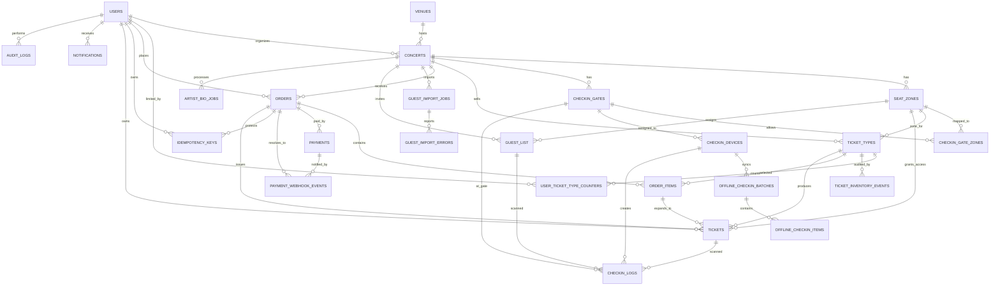

# TicketBox - Database Design

## 0. Mục tiêu tài liệu

Tài liệu này mô tả thiết kế cơ sở dữ liệu tối ưu cho TicketBox theo hướng **MVP-first nhưng đủ nghiệp vụ đồ án**. Mục tiêu là giảm độ phức tạp so với bản thiết kế cũ, đồng thời vẫn đáp ứng các yêu cầu trong `blueprint/design.md` và các spec:

- chống oversell bằng PostgreSQL transaction và row-level lock;
- enforce giới hạn vé theo user dưới tải cao;
- chống tạo order/payment/webhook trùng bằng idempotency;
- hỗ trợ e-ticket QR, check-in online và offline sync;
- hỗ trợ gate-zone validation;
- hỗ trợ CSV guest list, AI Artist Bio, notification, audit;
- tách đúng vai trò PostgreSQL, Redis, SQLite mobile, Object Storage và BullMQ.

Thiết kế tối ưu dùng **25 bảng PostgreSQL lõi**. Các bảng mang tính enterprise hoặc chưa cần cho demo được đưa vào mục Optional/Future Extension.

## 1. Nguyên tắc thiết kế

1. **PostgreSQL là source of truth** cho tài khoản, concert, vé, order, payment, check-in, guest list, AI job, notification và audit.
2. **Redis không thay PostgreSQL**. Redis chỉ dùng cho cache catalog/inventory, rate limit, idempotency TTL ngắn, JWT denylist và singleflight/read-model.
3. **SQLite chỉ nằm trên mobile app** để preload vé/guest hợp lệ và ghi scan offline. Khi sync, backend vẫn validate lại bằng PostgreSQL.
4. **Object Storage lưu file lớn** như ảnh, SVG seat map, CSV, PDF/Press kit. PostgreSQL chỉ lưu URL/metadata.
5. **Bảng lõi phải phục vụ trực tiếp use case**. Không thêm bảng nếu chỉ để mở rộng tương lai hoặc mô phỏng hệ thống production lớn.
6. **Không bán lố vé quan trọng hơn tốc độ ghi**. Luồng giữ vé phải khóa dòng `ticket_types` bằng `SELECT ... FOR UPDATE`.
7. **Check-in là một chiều**. Vé/guest đã `CHECKED_IN` không quay lại trạng thái trước đó trong scope đồ án.
8. **Gate-zone validation là bắt buộc** cho cả online và offline check-in.
9. **Mọi retry phải idempotent**. Request tạo order, payment webhook và offline batch retry không được tạo tác dụng phụ lần hai.

## 2. Vai trò từng lớp lưu trữ

| Thành phần | Dùng cho | Không dùng cho |
| --- | --- | --- |
| PostgreSQL | Dữ liệu nghiệp vụ lõi, transaction, lock, unique constraint, audit | Cache tạm thời, rate limit tốc độ cao |
| Redis | Cache catalog, inventory display, rate limit, idempotency TTL, JWT denylist | Quyết định cuối cùng về số vé bán được |
| SQLite mobile | Preload valid tickets/guests, local scan offline, local sync state | Ghi trực tiếp vào dữ liệu server |
| Object Storage/MinIO | Ảnh, SVG seat map, PDF press kit, CSV guest list | Binary/blob lớn trong PostgreSQL |
| BullMQ | Worker notification, AI bio, CSV import, hold-expiry job | Thay thế transaction DB |

## 3. Danh mục enum tối thiểu

| Enum | Giá trị | Dùng cho |
| --- | --- | --- |
| `user_role` | AUDIENCE, ORGANIZER, CHECKER, ADMIN | Phân quyền đơn giản theo `design.md`. |
| `user_status` | ACTIVE, LOCKED, DISABLED | Khóa tài khoản, ban user. |
| `concert_status` | DRAFT, PUBLISHED, CANCELLED, COMPLETED | Vòng đời concert. |
| `ticket_type_status` | DRAFT, ON_SALE, SOLD_OUT, CLOSED | Vòng đời loại vé. |
| `order_status` | HELD, PAID, CANCELLED, EXPIRED, FAILED, REFUNDED | Vòng đời order và hold TTL. |
| `payment_provider` | VNPAY, MOMO | Cổng thanh toán sandbox. |
| `payment_status` | PENDING, SUCCEEDED, FAILED, CANCELLED, REFUNDED | Trạng thái payment. |
| `ticket_status` | ISSUED, CHECKED_IN, CANCELLED, REFUNDED | Trạng thái e-ticket. |
| `checkin_result` | SUCCESS, ALREADY_CHECKED_IN, INVALID_TICKET, INVALID_GUEST, WRONG_CONCERT, WRONG_GATE, CONFLICT, ERROR | Kết quả scan. |
| `offline_batch_status` | PENDING, SYNCING, DONE, FAILED | Trạng thái batch sync. |
| `offline_item_status` | PENDING, ACCEPTED, CONFLICT, INVALID, WRONG_GATE, ERROR | Kết quả từng item offline. |
| `guest_status` | INVITED, CHECKED_IN, CANCELLED | Trạng thái khách mời. |
| `job_status` | PENDING, PROCESSING, DONE, FAILED | AI/CSV worker job. |
| `notification_channel` | APP, EMAIL, SMS, ZALO_OA | Kênh gửi thông báo. |
| `notification_status` | PENDING, SENT, FAILED, RETRYING | Trạng thái gửi. |
| `idempotency_status` | PROCESSING, SUCCEEDED, FAILED | Trạng thái idempotency. |
| `inventory_event_type` | HOLD, RELEASE, PAYMENT_CONFIRMED, REFUND, ADMIN_ADJUST | Audit thay đổi tồn kho. |

## 4. Bảng lõi theo domain

### 4.1. Auth và access control

| Bảng | Mục đích |
| --- | --- |
| `users` | Tài khoản khán giả, ban tổ chức, nhân sự check-in, admin. |

Thiết kế tối ưu dùng `users.role` thay vì `roles`, `user_roles`, `permissions`, `role_permissions`. Cách này khớp với `design.md`, nơi JWT payload đọc trường `role` ở API Gateway.

### 4.2. Catalog, venue, seat map và gate

| Bảng | Mục đích |
| --- | --- |
| `venues` | Địa điểm tổ chức. |
| `concerts` | Thông tin concert, artist bio, ảnh, seat map URL. |
| `seat_zones` | Khu vé trong từng concert: GA, VIP, SVIP, CAT1, CAT2. |
| `checkin_gates` | Cổng check-in của concert. |
| `checkin_gate_zones` | Mapping cổng được phép nhận khu nào. |

Thiết kế này bỏ bảng `artists`, `concert_artists`, `seat_maps` ở MVP. Nếu cần, `concerts.artist_name`, `concerts.artist_bio`, `concerts.seat_map_url` đủ để demo catalog, AI bio và SVG seat map.

### 4.3. Ticketing và inventory

| Bảng | Mục đích |
| --- | --- |
| `ticket_types` | Loại vé, giá, sale window, total/available/held/sold, max per user. |
| `user_ticket_type_counters` | Counter chống user mua vượt giới hạn khi spam request song song. |
| `ticket_inventory_events` | Audit mọi thay đổi tồn kho: hold, release, payment confirmed, refund. |

Không tách `ticket_inventory` và `inventory_reservations` trong MVP. `ticket_types` giữ trực tiếp số lượng tồn kho, còn `orders.hold_expires_at` đại diện cho reservation TTL.

### 4.4. Order, payment và idempotency

| Bảng | Mục đích |
| --- | --- |
| `orders` | Đơn hàng, trạng thái hold/payment, idempotency key tạo order. |
| `order_items` | Dòng vé trong order. |
| `payments` | Payment attempt qua VNPAY/MoMo sandbox. |
| `payment_webhook_events` | Raw webhook/IPN, signature validation, dedupe webhook. |
| `idempotency_keys` | Lớp bảo vệ bền vững ngoài Redis cho request retry. |

`idempotency_keys` có thể cache response như Redis, nhưng PostgreSQL vẫn cần unique constraint để chặn trùng khi Redis lỗi hoặc bị flush.

### 4.5. E-ticket và check-in

| Bảng | Mục đích |
| --- | --- |
| `tickets` | Vé thật được phát hành sau payment success. |
| `checkin_devices` | Thiết bị mobile check-in, gắn staff/concert/gate. |
| `checkin_logs` | Audit mọi lần scan online/offline, kể cả lỗi. |
| `offline_checkin_batches` | Batch sync từ mobile khi có mạng lại. |
| `offline_checkin_items` | Kết quả xử lý từng scan offline. |

### 4.6. Notification, AI, guest list và audit

| Bảng | Mục đích |
| --- | --- |
| `notifications` | Gộp template/log/delivery tối giản cho email/app/SMS/Zalo. |
| `artist_bio_jobs` | Job xử lý PDF/Press kit và kết quả bio sinh bằng AI. |
| `guest_import_jobs` | Job import CSV khách mời. |
| `guest_list` | Danh sách khách mời VIP. |
| `guest_import_errors` | Lỗi từng dòng CSV. |
| `audit_logs` | Audit thao tác admin hoặc nghiệp vụ quan trọng. |

## 5. Sơ đồ phụ thuộc triển khai

```text
users
-> venues, concerts, seat_zones
-> checkin_gates, checkin_gate_zones
-> ticket_types, user_ticket_type_counters, ticket_inventory_events
-> orders, order_items, payments, payment_webhook_events, idempotency_keys
-> tickets
-> checkin_devices, checkin_logs, offline_checkin_batches, offline_checkin_items
-> notifications
-> artist_bio_jobs
-> guest_import_jobs, guest_list, guest_import_errors
-> audit_logs
```

## 6. Mô tả bảng và trường chính

### 6.1. `users`

Lưu tài khoản và role chính của người dùng.

| Trường | Kiểu | Ràng buộc | Ý nghĩa |
| --- | --- | --- | --- |
| `id` | UUID | PK | Định danh user. |
| `email` | VARCHAR(255) | NOT NULL, UNIQUE | Email đăng nhập. |
| `password_hash` | TEXT | NOT NULL | Mật khẩu đã hash. |
| `full_name` | VARCHAR(255) | NOT NULL | Tên hiển thị. |
| `phone` | VARCHAR(20) | UNIQUE, NULL | Liên hệ/tra cứu. |
| `role` | user_role | NOT NULL | AUDIENCE/ORGANIZER/CHECKER/ADMIN. |
| `status` | user_status | NOT NULL | ACTIVE/LOCKED/DISABLED. |
| `created_at`, `updated_at` | TIMESTAMPTZ | NOT NULL | Audit thời gian. |

Index chính: `email`, `role`, `status`.

### 6.2. `venues`

| Trường | Kiểu | Ràng buộc | Ý nghĩa |
| --- | --- | --- | --- |
| `id` | UUID | PK | Định danh venue. |
| `name` | VARCHAR(255) | NOT NULL | Tên địa điểm. |
| `address` | TEXT | NOT NULL | Địa chỉ. |
| `city` | VARCHAR(100) | NOT NULL | Thành phố. |
| `capacity` | INTEGER | CHECK > 0, NULL | Sức chứa tham khảo. |
| `map_url` | TEXT | NULL | Link bản đồ/sơ đồ tổng. |
| `created_at`, `updated_at` | TIMESTAMPTZ | NOT NULL | Audit thời gian. |

### 6.3. `concerts`

| Trường | Kiểu | Ràng buộc | Ý nghĩa |
| --- | --- | --- | --- |
| `id` | UUID | PK | Định danh concert. |
| `venue_id` | UUID | FK venues, NOT NULL | Địa điểm. |
| `organizer_id` | UUID | FK users, NOT NULL | Ban tổ chức phụ trách. |
| `title` | VARCHAR(255) | NOT NULL | Tên concert. |
| `slug` | VARCHAR(255) | UNIQUE, NOT NULL | URL thân thiện. |
| `description` | TEXT | NULL | Mô tả. |
| `artist_name` | VARCHAR(255) | NULL | Nghệ sĩ/lineup chính. |
| `artist_bio` | TEXT | NULL | Bio do AI worker sinh hoặc nhập tay. |
| `starts_at`, `ends_at` | TIMESTAMPTZ | NOT NULL | Thời gian diễn ra. |
| `status` | concert_status | NOT NULL | DRAFT/PUBLISHED/CANCELLED/COMPLETED. |
| `cover_image_url` | TEXT | NULL | Ảnh bìa trong object storage. |
| `seat_map_url` | TEXT | NULL | SVG/asset seat map trong object storage. |
| `created_at`, `updated_at` | TIMESTAMPTZ | NOT NULL | Audit thời gian. |

Index chính: `(status, starts_at)`, `slug`, `venue_id`.

### 6.4. `seat_zones`

Mỗi zone thuộc một concert, không tách thành venue-level zone để giảm join và phù hợp seed demo 4 concert.

| Trường | Kiểu | Ràng buộc | Ý nghĩa |
| --- | --- | --- | --- |
| `id` | UUID | PK | Định danh zone. |
| `concert_id` | UUID | FK concerts, NOT NULL | Concert sở hữu zone. |
| `code` | VARCHAR(50) | UNIQUE `(concert_id, code)` | Mã GA/VIP/SVIP/CAT1. |
| `name` | VARCHAR(100) | NOT NULL | Tên hiển thị. |
| `capacity` | INTEGER | CHECK > 0 | Sức chứa zone. |
| `svg_path` | TEXT | NULL | Metadata vị trí trên SVG nếu cần. |
| `sort_order` | INTEGER | DEFAULT 0 | Thứ tự hiển thị. |

### 6.5. `checkin_gates` và `checkin_gate_zones`

`checkin_gates`:

| Trường | Kiểu | Ràng buộc | Ý nghĩa |
| --- | --- | --- | --- |
| `id` | UUID | PK | Định danh cổng. |
| `concert_id` | UUID | FK concerts, NOT NULL | Concert của cổng. |
| `code` | VARCHAR(50) | UNIQUE `(concert_id, code)` | Mã cổng. |
| `name` | VARCHAR(255) | NOT NULL | Tên cổng. |
| `is_active` | BOOLEAN | DEFAULT TRUE | Bật/tắt cổng. |

`checkin_gate_zones`:

| Trường | Kiểu | Ràng buộc | Ý nghĩa |
| --- | --- | --- | --- |
| `gate_id` | UUID | PK, FK checkin_gates | Cổng. |
| `seat_zone_id` | UUID | PK, FK seat_zones | Zone được phép vào. |
| `created_at` | TIMESTAMPTZ | NOT NULL | Thời điểm tạo mapping. |

Ràng buộc nghiệp vụ: khi check-in, `ticket.seat_zone_id` hoặc `guest_list.seat_zone_id` phải nằm trong mapping của `gate_id`; nếu không, trả `WRONG_GATE`.

### 6.6. `ticket_types`

| Trường | Kiểu | Ràng buộc | Ý nghĩa |
| --- | --- | --- | --- |
| `id` | UUID | PK | Định danh loại vé. |
| `concert_id` | UUID | FK concerts, NOT NULL | Concert bán vé. |
| `seat_zone_id` | UUID | FK seat_zones, NOT NULL | Vé thuộc zone nào. |
| `code` | VARCHAR(50) | UNIQUE `(concert_id, code)` | Mã loại vé. |
| `name` | VARCHAR(100) | NOT NULL | Tên loại vé. |
| `price` | DECIMAL(12,2) | NOT NULL | Giá vé. |
| `currency` | CHAR(3) | DEFAULT VND | Tiền tệ. |
| `total_quantity` | INTEGER | CHECK >= 0 | Tổng số vé. |
| `available_quantity` | INTEGER | CHECK >= 0 | Số còn có thể hold. |
| `held_quantity` | INTEGER | CHECK >= 0 | Số đang giữ chờ thanh toán. |
| `sold_quantity` | INTEGER | CHECK >= 0 | Số đã bán. |
| `max_per_user` | INTEGER | CHECK > 0 | Giới hạn mua mỗi user. |
| `sale_start_at`, `sale_end_at` | TIMESTAMPTZ | NOT NULL | Cửa sổ mở bán. |
| `status` | ticket_type_status | NOT NULL | Trạng thái bán. |

Ràng buộc: `total_quantity = available_quantity + held_quantity + sold_quantity`.

### 6.7. `user_ticket_type_counters`

| Trường | Kiểu | Ràng buộc | Ý nghĩa |
| --- | --- | --- | --- |
| `user_id` | UUID | PK, FK users | User mua vé. |
| `ticket_type_id` | UUID | PK, FK ticket_types | Loại vé. |
| `held_quantity` | INTEGER | CHECK >= 0 | Số vé đang hold. |
| `paid_quantity` | INTEGER | CHECK >= 0 | Số vé đã trả tiền. |
| `updated_at` | TIMESTAMPTZ | NOT NULL | Lần cập nhật gần nhất. |

Transaction tạo order phải lock/cập nhật counter này cùng lúc với `ticket_types`.

### 6.8. `ticket_inventory_events`

| Trường | Kiểu | Ràng buộc | Ý nghĩa |
| --- | --- | --- | --- |
| `id` | UUID | PK | Định danh event. |
| `ticket_type_id` | UUID | FK ticket_types, NOT NULL | Loại vé bị thay đổi. |
| `order_id` | UUID | FK orders, NULL | Order liên quan. |
| `event_type` | inventory_event_type | NOT NULL | HOLD/RELEASE/PAYMENT_CONFIRMED/... |
| `quantity` | INTEGER | NOT NULL | Số lượng thay đổi. |
| `before_available`, `after_available` | INTEGER | NULL | Snapshot trước/sau. |
| `before_held`, `after_held` | INTEGER | NULL | Snapshot trước/sau. |
| `before_sold`, `after_sold` | INTEGER | NULL | Snapshot trước/sau. |
| `metadata` | JSONB | NULL | Thông tin debug. |
| `created_at` | TIMESTAMPTZ | NOT NULL | Thời điểm event. |

### 6.9. `orders` và `order_items`

`orders`:

| Trường | Kiểu | Ràng buộc | Ý nghĩa |
| --- | --- | --- | --- |
| `id` | UUID | PK | Định danh order. |
| `user_id` | UUID | FK users, NOT NULL | Người đặt. |
| `concert_id` | UUID | FK concerts, NOT NULL | Concert. |
| `idempotency_key` | VARCHAR(128) | UNIQUE, NOT NULL | Chống double submit tạo order. |
| `status` | order_status | NOT NULL | HELD/PAID/CANCELLED/EXPIRED/FAILED/REFUNDED. |
| `total_amount` | DECIMAL(12,2) | NOT NULL | Tổng tiền. |
| `currency` | CHAR(3) | DEFAULT VND | Tiền tệ. |
| `hold_expires_at` | TIMESTAMPTZ | NOT NULL | TTL giữ vé. |
| `cancelled_reason` | TEXT | NULL | Lý do hủy/hết hạn. |
| `created_at`, `updated_at` | TIMESTAMPTZ | NOT NULL | Audit thời gian. |

`order_items`:

| Trường | Kiểu | Ràng buộc | Ý nghĩa |
| --- | --- | --- | --- |
| `id` | UUID | PK | Định danh dòng order. |
| `order_id` | UUID | FK orders, NOT NULL | Order cha. |
| `ticket_type_id` | UUID | FK ticket_types, NOT NULL | Loại vé. |
| `quantity` | INTEGER | CHECK > 0 | Số lượng. |
| `unit_price` | DECIMAL(12,2) | NOT NULL | Giá tại thời điểm mua. |
| `line_total` | DECIMAL(12,2) | NOT NULL | Thành tiền. |

### 6.10. `payments` và `payment_webhook_events`

`payments`:

| Trường | Kiểu | Ràng buộc | Ý nghĩa |
| --- | --- | --- | --- |
| `id` | UUID | PK | Định danh payment attempt. |
| `order_id` | UUID | FK orders, NOT NULL | Order liên quan. |
| `provider` | payment_provider | NOT NULL | VNPAY/MOMO. |
| `provider_transaction_id` | VARCHAR(255) | UNIQUE partial | Mã giao dịch provider. |
| `idempotency_key` | VARCHAR(128) | UNIQUE, NULL | Chống tạo payment trùng. |
| `amount` | DECIMAL(12,2) | NOT NULL | Số tiền. |
| `currency` | CHAR(3) | DEFAULT VND | Tiền tệ. |
| `status` | payment_status | NOT NULL | PENDING/SUCCEEDED/FAILED/CANCELLED/REFUNDED. |
| `provider_payload` | JSONB | NULL | Payload tạo payment/response. |
| `paid_at` | TIMESTAMPTZ | NULL | Thời điểm thanh toán thành công. |
| `failure_reason` | TEXT | NULL | Lý do lỗi. |

`payment_webhook_events`:

| Trường | Kiểu | Ràng buộc | Ý nghĩa |
| --- | --- | --- | --- |
| `id` | UUID | PK | Định danh webhook. |
| `payment_id` | UUID | FK payments, NULL | Payment resolve được. |
| `order_id` | UUID | FK orders, NULL | Order resolve được. |
| `provider` | payment_provider | NOT NULL | Provider gửi webhook. |
| `provider_event_id` | VARCHAR(255) | UNIQUE partial | Dedupe event nếu provider có event id. |
| `provider_transaction_id` | VARCHAR(255) | NULL | Dedupe theo transaction nếu cần. |
| `raw_payload` | JSONB | NOT NULL | Bằng chứng webhook. |
| `signature_valid` | BOOLEAN | NOT NULL | Kết quả verify chữ ký. |
| `processed` | BOOLEAN | DEFAULT FALSE | Đã xử lý nghiệp vụ chưa. |
| `processing_error` | TEXT | NULL | Lỗi xử lý. |
| `received_at`, `processed_at` | TIMESTAMPTZ | NULL | Thời điểm nhận/xử lý. |

Unique khuyến nghị: `(provider, provider_event_id)` khi event id không null, hoặc `(provider, provider_transaction_id)` khi transaction id không null.

### 6.11. `idempotency_keys`

| Trường | Kiểu | Ràng buộc | Ý nghĩa |
| --- | --- | --- | --- |
| `id` | UUID | PK | Định danh key. |
| `user_id` | UUID | FK users, NULL | User gửi request. |
| `order_id` | UUID | FK orders, NULL | Order liên quan. |
| `key` | VARCHAR(128) | UNIQUE, NOT NULL | Idempotency-Key. |
| `request_hash` | VARCHAR(128) | NOT NULL | Hash body để phát hiện key dùng sai payload. |
| `status` | idempotency_status | NOT NULL | PROCESSING/SUCCEEDED/FAILED. |
| `response_code` | INTEGER | NULL | HTTP code đã trả. |
| `response_body` | JSONB | NULL | Response cache nếu cần. |
| `locked_until` | TIMESTAMPTZ | NULL | Tránh xử lý song song. |
| `expires_at` | TIMESTAMPTZ | NOT NULL | TTL cleanup. |

### 6.12. `tickets`

| Trường | Kiểu | Ràng buộc | Ý nghĩa |
| --- | --- | --- | --- |
| `id` | UUID | PK | Định danh vé. |
| `order_id` | UUID | FK orders, NOT NULL | Order phát hành vé. |
| `order_item_id` | UUID | FK order_items, NOT NULL | Dòng order. |
| `user_id` | UUID | FK users, NOT NULL | Chủ vé. |
| `concert_id` | UUID | FK concerts, NOT NULL | Concert. |
| `ticket_type_id` | UUID | FK ticket_types, NOT NULL | Loại vé. |
| `seat_zone_id` | UUID | FK seat_zones, NOT NULL | Zone được vào. |
| `qr_token_hash` | VARCHAR(255) | UNIQUE, NOT NULL | Hash token QR. |
| `qr_payload` | JSONB | NULL | Payload QR. |
| `qr_signature` | TEXT | NOT NULL | Chữ ký để mobile verify offline. |
| `status` | ticket_status | NOT NULL | ISSUED/CHECKED_IN/CANCELLED/REFUNDED. |
| `issued_at` | TIMESTAMPTZ | NOT NULL | Thời điểm phát hành. |
| `checked_in_at` | TIMESTAMPTZ | NULL | Thời điểm check-in. |
| `checked_in_by` | UUID | FK users, NULL | Nhân sự check-in. |

### 6.13. `checkin_devices`

| Trường | Kiểu | Ràng buộc | Ý nghĩa |
| --- | --- | --- | --- |
| `id` | UUID | PK | Định danh thiết bị. |
| `device_code` | VARCHAR(100) | UNIQUE, NOT NULL | Mã thiết bị. |
| `staff_id` | UUID | FK users, NULL | Nhân sự dùng thiết bị. |
| `concert_id` | UUID | FK concerts, NOT NULL | Concert được phân công. |
| `gate_id` | UUID | FK checkin_gates, NOT NULL | Cổng được phân công. |
| `public_key` | TEXT | NULL | Key thiết bị nếu cần ký batch. |
| `last_sync_at` | TIMESTAMPTZ | NULL | Lần sync cuối. |
| `created_at` | TIMESTAMPTZ | NOT NULL | Thời điểm đăng ký thiết bị. |

Thiết bị hợp lệ trong MVP khi bản ghi tồn tại và `concert_id`, `gate_id`, `staff_id` khớp phiên làm việc. Các trạng thái thu hồi/mất thiết bị nằm ngoài scope hiện tại và có thể thêm sau.

### 6.14. `checkin_logs`

| Trường | Kiểu | Ràng buộc | Ý nghĩa |
| --- | --- | --- | --- |
| `id` | UUID | PK | Định danh log. |
| `ticket_id` | UUID | FK tickets, NULL | Vé được quét. |
| `guest_id` | UUID | FK guest_list, NULL | Guest được quét. |
| `concert_id` | UUID | FK concerts, NOT NULL | Concert. |
| `seat_zone_id` | UUID | FK seat_zones, NULL | Zone resolve được. |
| `gate_id` | UUID | FK checkin_gates, NULL | Cổng scan. |
| `device_id` | UUID | FK checkin_devices, NULL | Thiết bị scan. |
| `staff_id` | UUID | FK users, NULL | Nhân sự scan. |
| `scan_token_hash` | VARCHAR(255) | NULL | Hash QR/guest token. |
| `result` | checkin_result | NOT NULL | Kết quả scan. |
| `reason` | TEXT | NULL | Lý do lỗi/conflict. |
| `scanned_at` | TIMESTAMPTZ | NOT NULL | Thời điểm scan. |
| `synced_at` | TIMESTAMPTZ | NULL | Có giá trị nếu từ offline sync. |
| `metadata` | JSONB | NULL | Debug context. |

### 6.15. `offline_checkin_batches` và `offline_checkin_items`

`offline_checkin_batches`:

| Trường | Kiểu | Ràng buộc | Ý nghĩa |
| --- | --- | --- | --- |
| `id` | UUID | PK | Định danh batch. |
| `concert_id` | UUID | FK concerts, NOT NULL | Concert. |
| `staff_id` | UUID | FK users, NULL | Nhân sự sync. |
| `device_id` | UUID | FK checkin_devices, NOT NULL | Thiết bị sync. |
| `gate_id` | UUID | FK checkin_gates, NOT NULL | Cổng sync. |
| `batch_token` | VARCHAR(128) | UNIQUE, NOT NULL | Idempotency của batch. |
| `status` | offline_batch_status | NOT NULL | PENDING/SYNCING/DONE/FAILED. |
| `item_count` | INTEGER | DEFAULT 0 | Tổng item. |
| `conflict_count` | INTEGER | DEFAULT 0 | Số conflict. |
| `started_at`, `synced_at` | TIMESTAMPTZ | NULL | Thời gian xử lý. |

`offline_checkin_items`:

| Trường | Kiểu | Ràng buộc | Ý nghĩa |
| --- | --- | --- | --- |
| `id` | UUID | PK | Định danh item. |
| `batch_id` | UUID | FK offline_checkin_batches, NOT NULL | Batch cha. |
| `ticket_id` | UUID | FK tickets, NULL | Vé resolve được. |
| `guest_id` | UUID | FK guest_list, NULL | Guest resolve được. |
| `seat_zone_id` | UUID | FK seat_zones, NULL | Zone local resolve. |
| `gate_id` | UUID | FK checkin_gates, NOT NULL | Gate local scan. |
| `qr_token_hash` | VARCHAR(255) | NULL | Hash QR. |
| `local_scanned_at` | TIMESTAMPTZ | NOT NULL | Thời điểm scan offline. |
| `sync_result` | offline_item_status | NOT NULL | ACCEPTED/CONFLICT/WRONG_GATE/... |
| `conflict_reason` | TEXT | NULL | Lý do conflict. |
| `metadata` | JSONB | NULL | Debug context. |

Unique khuyến nghị: `(batch_id, qr_token_hash)` để client retry batch không tạo item trùng.

### 6.16. `notifications`

Gộp template, log và delivery tối giản vào một bảng để đủ demo gửi email/app push.

| Trường | Kiểu | Ràng buộc | Ý nghĩa |
| --- | --- | --- | --- |
| `id` | UUID | PK | Định danh notification. |
| `user_id` | UUID | FK users, NULL | Người nhận nếu có tài khoản. |
| `concert_id` | UUID | FK concerts, NULL | Concert liên quan. |
| `order_id` | UUID | FK orders, NULL | Order liên quan. |
| `ticket_id` | UUID | FK tickets, NULL | Ticket liên quan. |
| `channel` | notification_channel | NOT NULL | APP/EMAIL/SMS/ZALO_OA. |
| `recipient` | VARCHAR(255) | NULL | Email/phone/user target. |
| `title` | VARCHAR(255) | NOT NULL | Tiêu đề. |
| `body` | TEXT | NULL | Nội dung. |
| `status` | notification_status | NOT NULL | PENDING/SENT/FAILED/RETRYING. |
| `attempts` | INTEGER | DEFAULT 0 | Số lần gửi. |
| `next_attempt_at` | TIMESTAMPTZ | NULL | Lịch retry. |
| `sent_at` | TIMESTAMPTZ | NULL | Thời điểm gửi thành công. |
| `error_message` | TEXT | NULL | Lỗi cuối. |
| `metadata` | JSONB | NULL | Payload/template variables. |

### 6.17. `artist_bio_jobs`

| Trường | Kiểu | Ràng buộc | Ý nghĩa |
| --- | --- | --- | --- |
| `id` | UUID | PK | Định danh job. |
| `concert_id` | UUID | FK concerts, NOT NULL | Concert cần sinh bio. |
| `uploaded_by` | UUID | FK users, NULL | Admin/organizer upload. |
| `source_file_url` | TEXT | NOT NULL | PDF/Press kit trong object storage. |
| `status` | job_status | NOT NULL | PENDING/PROCESSING/DONE/FAILED. |
| `extracted_text_url` | TEXT | NULL | File text sau extract nếu lớn. |
| `generated_bio` | TEXT | NULL | Bio AI sinh ra. |
| `model_name` | VARCHAR(100) | NULL | Model AI dùng. |
| `error_message` | TEXT | NULL | Lỗi nếu fail. |
| `created_at`, `updated_at`, `completed_at` | TIMESTAMPTZ | NULL | Audit job. |

Khi job thành công, worker cập nhật cả `artist_bio_jobs.generated_bio` và `concerts.artist_bio`.

### 6.18. `guest_import_jobs`, `guest_list`, `guest_import_errors`

`guest_import_jobs`:

| Trường | Kiểu | Ràng buộc | Ý nghĩa |
| --- | --- | --- | --- |
| `id` | UUID | PK | Định danh import. |
| `concert_id` | UUID | FK concerts, NOT NULL | Concert nhập guest. |
| `uploaded_by` | UUID | FK users, NULL | Người upload. |
| `source_file_url` | TEXT | NOT NULL | CSV trong object storage. |
| `status` | job_status | NOT NULL | PENDING/PROCESSING/DONE/FAILED. |
| `total_rows`, `success_rows`, `error_rows` | INTEGER | DEFAULT 0 | Thống kê import. |
| `error_message` | TEXT | NULL | Lỗi batch nếu có. |

`guest_list`:

| Trường | Kiểu | Ràng buộc | Ý nghĩa |
| --- | --- | --- | --- |
| `id` | UUID | PK | Định danh guest. |
| `concert_id` | UUID | FK concerts, NOT NULL | Concert. |
| `seat_zone_id` | UUID | FK seat_zones, NULL | Zone/cổng được phép. |
| `full_name` | VARCHAR(255) | NOT NULL | Tên khách mời. |
| `phone` | VARCHAR(20) | NOT NULL | Số điện thoại. |
| `email` | VARCHAR(255) | NULL | Email. |
| `sponsor_name` | VARCHAR(255) | NULL | Nhãn hàng/nguồn mời. |
| `qr_token_hash` | VARCHAR(255) | UNIQUE, NULL | QR guest nếu dùng QR. |
| `status` | guest_status | NOT NULL | INVITED/CHECKED_IN/CANCELLED. |
| `checked_in_at` | TIMESTAMPTZ | NULL | Thời điểm check-in. |
| `checked_in_by` | UUID | FK users, NULL | Nhân sự check-in. |

Unique khuyến nghị: `(concert_id, phone)` để dedupe CSV.

`guest_import_errors`:

| Trường | Kiểu | Ràng buộc | Ý nghĩa |
| --- | --- | --- | --- |
| `id` | UUID | PK | Định danh lỗi. |
| `job_id` | UUID | FK guest_import_jobs, NOT NULL | Job import. |
| `row_number` | INTEGER | NOT NULL | Dòng lỗi. |
| `raw_data` | JSONB | NULL | Dữ liệu gốc. |
| `error_message` | TEXT | NOT NULL | Lý do lỗi. |
| `created_at` | TIMESTAMPTZ | NOT NULL | Thời điểm ghi lỗi. |

### 6.19. `audit_logs`

| Trường | Kiểu | Ràng buộc | Ý nghĩa |
| --- | --- | --- | --- |
| `id` | UUID | PK | Định danh audit. |
| `actor_user_id` | UUID | FK users, NULL | Ai thực hiện. |
| `action` | VARCHAR(100) | NOT NULL | Hành động. |
| `entity_type` | VARCHAR(100) | NOT NULL | Loại entity. |
| `entity_id` | UUID | NULL | ID entity nếu có. |
| `before_data`, `after_data` | JSONB | NULL | Snapshot trước/sau. |
| `ip_address` | INET | NULL | IP. |
| `user_agent` | TEXT | NULL | User agent. |
| `created_at` | TIMESTAMPTZ | NOT NULL | Thời điểm audit. |

## 7. ERD tối ưu



## 8. Luồng dữ liệu quan trọng

### 8.1. Giữ vé và chống oversell

1. API Gateway rate limit request `/orders`.
2. Backend kiểm tra `Idempotency-Key` trong Redis và `idempotency_keys`.
3. Mở PostgreSQL transaction.
4. Lock các dòng `ticket_types` bằng `SELECT ... FOR UPDATE`.
5. Lock hoặc tạo `user_ticket_type_counters`.
6. Kiểm tra sale window, status, `available_quantity`, `max_per_user`.
7. Tạo `orders` trạng thái `HELD`, `order_items`.
8. Cập nhật `ticket_types`: giảm available, tăng held.
9. Cập nhật counter: tăng held.
10. Ghi `ticket_inventory_events(HOLD)`.
11. Commit transaction.
12. Sau commit, invalidate/cập nhật Redis inventory cache.

### 8.2. Hết hạn hold

1. Worker quét `orders.status = HELD` và `hold_expires_at < now()`.
2. Với từng order, mở transaction và lock order + ticket_types liên quan.
3. Nếu order vẫn `HELD`, chuyển `EXPIRED`.
4. Cập nhật inventory: tăng available, giảm held.
5. Cập nhật user counter: giảm held.
6. Ghi `ticket_inventory_events(RELEASE)`.
7. Commit và invalidate Redis.

### 8.3. Payment webhook idempotent

1. Webhook/IPN được ghi vào `payment_webhook_events.raw_payload` trước khi xử lý.
2. Verify chữ ký, amount, provider transaction id.
3. Nếu webhook trùng, trả HTTP 200 và không xử lý lại.
4. Nếu hợp lệ, mở transaction.
5. Cập nhật `payments.status = SUCCEEDED`.
6. Cập nhật `orders.status = PAID`.
7. Chuyển inventory từ held sang sold, cập nhật counter từ held sang paid.
8. Phát hành `tickets` theo `order_items`.
9. Ghi `ticket_inventory_events(PAYMENT_CONFIRMED)`.
10. Đánh dấu webhook `processed = TRUE`.

### 8.4. Check-in online

Điều kiện thành công:

```text
ticket.status = ISSUED
ticket.concert_id = current_concert_id
ticket.seat_zone_id thuộc mapping checkin_gate_zones của gate_id
device_id tồn tại và được gắn đúng concert/gate
gate.is_active = TRUE
QR signature hợp lệ
```

Nếu hợp lệ, update `tickets.status = CHECKED_IN`, set `checked_in_at`, `checked_in_by`, ghi `checkin_logs(SUCCESS)`. Nếu sai cổng, không đổi ticket và ghi `WRONG_GATE`.

### 8.5. Check-in offline

1. Mobile preload tickets/guests hợp lệ, allowed zones, gate và public key.
2. Khi offline, app verify QR signature, concert, gate-zone và local duplicate.
3. App ghi local scan vào SQLite.
4. Khi có mạng, app sync bằng `batch_token` unique.
5. Server tạo/resolve `offline_checkin_batches`.
6. Server xử lý từng item, validate lại bằng PostgreSQL.
7. Item hợp lệ và chưa check-in: cập nhật ticket/guest source of truth.
8. Item đã check-in: `CONFLICT`.
9. Item sai gate-zone: `WRONG_GATE`.
10. Ghi `offline_checkin_items` và `checkin_logs` cho mọi item.

## 9. SQLite schema tối thiểu trên mobile

SQLite không nằm trong migration PostgreSQL, nhưng mobile cần schema tối thiểu:

```sql
CREATE TABLE local_valid_tickets (
    ticket_id TEXT PRIMARY KEY,
    concert_id TEXT NOT NULL,
    ticket_type_id TEXT NOT NULL,
    seat_zone_id TEXT NOT NULL,
    qr_token_hash TEXT NOT NULL UNIQUE,
    qr_signature TEXT NOT NULL,
    status_snapshot TEXT NOT NULL,
    downloaded_at TEXT NOT NULL
);

CREATE TABLE local_valid_guests (
    guest_id TEXT PRIMARY KEY,
    concert_id TEXT NOT NULL,
    seat_zone_id TEXT,
    qr_token_hash TEXT UNIQUE,
    phone TEXT NOT NULL,
    full_name TEXT NOT NULL,
    status_snapshot TEXT NOT NULL,
    downloaded_at TEXT NOT NULL
);

CREATE TABLE local_gate_zones (
    gate_id TEXT NOT NULL,
    seat_zone_id TEXT NOT NULL,
    PRIMARY KEY (gate_id, seat_zone_id)
);

CREATE TABLE local_checkin_scans (
    id TEXT PRIMARY KEY,
    ticket_id TEXT,
    guest_id TEXT,
    qr_token_hash TEXT,
    concert_id TEXT NOT NULL,
    gate_id TEXT NOT NULL,
    seat_zone_id TEXT,
    device_id TEXT NOT NULL,
    result TEXT NOT NULL,
    local_scanned_at TEXT NOT NULL,
    sync_status TEXT NOT NULL DEFAULT 'PENDING',
    conflict_reason TEXT
);

CREATE TABLE local_sync_batches (
    id TEXT PRIMARY KEY,
    batch_token TEXT NOT NULL UNIQUE,
    concert_id TEXT NOT NULL,
    device_id TEXT NOT NULL,
    gate_id TEXT NOT NULL,
    status TEXT NOT NULL DEFAULT 'PENDING',
    created_at TEXT NOT NULL,
    synced_at TEXT
);
```

## 10. Mapping yêu cầu đồ án với bảng dữ liệu

| Yêu cầu | Bảng PostgreSQL | Thành phần phụ trợ |
| --- | --- | --- |
| Concert catalog chịu tải đọc cao | `concerts`, `venues`, `seat_zones`, `ticket_types` | Redis cache-aside, MinIO/CDN |
| Chống oversell | `ticket_types`, `orders`, `order_items`, `ticket_inventory_events` | PostgreSQL lock, BullMQ worker hết hold |
| Giới hạn vé per-user | `user_ticket_type_counters`, `ticket_types` | Rate limit Redis |
| Order checkout | `orders`, `order_items`, `payments` | Redis idempotency, payment sandbox |
| Payment idempotency | `idempotency_keys`, `payments`, `payment_webhook_events` | Redis TTL 24h |
| E-ticket QR | `tickets` | QR signature/public key |
| Online check-in | `tickets`, `checkin_devices`, `checkin_logs`, `checkin_gates`, `checkin_gate_zones` | Mobile app |
| Offline check-in sync | `offline_checkin_batches`, `offline_checkin_items`, `checkin_logs` | SQLite local DB |
| Guest VIP check-in | `guest_list`, `checkin_logs`, `checkin_gate_zones` | SQLite local DB |
| Guest CSV import | `guest_import_jobs`, `guest_import_errors`, `guest_list` | BullMQ worker, MinIO CSV |
| AI Artist Bio | `artist_bio_jobs`, `concerts.artist_bio` | BullMQ worker, OpenAI/Gemini |
| Notification | `notifications` | BullMQ worker, email/app/SMS provider |
| Auth/RBAC | `users.role`, `users.status` | JWT, Redis denylist |
| Audit logging | `audit_logs`, domain logs/events | PostgreSQL |
| Rate limiting/anti-bot | Không cần bảng PostgreSQL | Redis token bucket tại gateway |
| Caching | Không cần bảng PostgreSQL | Redis TTL và active invalidation |

## 11. Bảng đã gộp hoặc bỏ khỏi MVP

| Bảng/nhóm cũ | Phương án tối ưu | Lý do |
| --- | --- | --- |
| `roles`, `user_roles`, `permissions`, `role_permissions` | `users.role` enum | Role trong đồ án đơn giản, JWT đọc trực tiếp `role`. |
| `artists`, `concert_artists` | `concerts.artist_name`, `concerts.artist_bio` | Chưa cần quản lý artist độc lập. |
| `seat_maps` | `concerts.seat_map_url`, `seat_zones.svg_path` | SVG/file nằm ở MinIO, DB chỉ cần URL/metadata. |
| `ticket_inventory` | Cột quantity trên `ticket_types` | Tránh join và trùng source of truth. |
| `inventory_reservations` | `orders.status`, `orders.hold_expires_at`, `order_items` | Order hold đã đủ đại diện reservation. |
| `notification_templates`, `notification_logs`, `notification_dead_letters` | `notifications` | Đủ log gửi, retry, lỗi cho demo. |
| `artist_bios` | `artist_bio_jobs.generated_bio`, `concerts.artist_bio` | Giảm bảng, vẫn lưu kết quả và trạng thái job. |
| `rate_limit_buckets` | Redis token bucket | Rate limit là dữ liệu TTL tốc độ cao. |

## 12. Optional/Future Extension

Chỉ thêm các bảng sau nếu đồ án còn thời gian hoặc cần demo nâng cao:

- `roles`, `permissions`, `role_permissions`: khi cần RBAC động nhiều quyền chi tiết.
- `artists`, `concert_artists`: khi một concert có nhiều artist và artist có trang riêng.
- `seat_maps`: khi cần versioning seat map theo venue/concert.
- `notification_templates`, `notification_deliveries`, `notification_dead_letters`: khi cần hệ thống notification production-like.
- `ticket_inventory` riêng: khi cần nhiều read model/tối ưu inventory phức tạp hơn.
- `checkin_sessions`: khi cần quản lý ca trực check-in thay vì chỉ thiết bị/cổng.

## 13. Checklist đáp ứng yêu cầu

- [x] PostgreSQL là source of truth cho dữ liệu lõi.
- [x] Có thiết kế Redis cho cache, rate limit, idempotency ngắn hạn, JWT denylist.
- [x] Có thiết kế SQLite local cho offline check-in.
- [x] Có Object Storage cho ảnh, SVG, CSV, PDF.
- [x] Có bảng user và role tối giản.
- [x] Có bảng concert, venue, seat zone, gate-zone validation.
- [x] Có bảng ticket type với `available_quantity`, `held_quantity`, `sold_quantity`.
- [x] Có counter per-user limit.
- [x] Có inventory event audit theo spec chống oversell.
- [x] Có order, order item, payment.
- [x] Có idempotency key và webhook event theo spec payment.
- [x] Có e-ticket QR.
- [x] Có online check-in log.
- [x] Có offline batch/item sync.
- [x] Có guest CSV import và guest check-in.
- [x] Có AI Artist Bio job.
- [x] Có notification tối giản.
- [x] Có audit log.
