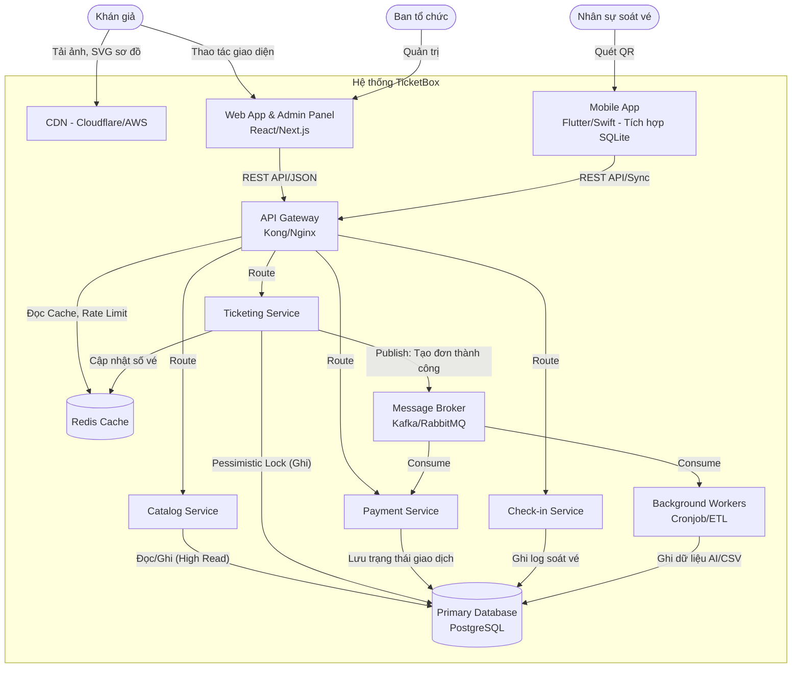
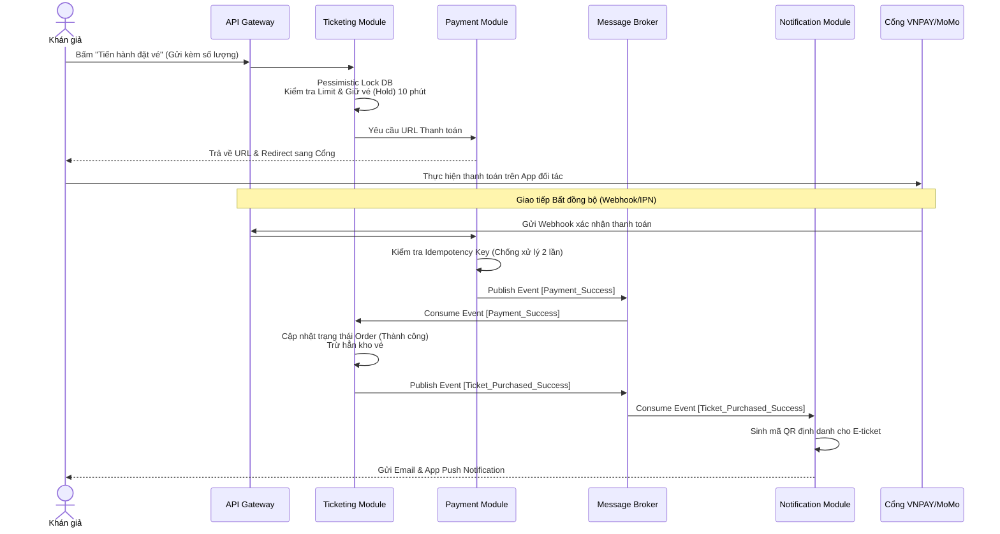
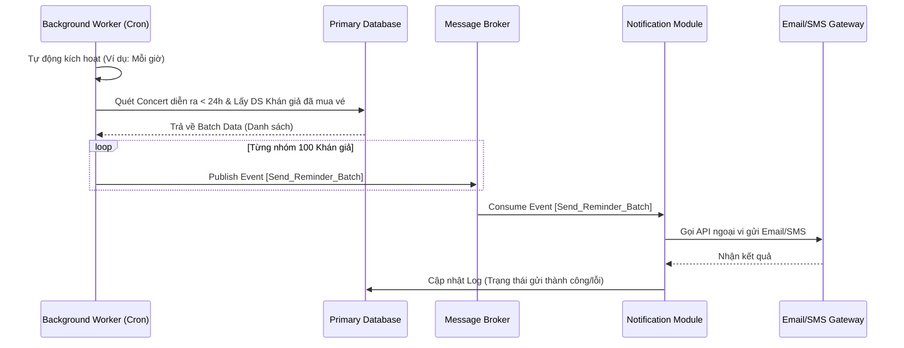
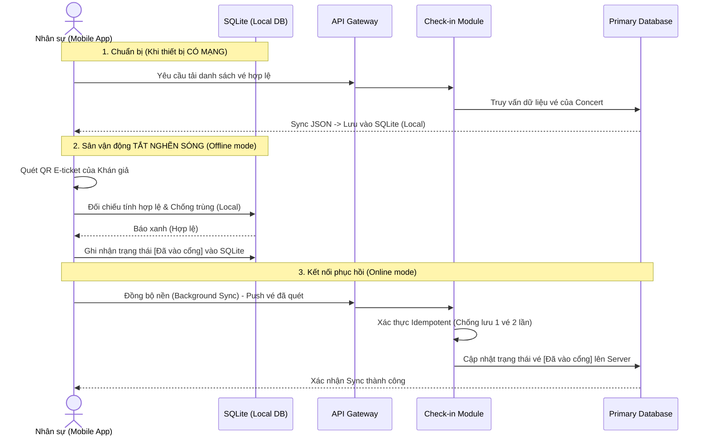
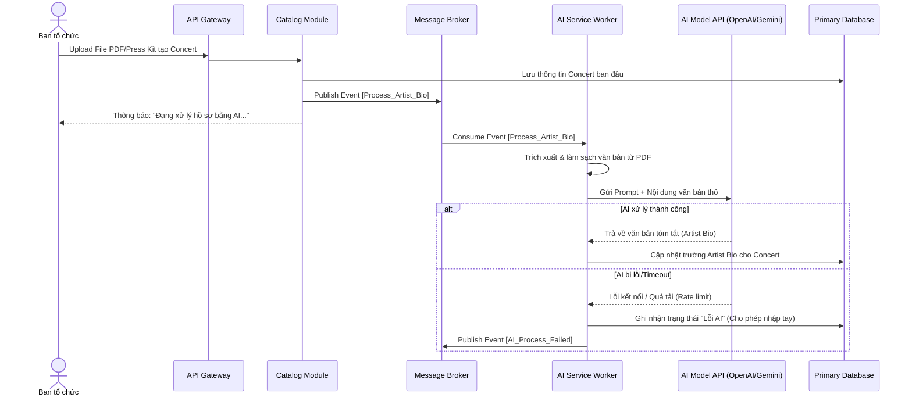
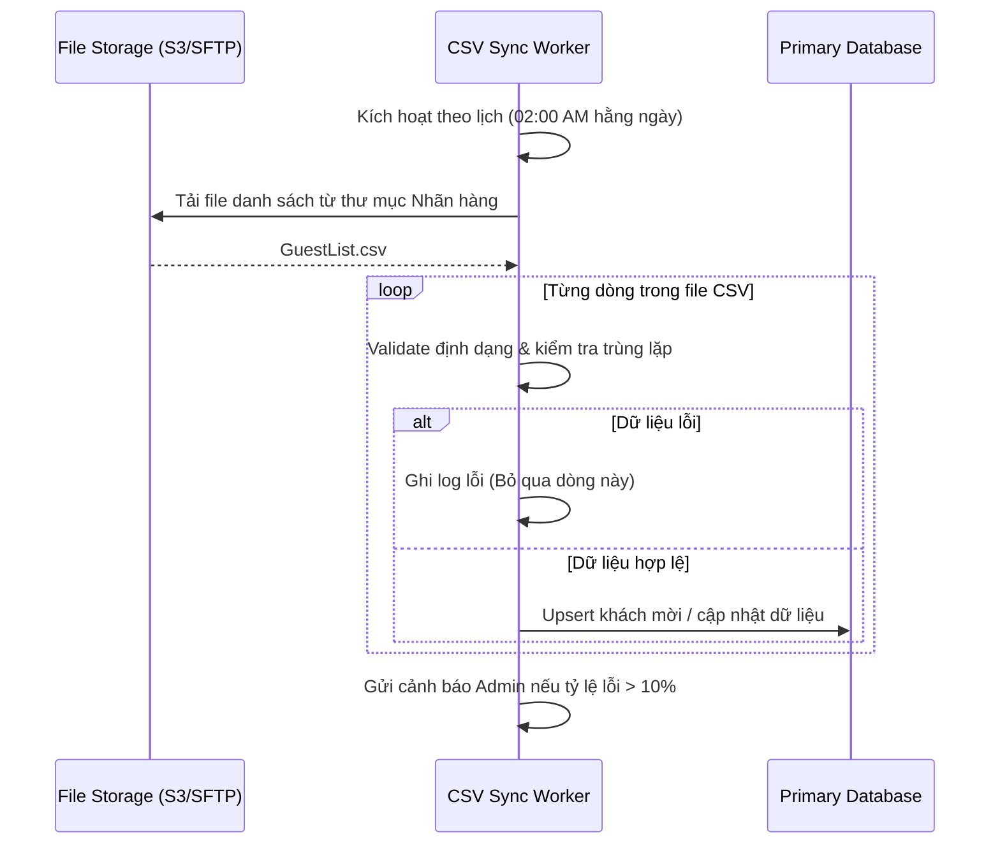

# TicketBox - Technical Design

## Kiến trúc tổng thể

Để đáp ứng các yêu cầu khắt khe về tải trọng, tính nhất quán dữ liệu và khả năng chịu lỗi, kiến trúc phù hợp nhất cho TicketBox là **Kiến trúc Hướng sự kiện kết hợp Modular Monlith (Event-Driven Modular Monolith*)**.

Dưới đây là đề xuất chi tiết cho kiến trúc hệ thống:

### Các thành phần chính

Hệ thống được chia thành các lớp (layers) và dịch vụ (services) độc lập để dễ dàng mở rộng và bảo trì:

**Lớp Ứng dụng khách (Client Layer):**
* **CDN (Content Delivery Network):** Đóng vai trò cực kỳ quan trọng trong việc phục vụ các tài nguyên tĩnh (Ảnh nghệ sĩ, Sơ đồ SVG, CSS/JS). Giúp giảm tải băng thông mạng cho server chính khi có 80.000 users truy cập đồng thời.
* **Web App (Khán giả):** Ứng dụng dành cho khán giả xem thông tin và mua vé.
* **Admin Dashboard:** Cổng quản trị nội bộ dành cho Ban tổ chức tạo concert, cấu hình vé và xem thống kê.
* **Mobile App (Nhân sự soát vé):** Ứng dụng di động dùng để quét mã QR tại cổng, tích hợp Local DB (SQLite/Room/CoreData) để lưu trữ cục bộ và hoạt động offline.

**Lớp Giao tiếp (Gateway & API Management):**
* **API Gateway:** Chịu trách nhiệm điều phối request, kiểm tra quyền truy cập, và đóng vai trò như một chốt chặn bảo vệ backend bằng cơ chế Rate Limiting (chống bot, chặn spam).

**Lớp Dịch vụ cốt lõi (Core Services / Backend API):**
* **Catalog Service:** Quản lý thông tin concert, nghệ sĩ, sơ đồ chỗ ngồi. Dịch vụ này chịu tải đọc cực cao.
* **Ticketing & Order Service:** Xử lý logic đặt vé, kiểm soát giới hạn số vé tối đa cho mỗi tài khoản và chống tranh chấp vé (Race condition).
* **Payment Service:** Tích hợp với VNPAY/MoMo, xử lý webhook và sinh Idempotency Key để chống trừ tiền hai lần.
* **Check-in Service:** Quản lý logic soát vé, đồng bộ dữ liệu vé ngoại tuyến từ Mobile App khi có mạng trở lại.

**Lớp Dữ liệu và Hàng đợi (Data & Queue Layer):**
* **Primary Database (RDBMS):** Đảm bảo tính toàn vẹn (ACID) cho dữ liệu đơn hàng và giao dịch thanh toán.
* **Caching (Redis):** Áp dụng Cache-aside để lưu trữ danh sách concert, chi tiết concert và số lượng vé còn lại nhằm giảm tải cho Database.
* **Message Broker (Kafka / RabbitMQ):** Đóng vai trò hàng đợi xử lý bất đồng bộ trong lúc tải đột biến (ví dụ: xếp hàng request đặt vé, gửi thông báo).

**Lớp Xử lý ngầm (Background Workers):**
* **AI Service Worker:** Nhận file PDF/Press kit, làm sạch văn bản và gọi mô hình AI để sinh bản giới thiệu nghệ sĩ (Artist Bio).
* **CSV Sync Worker:** Định kỳ chạy ngầm vào ban đêm để đọc, xử lý lỗi và nhập danh sách khách mời VIP từ file CSV mà không làm gián đoạn hệ thống.

### Cách các thành phần giao tiếp với nhau

Hệ thống kết hợp cả hai mô hình giao tiếp để cân bằng giữa hiệu suất và trải nghiệm người dùng:

* **Giao tiếp đồng bộ (Synchronous):** Sử dụng RESTful API hoặc gRPC cho các luồng cần phản hồi ngay lập tức như: Khán giả truy vấn danh sách concert, đăng nhập, hoặc lấy thông tin vé cá nhân. Các request này sẽ đi qua API Gateway, kiểm tra Cache, nếu miss sẽ chọc xuống Database và cập nhật lại Cache.
* **Giao tiếp bất đồng bộ (Asynchronous):** Sử dụng Message Broker. Trong 5 phút đầu mở bán với 80.000 lượt truy cập, request mua vé sẽ được API Gateway tiếp nhận, đi qua Ticketing Service để đẩy vào một hàng đợi (Queue). Ticketing Service xử lý dần để trừ vé và khóa chỗ, sau đó phát ra một sự kiện (Event) tới Payment Service và Notification Service để tiếp tục quy trình thanh toán và gửi email/app push.

**Bảng mô tả tác động khi một thành phần gặp sự cố:**

| Thành phần gặp sự cố | Hậu quả trực tiếp | Ảnh hưởng đến các thành phần khác | Trạng thái hệ thống tổng thể |
| --- | --- | --- | --- |
| **Cổng thanh toán (VNPAY/MoMo) lỗi/timeout** | Không thể xử lý giao dịch hoặc sinh webhook trả về. | Dịch vụ Payment bị treo. Các luồng tạo đơn hàng có phí bị kẹt. | **Graceful Degradation:** Hệ thống vẫn sống. Khán giả vẫn xem được thông tin concert và số vé còn lại bình thường. Các tính năng không liên quan đến thanh toán hoạt động tốt. |
| **Caching (Redis) sập** | Mất dữ liệu cache về số vé và thông tin concert. Mất cơ chế Rate Limiting. | Hàng nghìn request/giây sẽ dội thẳng trực tiếp vào Primary Database. | Rủi ro sập toàn bộ hệ thống nếu DB bị quá tải. (Cần có cơ chế Circuit Breaker chặn request tự động nếu Cache sập). |
| **Mất kết nối Internet tại cổng soát vé** | Mobile App không thể gọi API lên Check-in Service. | Ticketing Service và Database không nhận được trạng thái vé đã sử dụng theo thời gian thực. | Ứng dụng chuyển sang chế độ offline, ghi nhận soát vé tạm vào bộ nhớ cục bộ. Hệ thống trung tâm không bị ảnh hưởng, tự đồng bộ khi kết nối phục hồi. |
| **Message Broker sập** | Không thể đẩy request mua vé hoặc thông báo vào hàng đợi. | Ticketing Service không thể xử lý đơn đặt vé mới dưới tải cao. Notification Service không nhận được lệnh gửi email. | Luồng mua vé bị gián đoạn, khán giả nhận thông báo lỗi. Tuy nhiên, luồng xem thông tin concert và soát vé tại cổng vẫn hoạt động bình thường. |
| **CSV Sync Worker / AI Worker lỗi** | Không đọc được file danh sách VIP hoặc không sinh được Artist Bio. | Hệ thống không có danh sách khách mời mới nhất hoặc thông tin mô tả bị trống. | **Không gián đoạn:** Toàn bộ hệ thống lõi (mua vé, xem concert, soát vé thường) vẫn hoạt động bình thường. |

### Lý do lựa chọn kiến trúc đề xuất

Việc lựa chọn kiến trúc trên giải quyết trực tiếp các vấn đề kỹ thuật trọng tâm:

1. **Phân tách luồng Đọc/Ghi giúp giải quyết Tải đột biến:** Tách biệt rõ ràng việc đọc dữ liệu (phục vụ bằng Redis Cache để chịu hàng nghìn request/giây) và ghi dữ liệu (mua vé). Điều này giúp bảo vệ Database không bị quá tải khi trang chủ hoặc trang chi tiết bị truy cập mật độ cao.
2. **Đảm bảo tính toàn vẹn (Race Condition & Per-user limit):** Với đặc thù dự án yêu cầu xử lý đồng thời cực cao, hàng đợi (Message Broker) sẽ đóng vai trò như một bộ đệm (buffer) để xếp hàng tuần tự các request đặt vé. Điều này, kết hợp với cơ chế Database Locking (Pessimistic Locking) ở Ticketing Service, giúp hệ thống enforce chính xác giới hạn vé tối đa/tài khoản và không bao giờ cấp vé cuối cùng cho hai người.
3. **Khả năng chịu lỗi và tính độc lập (Fault Tolerance):** Thiết kế chia cắt các service cho phép áp dụng Circuit Breaker (ngắt mạch) hiệu quả. Nếu Payment Service hoặc hệ thống VNPAY sập, nó không kéo theo sự sụp đổ của Catalog Service, đảm bảo yêu cầu nghiệp vụ: thông tin concert và danh sách vé còn lại vẫn hiển thị bình thường.
4. **Hỗ trợ kiến trúc bảo mật chặt chẽ:** API Gateway tập trung giúp dễ dàng triển khai xác thực (Authentication), cấp quyền (RBAC cho admin) và bảo vệ hệ thống thông qua Rate Limiting (Token Bucket, Sliding Window) chặn bot spam request ngay từ vòng ngoài. Tận dụng tư duy về an toàn thông tin để đảm bảo endpoint nội bộ.
5. **Đáp ứng nghiệp vụ ngoại tuyến an toàn:** Việc tách bạch Check-in Service với API rõ ràng giúp Mobile App dễ dàng triển khai logic lưu trạng thái mã QR offline vào thiết bị (LocalDB/SQLite) và retry (thử lại) việc đồng bộ một cách an toàn mà không để lọt một vé vào cổng hai lần.

---

## C4 Diagram

### Level 1 — System Context
<!-- Sơ đồ: TicketBox + actors + hệ thống ngoài (VNPAY, MoMo, AI model, CSV nhãn hàng) -->

Sơ đồ System Context thể hiện ranh giới của hệ thống TicketBox và cách nó tương tác với người dùng (Actors) cũng như các hệ thống bên ngoài (External Systems).

**Chi tiết các thành phần ngoại vi (External Systems):**
*   **Cổng thanh toán (Payment Gateway):** Hệ thống độc lập của đối tác (VNPAY, MoMo). TicketBox chỉ chuyển hướng người dùng sang đây và lắng nghe IPN/Webhook trả về.
*   **Hệ thống thông báo:** Dịch vụ gửi Email (SendGrid/Amazon SES), SMS Gateway, hoặc Zalo OA API.
*   **AI Model API:** Dịch vụ của bên thứ ba cung cấp năng lực tóm tắt ngôn ngữ tự nhiên.

### Level 2 — Container
<!-- Sơ đồ: web app, mobile app soát vé, backend API, database, message broker, ... -->

Sơ đồ Container đi sâu vào bên trong (Zoom-in) Hệ thống TicketBox để xem các khối ứng dụng (Containers), nơi dữ liệu được lưu trữ và luồng giao tiếp giữa chúng.

**Mô tả các Container chính:**
*   **Web App (React/Next.js):** Ứng dụng Single Page hoặc Server-Side Rendering. Phục vụ khán giả mua vé và Ban tổ chức quản trị.
*   **Mobile App (Flutter/React Native):** Ứng dụng dành riêng cho nhân viên soát vé. Có tích hợp **SQLite/Room DB** cục bộ để tải trước danh sách vé hợp lệ, cho phép hoạt động và ghi nhận check-in ngay cả khi sân vận động mất sóng.
*   **API Gateway:** Điểm chạm duy nhất của Backend. Xử lý SSL, chặn Bot, áp dụng Rate Limiting và phân phối (routing) request đến các module bên dưới.
*   **Catalog Module:** Phục vụ dữ liệu tĩnh (tên concert, thời gian, sơ đồ). Thường xuyên chọc vào **Redis Cache** để trả về danh sách vé với độ trễ cực thấp.
*   **Ticketing Module:** Trái tim của hệ thống. Chịu trách nhiệm lock database (Pessimistic Locking) để tránh Race condition, tạo order, giữ vé tạm (Hold) và kiểm tra giới hạn per-user.
*   **Payment Module:** Quản lý giao dịch, tạo URL thanh toán, lắng nghe Webhook từ VNPAY/MoMo. Triển khai cơ chế Idempotency Key để chống trừ tiền 2 lần.
*   **Message Broker (RabbitMQ/Kafka):** Phân tải hệ thống. Thay vì bắt Ticketing Module phải chờ gọi API gửi Email hoặc lưu Log, nó chỉ ném một "Sự kiện" (Event) vào Broker rồi trả kết quả ngay cho người dùng.
*   **Background Workers:** Các script chạy ngầm. Phụ trách đọc file CSV định kỳ, lọc dữ liệu rác, và gọi API sang mô hình AI để xử lý văn bản PDF.

---

## High-Level Architecture Diagram
<!-- Sơ đồ luồng dữ liệu, đặc biệt tại các điểm tích hợp và luồng soát vé offline -->

### Luồng Thanh toán, Sinh E-ticket và Gửi Email xác nhận (Asynchronous)

Sử dụng Message Broker để tách biệt hoàn toàn việc ghi nhận dòng tiền (Payment) khỏi việc chốt vé và gửi thông báo. Giúp hệ thống không bị treo nếu dịch vụ Email bên thứ 3 phản hồi chậm.

### Luồng Thông báo nhắc nhở tự động (Cronjob Worker)

Sử dụng Worker chạy ngầm để quét cơ sở dữ liệu định kỳ, không làm ảnh hưởng đến các API phục vụ người dùng.

### Luồng Soát vé Ngoại tuyến (Offline Check-in & Sync)

Luồng này đảm bảo nhân viên soát vé có thể làm việc không gián đoạn trong môi trường sân vận động mất mạng, và không có chiếc vé nào bị bỏ lọt hoặc đồng bộ trùng lặp khi có mạng trở lại.

### Luồng Tích hợp AI sinh Artist Bio (Asynchronous Worker) 
Việc gọi API sang mô hình AI có thể mất từ vài giây đến hàng chục giây. Việc sử dụng Message Broker giúp Ban tổ chức không phải chờ đợi trình duyệt tải vòng vòng.

### Luồng Đồng bộ danh sách khách mời VIP từ CSV (Batch Processing) (Draft)
Thiết kế luồng ETL (Extract, Transform, Load) một chiều. Đảm bảo một dòng lỗi trong file CSV sẽ không làm chết toàn bộ tiến trình. 

---

## Thiết kế cơ sở dữ liệu
<!-- Loại database, lý do lựa chọn, schema các entity chính -->

---

## Thiết kế kiểm soát truy cập
<!-- Mô hình phân quyền, các nhóm người dùng, cách kiểm tra quyền tại từng điểm truy cập -->

---

## Thiết kế các cơ chế bảo vệ hệ thống

### Kiểm soát tải đột biến
<!-- Giải pháp, thuật toán, ngưỡng, hành vi khi vượt ngưỡng -->

### Xử lý cổng thanh toán không ổn định
<!-- Giải pháp, các trạng thái, ngưỡng kích hoạt, hành vi khi lỗi -->

### Chống trừ tiền hai lần
<!-- Cơ chế, nơi lưu trữ, TTL, luồng xử lý khi phát hiện trùng lặp -->

### Caching
<!-- Xác định các đối tượng cần cache (danh sách concert, chi tiết concert, số vé còn lại).
     Chiến lược: Cache-aside, Write-through hay Write-back?
     TTL cho từng loại. Cách invalidate khi dữ liệu thay đổi (đặc biệt: số vé sau mỗi giao dịch). -->

---

## Các quyết định kỹ thuật quan trọng (ADR)
<!-- Với mỗi quyết định lớn: lựa chọn gì, tại sao, đánh đổi gì.
     Ví dụ: SQL vs NoSQL, JWT vs Session, Kafka vs RabbitMQ, optimistic vs pessimistic locking, ... -->