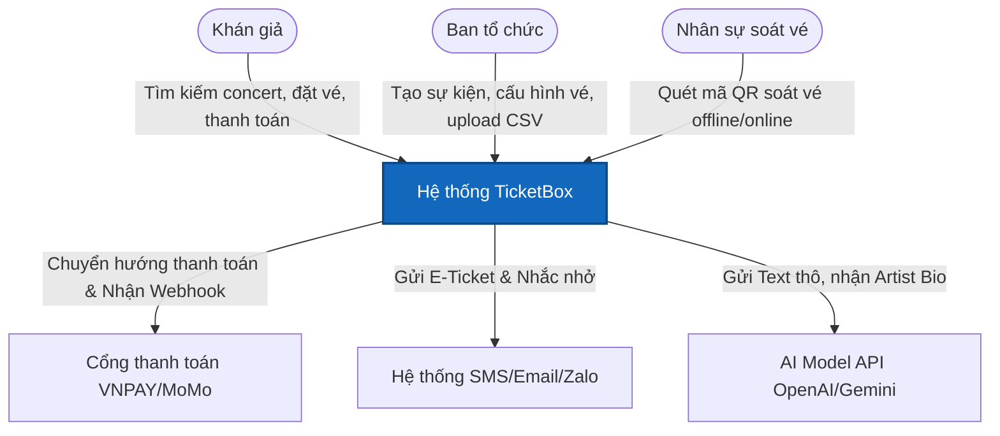
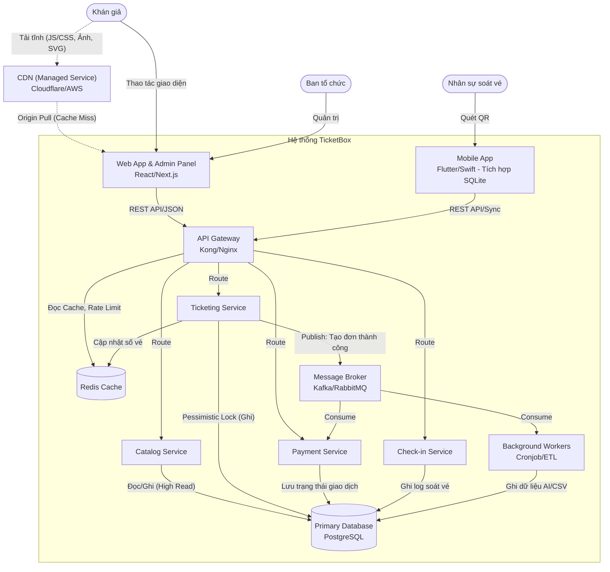
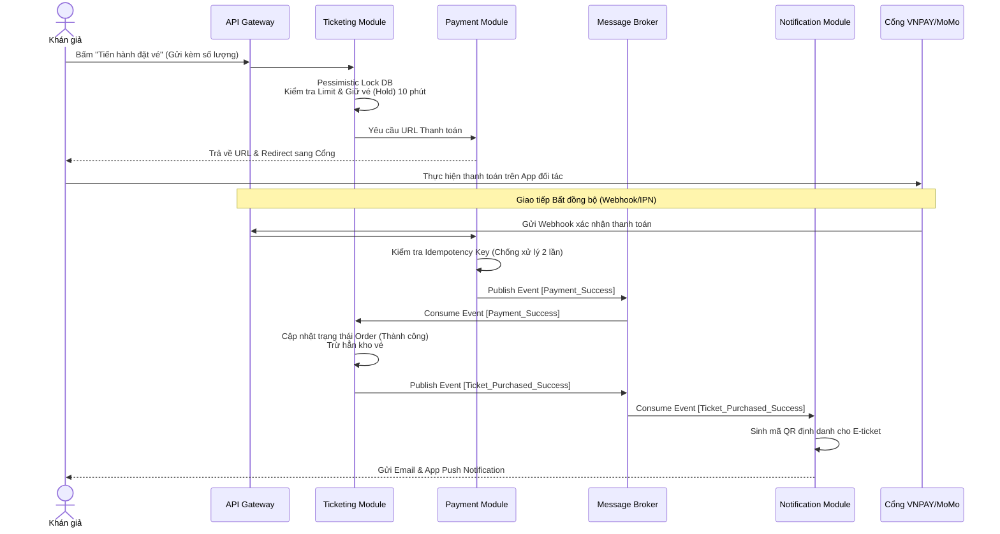
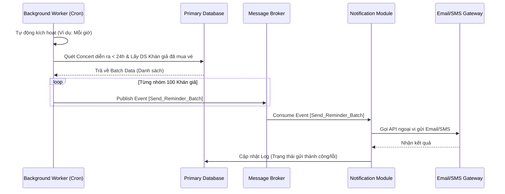
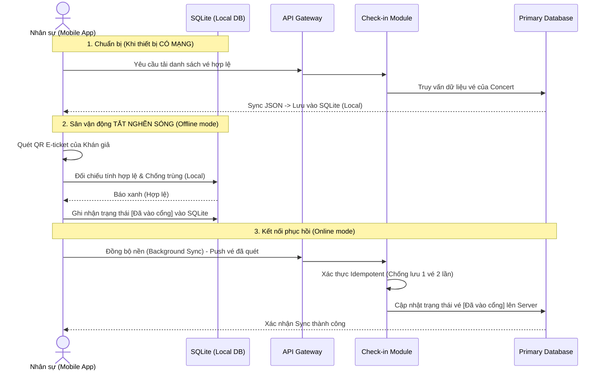
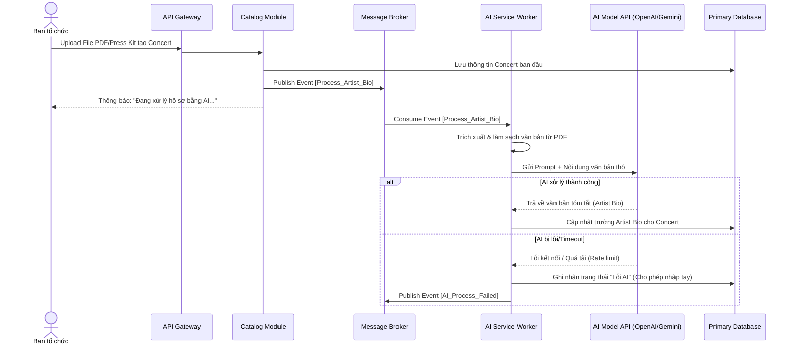
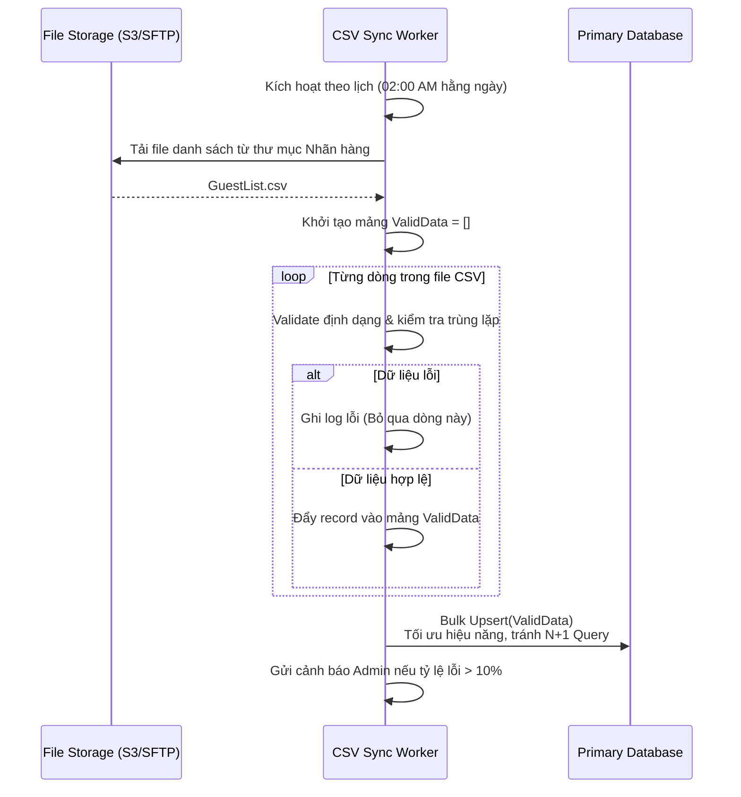
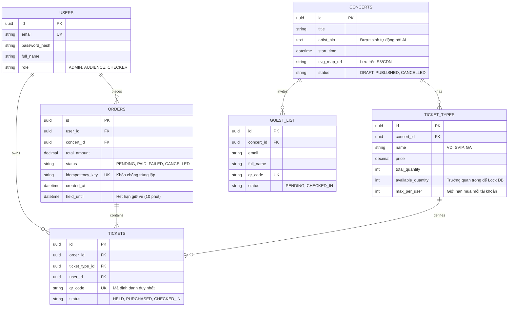

# TicketBox - Technical Design

## Kiến trúc tổng thể

Để đáp ứng các yêu cầu khắt khe về tải trọng, tính nhất quán dữ liệu và khả năng chịu lỗi, kiến trúc phù hợp nhất cho TicketBox là **Kiến trúc Hướng sự kiện kết hợp Modular Monlith (Event-Driven Modular Monolith)**.

Dưới đây là đề xuất chi tiết cho kiến trúc hệ thống:

### Các thành phần chính

Hệ thống được chia thành các lớp (layers) và dịch vụ (services) độc lập để dễ dàng mở rộng và bảo trì:

**Lớp Ứng dụng khách (Client Layer):**
* **CDN (Content Delivery Network):** Đóng vai trò cực kỳ quan trọng trong việc phục vụ các tài nguyên tĩnh (Ảnh nghệ sĩ, Sơ đồ SVG, CSS/JS). Giúp giảm tải băng thông mạng cho server chính khi có 80.000 users truy cập đồng thời.
* **Web App (Khán giả):** Ứng dụng dành cho khán giả xem thông tin và mua vé.
* **Admin Dashboard:** Cổng quản trị nội bộ dành cho Ban tổ chức tạo concert, cấu hình vé và xem thống kê.
* **Mobile App (Nhân sự soát vé):** Ứng dụng di động dùng để quét mã QR tại cổng, tích hợp Local DB (SQLite/Room/CoreData) để lưu trữ cục bộ và hoạt động offline.

**Lớp Giao tiếp (Gateway & API Management):**
* **API Gateway:** Chịu trách nhiệm điều phối request, kiểm tra quyền truy cập, và đóng vai trò như một chốt chặn bảo vệ backend bằng cơ chế Rate Limiting (chống bot, chặn spam).

**Lớp Module cốt lõi (Core Modules / Backend API):**
* **Catalog Module:** Quản lý thông tin concert, nghệ sĩ, sơ đồ chỗ ngồi. Module này chịu tải đọc cực cao.
* **Ticketing & Order Module:** Xử lý logic đặt vé, kiểm soát giới hạn số vé tối đa cho mỗi tài khoản và chống tranh chấp vé (Race condition).
* **Payment Module:** Tích hợp với VNPAY/MoMo, xử lý webhook và sinh Idempotency Key để chống trừ tiền hai lần.
* **Check-in Module:** Quản lý logic soát vé, đồng bộ dữ liệu vé ngoại tuyến từ Mobile App khi có mạng trở lại.

**Lớp Dữ liệu và Hàng đợi (Data & Queue Layer):**
* **Primary Database (RDBMS):** Đảm bảo tính toàn vẹn (ACID) cho dữ liệu đơn hàng và giao dịch thanh toán.
* **Caching (Redis):** Áp dụng Cache-aside để lưu trữ danh sách concert, chi tiết concert và số lượng vé còn lại nhằm giảm tải cho Database.
* **Message Broker (Kafka / RabbitMQ):** Đóng vai trò hàng đợi xử lý bất đồng bộ trong lúc tải đột biến (ví dụ: xếp hàng request đặt vé, gửi thông báo).

**Lớp Xử lý ngầm (Background Workers):**
* **AI Service Worker:** Nhận file PDF/Press kit, làm sạch văn bản và gọi mô hình AI để sinh bản giới thiệu nghệ sĩ (Artist Bio).
* **CSV Sync Worker:** Định kỳ chạy ngầm vào ban đêm để đọc, xử lý lỗi và nhập danh sách khách mời VIP từ file CSV mà không làm gián đoạn hệ thống.

### Cách các thành phần giao tiếp với nhau

Hệ thống kết hợp cả hai mô hình giao tiếp để cân bằng giữa hiệu suất và trải nghiệm người dùng:

* **Giao tiếp đồng bộ (Synchronous):** Sử dụng RESTful API hoặc gRPC cho các luồng cần phản hồi ngay lập tức như: Khán giả truy vấn danh sách concert, đăng nhập, hoặc lấy thông tin vé cá nhân. Các request này sẽ đi qua API Gateway, kiểm tra Cache, nếu miss sẽ chọc xuống Database và cập nhật lại Cache.
* **Giao tiếp bất đồng bộ (Asynchronous):** Sử dụng Message Broker. Trong 5 phút đầu mở bán với 80.000 lượt truy cập, request mua vé sẽ được API Gateway tiếp nhận, đi qua Ticketing Module để đẩy vào một hàng đợi (Queue). Ticketing Module xử lý dần để trừ vé và khóa chỗ, sau đó phát ra một sự kiện (Event) tới Payment Module và Notification Module để tiếp tục quy trình thanh toán và gửi email/app push.

**Bảng mô tả tác động khi một thành phần gặp sự cố:**

| Thành phần gặp sự cố | Hậu quả trực tiếp | Ảnh hưởng đến các thành phần khác | Trạng thái hệ thống tổng thể |
| --- | --- | --- | --- |
| **Cổng thanh toán (VNPAY/MoMo) lỗi/timeout** | Không thể xử lý giao dịch hoặc sinh webhook trả về. | Payment Module bị kẹt luồng xử lý. Các đơn hàng có phí bị kẹt. | **Graceful Degradation:** Hệ thống vẫn sống. Khán giả vẫn xem được thông tin concert và số vé còn lại bình thường. Các tính năng không liên quan đến thanh toán hoạt động tốt. |
| **Caching (Redis) sập** | Mất dữ liệu cache về số vé và thông tin concert. Mất cơ chế Rate Limiting. | Hàng nghìn request/giây sẽ dội thẳng trực tiếp vào Primary Database. | Rủi ro sập toàn bộ hệ thống nếu DB bị quá tải. (Cần có cơ chế Circuit Breaker chặn request tự động nếu Cache sập). |
| **Mất kết nối Internet tại cổng soát vé** | Mobile App không thể gọi API lên Check-in Module. | Ticketing Module và Database không nhận được trạng thái vé đã sử dụng theo thời gian thực. | Ứng dụng chuyển sang chế độ offline, ghi nhận soát vé tạm vào bộ nhớ cục bộ. Hệ thống trung tâm không bị ảnh hưởng, tự đồng bộ khi kết nối phục hồi. |
| **Message Broker sập** | Không thể đẩy request mua vé hoặc thông báo vào hàng đợi. | Ticketing Module không thể xử lý đơn đặt vé mới dưới tải cao. Notification Module không nhận được lệnh gửi email. | Luồng mua vé bị gián đoạn, khán giả nhận thông báo lỗi. Tuy nhiên, luồng xem thông tin concert và soát vé tại cổng vẫn hoạt động bình thường. |
| **CSV Sync Worker / AI Worker lỗi** | Không đọc được file danh sách VIP hoặc không sinh được Artist Bio. | Hệ thống không có danh sách khách mời mới nhất hoặc thông tin mô tả bị trống. | **Không gián đoạn:** Toàn bộ hệ thống lõi (mua vé, xem concert, soát vé thường) vẫn hoạt động bình thường. |

### Lý do lựa chọn kiến trúc đề xuất

Việc lựa chọn kiến trúc trên giải quyết trực tiếp các vấn đề kỹ thuật trọng tâm:

1. **Phân tách luồng Đọc/Ghi giúp giải quyết Tải đột biến:** Tách biệt rõ ràng việc đọc dữ liệu (phục vụ bằng Redis Cache để chịu hàng nghìn request/giây) và ghi dữ liệu (mua vé). Điều này giúp bảo vệ Database không bị quá tải khi trang chủ hoặc trang chi tiết bị truy cập mật độ cao.
2. **Đảm bảo tính toàn vẹn (Race Condition & Per-user limit):** Với đặc thù dự án yêu cầu xử lý đồng thời cực cao, hàng đợi (Message Broker) đóng vai trò như một bộ đệm (buffer) để xếp hàng tuần tự các request đặt vé. Điều này, kết hợp với cơ chế Database Locking (Pessimistic Locking) ở Ticketing Module, giúp hệ thống enforce chính xác giới hạn vé tối đa/tài khoản và không bao giờ cấp vé cuối cùng cho hai người.
3. **Khả năng chịu lỗi và cô lập sự cố (Fault Isolation):** Trong kiến trúc Modular Monolith, cô lập sự cố đến từ việc thiết lập ranh giới logic vững chắc (module boundaries) và kiểm soát ngoại lệ. Nếu đối tác VNPAY gặp sự cố mạng, cơ chế Circuit Breaker ở Payment Module sẽ chủ động ngắt kết nối (fail-fast) thay vì chờ đợi. Điều này ngăn chặn việc cạn kiệt tài nguyên hệ thống (thread pool/connection pool exhaustion) của toàn bộ tiến trình monolith, đảm bảo Catalog Module chạy trong cùng tiến trình vẫn có đủ tài nguyên để xử lý mượt mà luồng I/O đọc dữ liệu, giúp khán giả vẫn xem được thông tin concert bình thường.
4. **Hỗ trợ kiến trúc bảo mật chặt chẽ:** API Gateway tập trung giúp dễ dàng triển khai xác thực (Authentication), cấp quyền (RBAC cho admin) và bảo vệ hệ thống thông qua Rate Limiting (Token Bucket, Sliding Window) chặn bot spam request ngay từ vòng ngoài. Tận dụng tư duy về an toàn thông tin để đảm bảo endpoint nội bộ.
5. **Đáp ứng nghiệp vụ ngoại tuyến an toàn:** Việc tách bạch Check-in Service với API rõ ràng giúp Mobile App dễ dàng triển khai logic lưu trạng thái mã QR offline vào thiết bị (LocalDB/SQLite) và retry (thử lại) việc đồng bộ một cách an toàn mà không để lọt một vé vào cổng hai lần.

---

## C4 Diagram

### Level 1 — System Context
<!-- Sơ đồ: TicketBox + actors + hệ thống ngoài (VNPAY, MoMo, AI model, CSV nhãn hàng) -->

Sơ đồ System Context thể hiện ranh giới của hệ thống TicketBox và cách nó tương tác với người dùng (Actors) cũng như các hệ thống bên ngoài (External Systems).

**Chi tiết các thành phần ngoại vi (External Systems):**
*   **Cổng thanh toán (Payment Gateway):** Hệ thống độc lập của đối tác (VNPAY, MoMo). TicketBox chỉ chuyển hướng người dùng sang đây và lắng nghe IPN/Webhook trả về.
*   **Hệ thống thông báo:** Dịch vụ gửi Email (SendGrid/Amazon SES), SMS Gateway, hoặc Zalo OA API.
*   **AI Model API:** Dịch vụ của bên thứ ba cung cấp năng lực tóm tắt ngôn ngữ tự nhiên.

### Level 2 — Container
<!-- Sơ đồ: web app, mobile app soát vé, backend API, database, message broker, ... -->

Sơ đồ Container đi sâu vào bên trong (Zoom-in) Hệ thống TicketBox để xem các khối ứng dụng (Containers), nơi dữ liệu được lưu trữ và luồng giao tiếp giữa chúng.

**Mô tả các Container chính:**
*   **Web App (React/Next.js):** Ứng dụng Single Page hoặc Server-Side Rendering. Phục vụ khán giả mua vé và Ban tổ chức quản trị.
*   **Mobile App (Flutter/React Native):** Ứng dụng dành riêng cho nhân viên soát vé. Có tích hợp **SQLite/Room DB** cục bộ để tải trước danh sách vé hợp lệ, cho phép hoạt động và ghi nhận check-in ngay cả khi sân vận động mất sóng.
*   **API Gateway:** Điểm chạm duy nhất của Backend. Xử lý SSL, chặn Bot, áp dụng Rate Limiting và phân phối (routing) request đến các module bên dưới.
*   **Catalog Module:** Phục vụ dữ liệu tĩnh (tên concert, thời gian, sơ đồ). Thường xuyên chọc vào **Redis Cache** để trả về danh sách vé với độ trễ cực thấp.
*   **Ticketing Module:** Trái tim của hệ thống. Chịu trách nhiệm lock database (Pessimistic Locking) để tránh Race condition, tạo order, giữ vé tạm (Hold) và kiểm tra giới hạn per-user.
*   **Payment Module:** Quản lý giao dịch, tạo URL thanh toán, lắng nghe Webhook từ VNPAY/MoMo. Triển khai cơ chế Idempotency Key để chống trừ tiền 2 lần.
*   **Message Broker (RabbitMQ/Kafka):** Phân tải hệ thống. Thay vì bắt Ticketing Module phải chờ gọi API gửi Email hoặc lưu Log, nó chỉ ném một "Sự kiện" (Event) vào Broker rồi trả kết quả ngay cho người dùng.
*   **Background Workers:** Các script chạy ngầm. Phụ trách đọc file CSV định kỳ, lọc dữ liệu rác, và gọi API sang mô hình AI để xử lý văn bản PDF.

---

## High-Level Architecture Diagram
<!-- Sơ đồ luồng dữ liệu, đặc biệt tại các điểm tích hợp và luồng soát vé offline -->

### Luồng Thanh toán, Sinh E-ticket và Gửi Email xác nhận (Asynchronous)

Sử dụng Message Broker để tách biệt hoàn toàn việc ghi nhận dòng tiền (Payment) khỏi việc chốt vé và gửi thông báo. Giúp hệ thống không bị treo nếu dịch vụ Email bên thứ 3 phản hồi chậm.

### Luồng Thông báo nhắc nhở tự động (Cronjob Worker)

Sử dụng Worker chạy ngầm để quét cơ sở dữ liệu định kỳ, không làm ảnh hưởng đến các API phục vụ người dùng.

### Luồng Soát vé Ngoại tuyến (Offline Check-in & Sync)

Luồng này đảm bảo nhân viên soát vé có thể làm việc không gián đoạn trong môi trường sân vận động mất mạng, và không có chiếc vé nào bị bỏ lọt hoặc đồng bộ trùng lặp khi có mạng trở lại.

### Luồng Tích hợp AI sinh Artist Bio (Asynchronous Worker) 
Việc gọi API sang mô hình AI có thể mất từ vài giây đến hàng chục giây. Việc sử dụng Message Broker giúp Ban tổ chức không phải chờ đợi trình duyệt tải vòng vòng.

### Luồng Đồng bộ danh sách khách mời VIP từ CSV (Batch Processing) 
Thiết kế luồng ETL (Extract, Transform, Load) một chiều. Đảm bảo một dòng lỗi trong file CSV sẽ không làm chết toàn bộ tiến trình. 

---

## Thiết kế cơ sở dữ liệu
<!-- Loại database, lý do lựa chọn, schema các entity chính -->

Để đáp ứng cả hai yêu cầu khắt khe là **tính nhất quán tuyệt đối (chống bán lố vé)** và **hiệu năng cực cao (đáp ứng 80.000 users/5 phút)**, TicketBox áp dụng chiến lược đa cơ sở dữ liệu (Polyglot Persistence).

### 1. Phân tích đặc điểm dữ liệu và Lựa chọn Database

| Loại dữ liệu | Đặc điểm & Yêu cầu | Loại Database đề xuất | Công nghệ cụ thể |
| --- | --- | --- | --- |
| **Dữ liệu Cốt lõi & Giao dịch** (Tài khoản, Concert, Đơn hàng, Vé thực tế, Thanh toán) | Đòi hỏi tính toàn vẹn dữ liệu cực cao (chuẩn ACID). Cần tính cấu trúc và quan hệ chặt chẽ (Relational). Đặc biệt yêu cầu hỗ trợ **Locking (Pessimistic Lock)** cấp độ dòng (Row-level) để giải quyết triệt để tranh chấp vé (Race Condition). | Cơ sở dữ liệu quan hệ (RDBMS) | **PostgreSQL** |
| **Dữ liệu Truy xuất tốc độ cao** (Số lượng vé còn lại real-time, Caching thông tin Concert, Rate Limit, Idempotency Key) | Tốc độ đọc/ghi phải cực thấp (tính bằng mili-giây). Dữ liệu có thể mang tính tạm thời (TTL). Phải chịu được hàng chục nghìn request truy vấn cùng lúc mà không làm sập DB chính. | Cơ sở dữ liệu Key-Value (In-memory) | **Redis** |
| **Dữ liệu Ngoại tuyến (Offline)** (Danh sách mã vé hợp lệ tải trước, Lịch sử check-in tạm thời) | Lưu trữ trực tiếp trên thiết bị di động của nhân viên soát vé. Hỗ trợ truy vấn và ghi nhận dữ liệu độc lập không cần mạng Internet. | Cơ sở dữ liệu cục bộ (Embedded/Local DB) | **SQLite**  |
| **Dữ liệu File tĩnh (Blob)** (Ảnh nghệ sĩ, File PDF Press Kit, File CSV Khách mời, Sơ đồ chỗ ngồi SVG) | Kích thước file lớn, dữ liệu phi cấu trúc. Cần kết hợp chặt chẽ với CDN để phân phối đến hàng chục nghìn khán giả cùng lúc mà không nghẽn băng thông máy chủ. | Object Storage | **AWS S3** / **MinIO** |

*(Lưu ý: Vì hệ thống áp dụng kiến trúc Modular Monolith, tất cả các module nội bộ (Catalog, Ticketing, Payment, Check-in) sẽ dùng chung cơ sở dữ liệu PostgreSQL. Tuy nhiên, các bảng (Tables) sẽ được thiết kế phân tách rõ ràng theo ranh giới Domain (Schema) để giữ tính độc lập cao nhất có thể).*

### 2. Database Schema (Các Entity chính)
<!-- Schema các entity chính -->

Sơ đồ dưới đây tập trung vào cơ sở dữ liệu **PostgreSQL** (chứa dữ liệu cốt lõi). 

**Mô tả chi tiết các bảng và Thiết kế giải quyết rủi ro:**

#### 1. Bảng `users` (Tài khoản)
*   Lưu trữ thông tin người dùng. Phân quyền thông qua trường `role` (`ADMIN`, `AUDIENCE`, `CHECKER`).

#### 2. Bảng `concerts` (Sự kiện) và `ticket_types` (Loại vé)
*   `concerts.artist_bio`: Lưu trữ đoạn văn bản giới thiệu nghệ sĩ do Background Worker (gọi AI) trả về.
*   `ticket_types.available_quantity`: **Đóng vai trò then chốt trong việc chống bán lố vé.** Khi có request đặt vé, Ticketing Module sẽ sử dụng truy vấn `SELECT ... FOR UPDATE` (Pessimistic Locking) trên dòng dữ liệu này. Hệ thống sẽ kiểm tra xem `available_quantity >= request_quantity` không, sau đó trừ thẳng và `COMMIT`. Database đảm bảo các request đến cùng mili-giây sẽ được xếp hàng tuần tự.
*   `ticket_types.max_per_user`: Cấu hình giới hạn để Ticketing Module đếm tổng số vé người dùng đã sở hữu trước khi cho phép tạo `ORDERS` mới.

#### 3. Bảng `orders` (Đơn hàng)
*   `status`: Có các trạng thái `PENDING` (Đang thanh toán), `PAID` (Đã trả tiền), `FAILED/CANCELLED` (Lỗi/Hết hạn).
*   `idempotency_key` (Unique): **Vũ khí chống trừ tiền và xuất vé 2 lần**. Khóa này sinh ra 1 lần duy nhất từ Client khi khán giả bấm nút "Thanh toán". Nếu Client bấm 2 lần do lag mạng, hoặc VNPAY gửi Webhook về 2 lần, thao tác Insert/Update vào DB sẽ bị dội ngược (Conflict Unique Constraint), giúp ngắt ngay luồng xử lý trùng lặp.
*   `held_until`: Đóng vai trò là TTL (Time-To-Live). Một Background Worker sẽ định kỳ quét các đơn `PENDING` có `held_until` nhỏ hơn thời gian hiện tại. Khi phát hiện, hệ thống tự động cập nhật trạng thái đơn thành `CANCELLED`, thu hồi các `TICKETS` liên quan, và hoàn trả số lượng vé về `available_quantity` ở bảng `TICKET_TYPES`.

#### 4. Bảng `tickets` (Vé thực tế)
*   Đại diện cho 1 chiếc vé vật lý/e-ticket. 
*   `status` chuyển từ `HELD` (Đang giữ chỗ - có thể bị thu hồi nếu Order timeout 10 phút) sang `PURCHASED` (Khi thanh toán xong) và `CHECKED_IN` (Khi soát vé thành công).
*   Trường `qr_code` là duy nhất và được mã hóa (Signature) để Mobile App có thể xác thực tính nguyên vẹn (Integrity) khi làm việc hoàn toàn Offline mà không sợ vé giả.

#### 5. Bảng `guest_list` (Khách mời VIP)
*   Bảng này được tách biệt hoàn toàn khỏi `tickets` và `orders` để đảm bảo luồng Worker đọc file CSV và thực hiện Bulk Upsert ban đêm sẽ **không gây Deadlock** hay ảnh hưởng đến hiệu năng của các bảng bán vé lõi đang phục vụ khán giả trực tiếp.

---

## Thiết kế kiểm soát truy cập
<!-- Mô hình phân quyền, các nhóm người dùng, cách kiểm tra quyền tại từng điểm truy cập -->

Hệ thống TicketBox sử dụng mô hình **Role-Based Access Control (RBAC)** kết hợp với **JSON Web Token (JWT)** để quản lý định danh và phân quyền. Việc sử dụng JWT (Stateless) giúp API Gateway dễ dàng xác thực người dùng dựa trên chữ ký mà không cần truy vấn Database liên tục, đáp ứng tốt yêu cầu chịu tải cao của hệ thống.

### 1. Phân định các nhóm người dùng (Roles) và Quyền hạn (Permissions)

| Nhóm người dùng (Role) | Mô tả vai trò | Quyền hạn tương ứng (Permissions) |
| --- | --- | --- |
| **GUEST** *(Chưa đăng nhập)* | Khách vãng lai truy cập Web/App | • Xem danh sách Concert. • Xem chi tiết Concert và sơ đồ SVG. • Xem số lượng vé còn lại. |
| **AUDIENCE** *(Khán giả)* | Người dùng đã đăng ký tài khoản | • Tất cả quyền của GUEST. • Đặt vé và thực hiện Thanh toán. • Xem lịch sử giao dịch và E-ticket cá nhân. |
| **CHECKER** *(Nhân sự soát vé)* | Nhân viên làm việc tại cổng sự kiện | • Đăng nhập vào Mobile App Soát vé. • Tải trước danh sách mã QR vé hợp lệ (Offline Mode). • Quét QR và gọi API Check-in vé trực tiếp (Online Mode). • Thực hiện đồng bộ dữ liệu soát vé từ Local DB lên Server. |
| **ADMIN** *(Ban tổ chức)* | Quản trị viên hệ thống nội bộ | • Đăng nhập vào Admin Dashboard. • Tạo mới, cập nhật, hủy Concert. • Cấu hình các Loại vé (Giá, số lượng mở bán, giới hạn trên mỗi user). • Upload file PDF AI để sinh Artist Bio. • Tải lên file CSV danh sách khách VIP. • Xem thống kê dashboard doanh thu và lượng vé bán ra. |

### 2. Luồng kiểm tra quyền tại từng điểm truy cập

Để đảm bảo bảo mật nhiều lớp, hệ thống thực hiện kiểm tra phân quyền chặt chẽ tại 3 cấp độ khác nhau:

#### Cấp độ 1: API Gateway
*   **Cơ chế:** Bất kỳ request nào nhắm đến các route được bảo vệ đều phải đính kèm chuỗi JWT trong Header (`Authorization: Bearer <token>`). API Gateway sẽ tự động xác thực chữ ký (Signature) và thời hạn (Expiration) của Token.
*   **Thực thi:** Gateway sẽ giải mã Payload của JWT để đọc trường `role`. Dựa vào file cấu hình định tuyến (Routing Rule / ACL), nó sẽ cho qua hoặc chặn lại.

#### Cấp độ 2: Module Backend 
*   **Cơ chế:** Khi request vượt qua Gateway, Module nội bộ không chỉ tin vào `role` mà còn tiến hành kiểm tra **Quyền sở hữu dữ liệu (Data Ownership)**.
*   **Thực thi:** 
    *   *Ví dụ:* Một Khán giả gọi API lấy chi tiết E-ticket `/api/v1/tickets/{ticket_id}`. Ticketing Module sẽ trích xuất `user_id` từ Token và so sánh với trường `user_id` thực tế được gán cho chiếc vé đó trong Database. Nếu không khớp, trả về `403 Forbidden`. Việc này ngăn chặn tuyệt đối tình trạng một tài khoản `AUDIENCE` đi mò mẫm tham số ID để đánh cắp mã QR của người khác.

#### Cấp độ 3: Ứng dụng Frontend Web & Mobile (UI/UX)
*   **Cơ chế:** Máy khách (Browser / Mobile App) sẽ decode JWT (không cần private key) để biết user đang giữ `role` gì và tiến hành ẩn/hiện chức năng phù hợp.
*   **Thực thi:**
    *   **Web Khán giả:** Giao diện chỉ cho phép bấm nút "Tiến hành thanh toán" nếu JWT hợp lệ (Đã đăng nhập). Nếu Token hết hạn (Hết phiên session), UI tự động chuyển hướng về trang đăng nhập.
    *   **Mobile App Check-in:** Ứng dụng kiểm tra xem `role` của người đăng nhập có phải là `CHECKER` hay không. Nếu nhập tài khoản của khán giả thông thường, ứng dụng sẽ báo lỗi "Tài khoản không được hỗ trợ trên thiết bị này". Khi tải được vé offline, Token cũng được lưu cục bộ để Checker không bị văng ra ngoài màn hình login khi mất mạng.

---

## Thiết kế các cơ chế bảo vệ hệ thống

### Kiểm soát tải đột biến
<!-- Giải pháp, thuật toán, ngưỡng, hành vi khi vượt ngưỡng -->

Để giải quyết bài toán 80.000 khán giả truy cập trong 5 phút đầu (70% dồn vào phút đầu tiên), hệ thống cần triệt tiêu các request rác (do spam click hoặc bot đầu cơ) ngay từ vòng ngoài cùng.

*   **Giải pháp:** Triển khai cơ chế **Rate Limiting** tại tầng API Gateway, sử dụng **Redis** làm nơi lưu trữ bộ đếm (counter) siêu tốc.
*   **Thuật toán lựa chọn:** **Token Bucket**.
    *   *Lý do:* Khác với Fixed Window (dễ bị nghẽn ở khoảng giao thời giữa 2 chu kỳ) hay Leaky Bucket (xử lý đều đặn nhưng chậm), Token Bucket cho phép "tải đột biến cục bộ" (burst traffic). Nếu một người dùng bấm F5 liên tục 3 lần trong 1 giây, hệ thống vẫn cho qua nếu xô vẫn còn token, nhưng sẽ chặn đứng nếu họ dùng tool spam 50 lần/giây. Điều này rất phù hợp với hành vi cuống cuồng bấm "Mua vé" của khán giả thật.
*   **Cấu hình Ngưỡng (Thresholds) đa cấp độ:**
    1.  **Cấp độ Global (Chống DDoS/Bot theo IP):** Giới hạn tối đa `200 requests / 1 phút / 1 IP` đối với các luồng xem trang chủ và xem chi tiết Concert.
    2.  **Cấp độ Nghiệp vụ lõi (Chống đầu cơ vé theo User ID):** Giới hạn khắt khe tối đa `3 requests / 1 phút / 1 User ID` đối với API `/api/v1/orders` (Nút bấm Tiến hành thanh toán).
*   **Hành vi hệ thống khi vượt ngưỡng:**
    *   API Gateway lập tức từ chối request, trả về mã lỗi HTTP `429 Too Many Requests` mà không cần gọi xuống Backend Module.
    *   Trong Response Header sẽ trả về `Retry-After: <số giây>` để báo cho Frontend biết khi nào được gọi lại.

### Xử lý cổng thanh toán không ổn định
<!-- Giải pháp, các trạng thái, ngưỡng kích hoạt, hành vi khi lỗi -->

Hệ thống thanh toán của bên thứ ba (VNPAY/MoMo) có thể bị nghẽn mạng, phản hồi chậm (timeout) hoặc sập hoàn toàn. Nếu TicketBox tiếp tục gửi request và chờ đợi, các luồng xử lý (threads) của hệ thống sẽ bị treo, dẫn đến cạn kiệt tài nguyên và sập toàn bộ trang web.

*   **Giải pháp:** Áp dụng mẫu thiết kế **Circuit Breaker** tại lớp Payment Module để cắt đứt liên kết với dịch vụ đang bị lỗi, áp dụng cơ chế **Fail Fast** (Báo lỗi ngay lập tức thay vì chờ).
*   **Cách hoạt động (3 trạng thái):**
    1.  **Closed:** Mạch đóng, request tạo thanh toán được chuyển tiếp đến VNPAY/MoMo bình thường.
    2.  **Open:** Khi lỗi vượt ngưỡng, mạch mở. Hệ thống lập tức trả về lỗi cho người dùng mỗi khi họ bấm thanh toán mà không cần chọc gọi sang API của đối tác.
    3.  **Half-Open:** Sau một khoảng thời gian chờ nhất định (vd: 30s), mạch cho phép một số lượng nhỏ request lọt qua để "thăm dò". Nếu các request này thành công, cổng thanh toán đã ổn định, mạch quay về *Closed*. Nếu vẫn lỗi, mạch bật lại *Open*.
*   **Ngưỡng kích hoạt cấu hình (Ví dụ):**
    *   Thời gian chờ tối đa (Timeout): `5 giây` cho mỗi request gọi sang cổng.
    *   Tỷ lệ lỗi (Failure Rate Threshold): `> 50%` request bị lỗi hoặc timeout trong một khung thời gian (Sliding Window) 10 giây (với tối thiểu 20 request được ghi nhận).
*   **Hành vi hệ thống khi lỗi (Graceful Degradation):**
    *   **Cách ly sự cố:** Việc thanh toán lỗi không làm sập Database. Người dùng khác vẫn truy cập xem thông tin Concert và Soát vé bình thường.
    *   **Trải nghiệm người dùng:** Khán giả đang đặt vé sẽ nhận được thông báo lịch sự: *"Cổng thanh toán đối tác hiện đang bảo trì hoặc quá tải. Vui lòng thử lại sau ít phút hoặc đổi phương thức thanh toán."*
    *   **Hoàn trả vé:** Lệnh giữ vé (`HELD`) của những khán giả không thể thanh toán do Circuit Breaker sẽ không bị giam vĩnh viễn, mà sẽ được tự động trả lại kho (`available_quantity`) khi hết TTL 10 phút.

### Chống trừ tiền hai lần
<!-- Cơ chế, nơi lưu trữ, TTL, luồng xử lý khi phát hiện trùng lặp -->

Vấn đề phổ biến trong thanh toán là người dùng bấm nút "Xác nhận mua" 2-3 lần do lag mạng, hoặc VNPAY/MoMo gọi Webhook báo thành công nhiều lần cho cùng một giao dịch. Nếu không kiểm soát, khán giả sẽ bị tạo 2 đơn hàng, trừ tiền 2 lần hoặc hệ thống cấp 2 vé cho 1 lần trả tiền.

*   **Giải pháp:** Áp dụng cơ chế **Idempotency Key**. Cơ chế này đảm bảo một API dù bị gọi bao nhiêu lần với cùng một tham số thì kết quả hệ thống (trạng thái DB, số dư) chỉ thay đổi đúng một lần duy nhất.
*   **Cơ chế sinh khóa (Key Generation):**
    *   **Luồng tạo đơn:** Frontend tự động sinh một mã UUID (Idempotency-Key) khi khán giả bắt đầu vào màn hình thanh toán. Khóa này được đính kèm vào Header của request API `/orders`.
    *   **Luồng nhận Webhook:** Khóa sẽ là sự kết hợp giữa `OrderID` của TicketBox và `TransactionID` do cổng thanh toán trả về.
*   **Nơi lưu trữ và TTL:**
    *   **Lớp 1 (Truy xuất nhanh):** Lưu tại **Redis** với TTL là **24 giờ** (đủ để bao phủ mọi thời gian chờ và vòng lặp retry Webhook của đối tác). Giá trị lưu trữ bao gồm trạng thái xử lý (IN_PROGRESS, COMPLETED) và payload response cũ.
    *   **Lớp 2 (Tuyệt đối):** Cấu hình ràng buộc `UNIQUE` trên cột `idempotency_key` ở bảng `orders` và bảng lưu log Webhook trong **PostgreSQL**.
*   **Luồng xử lý khi phát hiện trùng lặp:**
    1.  Khi request tới, Payment Module kiểm tra khóa trong Redis.
    2.  Nếu khóa **chưa tồn tại**: Tạo khóa trên Redis với trạng thái `IN_PROGRESS`. Thực hiện logic giữ vé, gọi API thanh toán. Thành công thì cập nhật Redis thành `COMPLETED` kèm dữ liệu hóa đơn.
    3.  Nếu khóa **đã tồn tại** và trạng thái là `IN_PROGRESS`: Hệ thống lập tức trả về lỗi HTTP 409 Conflict hoặc 400 Bad Request: *"Giao dịch của bạn đang được xử lý, vui lòng không gửi lại"*. Ngăn chặn việc chạy logic 2 lần song song.
    4.  Nếu khóa **đã tồn tại** và trạng thái là `COMPLETED`: Hệ thống bỏ qua toàn bộ logic ghi DB, không gọi cổng thanh toán nữa, mà lấy trực tiếp kết quả đã lưu trong Redis để trả về ngay HTTP 200 OK cho Client (Client không hề biết request của mình là request thừa).
    5.  **Fallback (Dự phòng):** Nếu Redis bị trôi dữ liệu, thao tác Insert vào PostgreSQL với cùng `idempotency_key` sẽ văng lỗi `Unique Constraint Violation`. Database sẽ tự động Rollback Transaction, tiền không bị trừ và vé không bị mất.

### Caching
<!-- Xác định các đối tượng cần cache (danh sách concert, chi tiết concert, số vé còn lại).
     Chiến lược: Cache-aside, Write-through hay Write-back?
     TTL cho từng loại. Cách invalidate khi dữ liệu thay đổi (đặc biệt: số vé sau mỗi giao dịch). -->

Trong thời điểm mở bán, 80.000 người dùng liên tục tải lại trang chủ và trang chi tiết Concert. Nếu toàn bộ lưu lượng này đi thẳng xuống PostgreSQL, cơ sở dữ liệu sẽ sập ngay lập tức do quá tải tác vụ đọc (Read-heavy). Redis được sử dụng với các chiến lược linh hoạt:

*   **1. Dữ liệu tĩnh (Danh sách Concert, Chi tiết, Sơ đồ SVG):**
    *   **Chiến lược:** **Cache-aside (Lazy Loading)**. Request đọc sẽ tìm trong Redis trước; nếu Cache Miss (không có), hệ thống mới truy vấn Database lấy dữ liệu, sau đó ghi ngược lên Redis cho các request sau.
    *   **TTL (Thời gian tồn tại):** Dài (1 - 24 giờ).
    *   **Cơ chế Invalidate (Làm mới):** Chủ động (Active Invalidation). Bất cứ khi nào Ban tổ chức cập nhật thông tin Concert từ trang Admin, hệ thống sẽ tự động xóa (Evict) key tương ứng trong Redis để dữ liệu được làm mới ngay lập tức.

*   **2. Dữ liệu động (Số lượng vé còn lại):**
    *   **Thách thức:** Con số này thay đổi liên tục nhưng lại bị hàng chục nghìn người xem cùng một lúc.
    *   **Chiến lược:** Chấp nhận tính nhất quán cuối (Eventual Consistency) ở phần hiển thị giao diện. (Lưu ý: Tính toàn vẹn nghiệp vụ chống mua lố vé đã được Pessimistic Lock ở DB bảo vệ tuyệt đối, nên việc UI có thể hiển thị sai lệch vài giây không gây lỗi bán lố vé).
    *   **TTL (Thời gian tồn tại):** Rất ngắn (5 - 10 giây). Nhờ vậy, dù có 10.000 người F5 trang xem số vé trong 10 giây, Database cũng chỉ phải xử lý đúng 1 câu lệnh `SELECT`.
    *   **Cơ chế Invalidate & Tối ưu (Cập nhật chủ động):** Để giao diện nhảy số nhanh (Real-time) hơn thay vì đợi hết TTL 10 giây, Ticketing Module sau khi thực hiện chốt đơn thành công ở Database có thể gửi thêm một lệnh `DECRBY <số_lượng_vé_đã_mua>` vào Redis. Điều này giúp đồng bộ số liệu gần như tức thời về mặt thị giác cho những người đang đứng đợi.

*   **3. Phiên đăng nhập (Session/JWT Denylist):**
    *   Mặc dù hệ thống dùng JWT (Stateless), Redis vẫn được dùng để lưu trữ danh sách các Token bị thu hồi (Denylist) khi người dùng chủ động Đăng xuất (Logout) hoặc khi Admin cấm (Ban) một tài khoản gian lận. Token sẽ bị lưu trữ tại đây với mức TTL bằng chính thời gian sống còn lại của JWT đó.

---

## Các quyết định kỹ thuật quan trọng (ADR)

Dưới đây là các tài liệu ghi nhận quyết định kiến trúc (Architecture Decision Records) lý giải tại sao hệ thống lại được thiết kế như hiện tại:

### ADR 1: Kiến trúc Event-Driven Modular Monolith (Thay vì Microservices)
*   **Lựa chọn:** Xây dựng hệ thống trong 1 khối code (Monolith) nhưng chia module cực kỳ nghiêm ngặt, kết hợp với Message Broker.
*   **Lý do:** Giữ được ranh giới rõ ràng của các Domain (Catalog, Ticketing, Payment) như Microservices, nhưng tránh được độ phức tạp về hạ tầng DevOps và quản trị Giao dịch phân tán (Distributed Transactions).
*   **Đánh đổi:** Không thể scale rạch ròi từng module một cách độc lập (Ví dụ: scale riêng mỗi Ticketing khi tải cao) mà phải scale toàn bộ cục Monolith.

### ADR 2: Cơ sở dữ liệu quan hệ & Pessimistic Locking (Thay vì NoSQL / Optimistic Locking)
*   **Lựa chọn:** Dùng **PostgreSQL** và **Pessimistic Locking**  (`SELECT ... FOR UPDATE`).
*   **Lý do:** Yêu cầu tiên quyết của việc bán vé là **tuyệt đối không bán lố vé**. Optimistic Locking sẽ sinh ra quá nhiều lỗi văng ra cho khán giả (bắt họ thử lại) khi có chục nghìn người cùng mua một loại vé. Pessimistic Locking xếp hàng giao dịch ngay tại DB, xử lý tuần tự và chính xác 100%. NoSQL không hỗ trợ transaction/locking đủ mạnh cho nghiệp vụ này.
*   **Đánh đổi:** Hiệu năng ghi (Write Performance) của DB sẽ bị giảm do phải chờ lock. Điều này được bù đắp bằng cách dùng Message Broker để làm bộ đệm (buffer) nhốt traffic lại ở hàng đợi.

### ADR 3: Quản lý phiên bằng JWT Stateless (Thay vì Stateful Session)
*   **Lựa chọn:** Sử dụng **JSON Web Token (JWT)** để định danh và phân quyền.
*   **Lý do:** Hệ thống yêu cầu tốc độ xử lý ở API Gateway phải cực nhanh để cản traffic rác. JWT cho phép API Gateway xác thực chữ ký và vai trò (Role) cục bộ mà không cần phải mở kết nối xuống Database hay Cache liên tục.
*   **Đánh đổi:** Không thể thu hồi (revoke) token ngay lập tức nếu chỉ dựa vào JWT. Khắc phục bằng cách duy trì một Denylist nhỏ trên Redis cho các trường hợp logout/ban tài khoản.

### ADR 4: Tích hợp Background Workers (Thay vì gọi API đồng bộ)
*   **Lựa chọn:** Xử lý AI, gửi Email và import CSV bằng các tiến trình chạy ngầm (Workers) đọc từ Message Broker thay vì xử lý trực tiếp trên request của người dùng.
*   **Lý do:** Các tác vụ này nặng, phụ thuộc vào bên thứ 3 (OpenAI, Email Gateway) và dễ bị timeout. Đẩy ra Worker giúp API trả về phản hồi tính bằng mili-giây, cô lập hoàn toàn sự cố (AI lỗi thì web vẫn bán vé bình thường).
*   **Đánh đổi:** Tăng độ phức tạp của hệ thống (phải dựng thêm worker, theo dõi trạng thái bất đồng bộ).

---

### Bảng tổng hợp Công nghệ sử dụng

Dựa trên các quyết định kiến trúc, dưới đây là danh sách công nghệ (Tech Stack) đề xuất để cài đặt hệ thống:

| Lớp (Layer) / Thành phần | Công nghệ đề xuất | Vai trò & Lý do lựa chọn |
| --- | --- | --- |
| **Frontend (Web)** | **Next.js/React (App Router)** | Phát triển trang chủ, chi tiết Concert và Admin Dashboard. Hỗ trợ SSR (Server-Side Rendering) tốt cho SEO và chịu tải. |
| **Frontend (Mobile)** | **React Native (Expo)** | Phù hợp với kiến thức của các thành viên  |
| **API Gateway** | **Nginx** | Chịu trách nhiệm Rate Limiting (Token Bucket), Routing và Verify JWT. Nginx đơn giản hơn cho reverse proxy. Kong mạnh nhưng cần setup riêng, thêm một service phải quản lý. |
| **Backend Framework** | **NestJS (Node.js/TypeScript)** | Xây dựng các Module nghiệp vụ. Phù hợp cực tốt cho các luồng I/O-intensive bất đồng bộ. NestJS có Module system built-in, decorator-based, rất phù hợp để implement Modular Monolith một cách có cấu trúc. TypeScript giúp bắt lỗi sớm. |
| **Primary Database** | **PostgreSQL** | Lưu trữ toàn bộ dữ liệu cốt lõi, đảm bảo ACID, hỗ trợ Row-level locking cực mạnh. |
| **In-memory Cache** | **Redis** | Xử lý Rate Limiting, Idempotency Key, Cache thông tin Concert và đếm số vé Real-time để giảm tải cho DB. |
| **Local Database** | **SQLite** | Nhúng trực tiếp vào Mobile App, cho phép truy vấn và soát vé ngay cả khi điện thoại hoàn toàn mất mạng (Offline mode). |
| **Message Broker** | **RabbitMQ** | Hàng đợi sự kiện. Giảm xóc cho hệ thống dưới tải đột biến, tách bạch các luồng thanh toán và thông báo. RabbitMQ đơn giản hơn, dễ setup, dễ debug, phù hợp với task queue (gửi email, xử lý CSV). Trong khi Kafka được thiết kế cho throughput hàng triệu message/giây và event streaming lâu dài. overkill cho đồ án|
| **Object Storage / CDN** | **MinIO** + **Cloudflare** | Lưu trữ và phân phối siêu tốc các file tĩnh (Ảnh nghệ sĩ, SVG sơ đồ, Press Kit, CSV) với băng thông lớn. AWS S3 yêu cầu account và billing. MinIO chạy local/Docker, API tương thích S3, dễ demo. AWS CloudFront phức tạp hơn và có chi phí. Cloudflare free tier đủ cho demo.|
| **AI Model** | **OpenAI API(gpt-4o-mini)** | Tích hợp theo luồng Worker chạy ngầm để sinh văn bản tóm tắt Artist Bio. Rẻ hơn GPT-4, OpenAI SDK thuần thục hơn, ít config hơn.|
