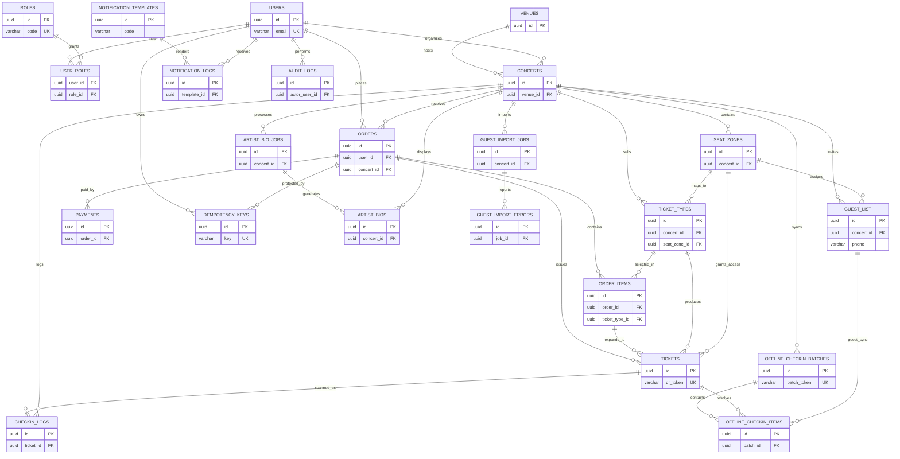
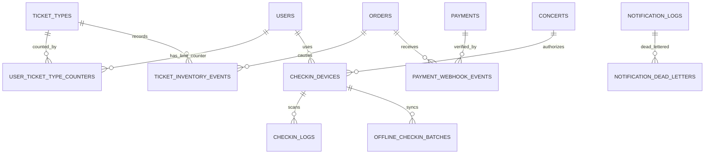

# database-design.md

# Thiết kế cơ sở dữ liệu TicketBox

## Giả định thiết kế

- Dữ liệu concert, venue, ticket type trong `seed.sql` là dữ liệu mẫu phục vụ demo, không phải dữ liệu thật ngoài đời.
- Backend sẽ thực hiện transaction khi đặt vé: khóa dòng `ticket_types`, kiểm tra kho, kiểm tra per-user limit, tạo order và order_items trong cùng transaction.
- QR offline dùng `qr_token` và `qr_signature`; phần tạo/chứng thực chữ ký nằm ở backend/mobile app, database chỉ lưu token và chữ ký.
- Redis, SQLite mobile, object storage và message broker là thành phần hỗ trợ; PostgreSQL là database chính cho dữ liệu giao dịch.

# PHẦN A — TỔNG QUAN THIẾT KẾ CƠ SỞ DỮ LIỆU

## A.1. Loại database đề xuất

Database chính đề xuất: **PostgreSQL**.

Lý do chọn PostgreSQL:
- Dữ liệu TicketBox có quan hệ chặt chẽ giữa user, role, concert, ticket type, order, payment, ticket và check-in.
- Luồng mua vé cần transaction để giữ vé, trừ kho, tạo đơn và phát hành vé theo một chuỗi nhất quán.
- Khóa ngoại giúp đảm bảo order không trỏ tới user/concert/ticket type không tồn tại.
- Unique constraint hỗ trợ chống trùng email, QR token, provider transaction id, idempotency key và guest list theo `(concert_id, phone)`.
- Row-level locking trên `ticket_types` giúp chống oversell khi nhiều người mua cùng lúc.
- PostgreSQL phù hợp cho order, payment, ticket, check-in, guest list và audit log vì cần tính toàn vẹn cao.

Thành phần hỗ trợ ngoài database chính:
- **Redis**: cache danh sách/chi tiết concert, số vé còn lại TTL ngắn, rate limit và idempotency key ngắn hạn.
- **SQLite trên mobile app**: lưu tạm check-in offline và đồng bộ lại khi có mạng.
- **Object Storage**: lưu PDF/Press Kit và ảnh concert; PostgreSQL chỉ lưu URL/metadata.
- **Message Broker**: xử lý notification, AI job, import job bất đồng bộ.

# PHẦN B — DANH SÁCH BẢNG CẦN THIẾT KẾ

## B.1. Nhóm người dùng và phân quyền

- Mục đích: Lưu tài khoản, phân quyền RBAC cho khán giả, ban tổ chức, nhân sự soát vé và admin.
- Bảng: `users`, `roles`, `user_roles`

## B.2. Nhóm concert và địa điểm

- Mục đích: Lưu concert, venue, sơ đồ/khu vực và cấu hình vé.
- Bảng: `venues`, `concerts`, `seat_zones`, `ticket_types`

## B.3. Nhóm đơn hàng, giữ vé, thanh toán

- Mục đích: Lưu đơn đặt vé, dòng vé, giao dịch payment và chống request trùng.
- Bảng: `orders`, `order_items`, `payments`, `idempotency_keys`

## B.4. Nhóm vé điện tử và QR

- Mục đích: Lưu từng e-ticket QR được phát hành.
- Bảng: `tickets`

## B.5. Nhóm soát vé và đồng bộ offline

- Mục đích: Lưu log quét vé và dữ liệu sync offline.
- Bảng: `checkin_logs`, `offline_checkin_batches`, `offline_checkin_items`

## B.6. Nhóm thông báo

- Mục đích: Lưu template và lịch sử gửi thông báo.
- Bảng: `notification_templates`, `notification_logs`

## B.7. Nhóm AI Artist Bio

- Mục đích: Lưu job xử lý PDF/Press Kit và kết quả bio AI.
- Bảng: `artist_bio_jobs`, `artist_bios`

## B.8. Nhóm Guest List VIP từ CSV

- Mục đích: Lưu job import CSV, lỗi từng dòng và danh sách khách mời VIP.
- Bảng: `guest_import_jobs`, `guest_import_errors`, `guest_list`

## B.9. Nhóm audit log

- Mục đích: Ghi lại thao tác quan trọng để truy vết bảo mật và debug.
- Bảng: `audit_logs`

# PHẦN C — MÔ TẢ CHI TIẾT TỪNG BẢNG

## Tên bảng: `users`

### 1. Mục đích
Lưu tài khoản người dùng của TicketBox, bao gồm khán giả, ban tổ chức, nhân sự soát vé và admin.

### 2. Các trường

| Tên trường | Kiểu dữ liệu | Ràng buộc | Ý nghĩa | Mục đích sử dụng |
|---|---|---|---|---|
| `id` | `UUID` | `PRIMARY KEY, DEFAULT gen_random_uuid()` | Định danh duy nhất của user | Dùng làm khóa chính và liên kết sang đơn hàng, vai trò, audit, check-in. |
| `email` | `VARCHAR(255)` | `UNIQUE, NOT NULL, CHECK chứa @` | Email đăng nhập | Chống trùng tài khoản và dùng cho thông báo email. |
| `password_hash` | `TEXT` | `NOT NULL` | Mật khẩu đã hash | Xác thực đăng nhập, không lưu mật khẩu thô. |
| `full_name` | `VARCHAR(255)` | `NOT NULL` | Họ tên người dùng | Hiển thị trên tài khoản, vé, guest/admin. |
| `phone` | `VARCHAR(20)` | `UNIQUE, CHECK định dạng` | Số điện thoại | Liên hệ, đối soát khách mời, chống trùng khi cần. |
| `status` | `user_status` | `NOT NULL, DEFAULT ACTIVE` | Trạng thái tài khoản | Khóa hoặc vô hiệu hóa user khi phát hiện rủi ro. |
| `created_at` | `TIMESTAMPTZ` | `NOT NULL, DEFAULT now()` | Thời điểm tạo | Audit/debug. |
| `updated_at` | `TIMESTAMPTZ` | `NOT NULL, DEFAULT now(), trigger update` | Thời điểm cập nhật | Theo dõi thay đổi hồ sơ. |

### 3. Ràng buộc chính
- PK id
- UNIQUE email
- UNIQUE phone
- CHECK email/phone format
- INDEX status

### 4. Quan hệ với bảng khác
- 1-n orders
- n-n roles qua user_roles
- 1-n tickets
- 1-n audit_logs actor_user_id
- 1-n checkin_logs staff_id

## Tên bảng: `roles`

### 1. Mục đích
Lưu danh mục vai trò phục vụ RBAC.

### 2. Các trường

| Tên trường | Kiểu dữ liệu | Ràng buộc | Ý nghĩa | Mục đích sử dụng |
|---|---|---|---|---|
| `id` | `UUID` | `PRIMARY KEY` | Định danh role | Khóa chính cho user_roles. |
| `code` | `VARCHAR(50)` | `UNIQUE, NOT NULL, CHECK role hợp lệ` | Mã vai trò | Phân quyền CUSTOMER/ORGANIZER/CHECKIN_STAFF/ADMIN. |
| `name` | `VARCHAR(100)` | `NOT NULL` | Tên hiển thị role | Hiển thị trên admin. |
| `description` | `TEXT` | `NULL` | Mô tả quyền | Giải thích phạm vi role. |
| `created_at` | `TIMESTAMPTZ` | `NOT NULL, DEFAULT now()` | Thời điểm tạo | Audit danh mục quyền. |

### 3. Ràng buộc chính
- PK id
- UNIQUE code
- CHECK code in role list

### 4. Quan hệ với bảng khác
- n-n users qua user_roles

## Tên bảng: `user_roles`

### 1. Mục đích
Bảng nối nhiều-nhiều giữa users và roles.

### 2. Các trường

| Tên trường | Kiểu dữ liệu | Ràng buộc | Ý nghĩa | Mục đích sử dụng |
|---|---|---|---|---|
| `user_id` | `UUID` | `PK, FK users(id), ON DELETE CASCADE` | User được gán quyền | Liên kết tài khoản với role. |
| `role_id` | `UUID` | `PK, FK roles(id), ON DELETE CASCADE` | Role được gán | Cho phép một user có nhiều vai trò. |
| `assigned_at` | `TIMESTAMPTZ` | `NOT NULL, DEFAULT now()` | Thời điểm gán quyền | Audit phân quyền. |

### 3. Ràng buộc chính
- PK (user_id, role_id)
- FK user_id
- FK role_id
- INDEX role_id

### 4. Quan hệ với bảng khác
- users n-n roles

## Tên bảng: `venues`

### 1. Mục đích
Lưu địa điểm tổ chức concert.

### 2. Các trường

| Tên trường | Kiểu dữ liệu | Ràng buộc | Ý nghĩa | Mục đích sử dụng |
|---|---|---|---|---|
| `id` | `UUID` | `PRIMARY KEY` | Định danh venue | Liên kết concert. |
| `name` | `VARCHAR(255)` | `NOT NULL` | Tên địa điểm | Hiển thị chi tiết concert. |
| `address` | `TEXT` | `NOT NULL` | Địa chỉ | Hiển thị và gửi reminder. |
| `city` | `VARCHAR(100)` | `NOT NULL` | Thành phố | Lọc concert theo khu vực. |
| `capacity` | `INTEGER` | `NOT NULL, CHECK > 0` | Sức chứa | Kiểm tra hợp lý tổng số vé/khu. |
| `map_url` | `TEXT` | `NULL` | Link bản đồ | Hỗ trợ người mua tìm địa điểm. |
| `created_at` | `TIMESTAMPTZ` | `NOT NULL` | Thời điểm tạo | Audit. |
| `updated_at` | `TIMESTAMPTZ` | `NOT NULL` | Thời điểm cập nhật | Audit. |

### 3. Ràng buộc chính
- PK id
- CHECK capacity > 0

### 4. Quan hệ với bảng khác
- venues 1-n concerts

## Tên bảng: `concerts`

### 1. Mục đích
Lưu thông tin chính của concert.

### 2. Các trường

| Tên trường | Kiểu dữ liệu | Ràng buộc | Ý nghĩa | Mục đích sử dụng |
|---|---|---|---|---|
| `id` | `UUID` | `PRIMARY KEY` | Định danh concert | Khóa liên kết toàn bộ module vé, bio, guest list. |
| `venue_id` | `UUID` | `FK venues(id), NOT NULL, ON DELETE RESTRICT` | Địa điểm tổ chức | Gắn concert với venue. |
| `organizer_id` | `UUID` | `FK users(id), ON DELETE SET NULL` | Ban tổ chức phụ trách | Phân quyền quản trị concert. |
| `title` | `VARCHAR(255)` | `NOT NULL` | Tên concert | Hiển thị danh sách/chi tiết. |
| `slug` | `VARCHAR(255)` | `UNIQUE, NOT NULL` | Đường dẫn thân thiện | Dùng cho URL chi tiết concert. |
| `description` | `TEXT` | `NULL` | Mô tả concert | Hiển thị thông tin sự kiện. |
| `artist_name` | `VARCHAR(255)` | `NULL` | Tên nghệ sĩ/lineup chính | Tìm kiếm và hiển thị. |
| `starts_at` | `TIMESTAMPTZ` | `NOT NULL` | Thời điểm bắt đầu | Sắp xếp, nhắc lịch. |
| `ends_at` | `TIMESTAMPTZ` | `NOT NULL, CHECK > starts_at` | Thời điểm kết thúc | Kiểm tra thời gian hợp lệ. |
| `status` | `concert_status` | `NOT NULL, DEFAULT DRAFT` | Trạng thái concert | Ẩn/hiện, hủy, hoàn tất. |
| `cover_image_url` | `TEXT` | `NULL` | Ảnh bìa | Hiển thị UI. |
| `created_at` | `TIMESTAMPTZ` | `NOT NULL` | Thời điểm tạo | Audit. |
| `updated_at` | `TIMESTAMPTZ` | `NOT NULL` | Thời điểm cập nhật | Invalidate cache khi thay đổi. |

### 3. Ràng buộc chính
- PK id
- UNIQUE slug
- FK venue_id
- FK organizer_id
- CHECK ends_at > starts_at
- INDEX status, starts_at

### 4. Quan hệ với bảng khác
- venues 1-n concerts
- concerts 1-n seat_zones/ticket_types/orders/tickets/artist_bios/guest_list

## Tên bảng: `seat_zones`

### 1. Mục đích
Lưu khu vực ghế/chỗ đứng của từng concert như GA, SVIP, VIP, CAT1, CAT2.

### 2. Các trường

| Tên trường | Kiểu dữ liệu | Ràng buộc | Ý nghĩa | Mục đích sử dụng |
|---|---|---|---|---|
| `id` | `UUID` | `PRIMARY KEY` | Định danh khu | Liên kết loại vé và guest list. |
| `concert_id` | `UUID` | `FK concerts(id), NOT NULL, ON DELETE CASCADE` | Concert sở hữu khu | Xóa concert thì xóa khu. |
| `code` | `VARCHAR(50)` | `NOT NULL` | Mã khu | GA/SVIP/VIP/CAT1/CAT2. |
| `name` | `VARCHAR(100)` | `NOT NULL` | Tên khu | Hiển thị sơ đồ vé. |
| `description` | `TEXT` | `NULL` | Mô tả khu | Mô tả quyền lợi/vị trí. |
| `capacity` | `INTEGER` | `NOT NULL, CHECK > 0` | Sức chứa khu | Kiểm tra tổng vé trong khu. |
| `svg_path` | `TEXT` | `NULL` | Dữ liệu path SVG | Render sơ đồ ghế tương tác. |
| `sort_order` | `INTEGER` | `NOT NULL` | Thứ tự hiển thị | Sắp xếp khu trên UI. |
| `created_at` | `TIMESTAMPTZ` | `NOT NULL` | Thời điểm tạo | Audit. |
| `updated_at` | `TIMESTAMPTZ` | `NOT NULL` | Thời điểm cập nhật | Audit/cache invalidation. |

### 3. Ràng buộc chính
- PK id
- UNIQUE (concert_id, code)
- FK concert_id
- CHECK capacity > 0

### 4. Quan hệ với bảng khác
- concerts 1-n seat_zones
- seat_zones 1-n ticket_types
- seat_zones 1-n guest_list

## Tên bảng: `ticket_types`

### 1. Mục đích
Lưu từng loại vé, giá, kho vé, thời gian mở bán và giới hạn mua mỗi tài khoản.

### 2. Các trường

| Tên trường | Kiểu dữ liệu | Ràng buộc | Ý nghĩa | Mục đích sử dụng |
|---|---|---|---|---|
| `id` | `UUID` | `PRIMARY KEY` | Định danh loại vé | Khóa chính cho order_items/tickets. |
| `concert_id` | `UUID` | `FK concerts(id), NOT NULL` | Concert áp dụng | Lọc loại vé theo concert. |
| `seat_zone_id` | `UUID` | `FK seat_zones(id), NOT NULL` | Khu vực áp dụng | Gắn loại vé với sơ đồ chỗ ngồi. |
| `name` | `VARCHAR(100)` | `UNIQUE theo concert, NOT NULL` | Tên loại vé | Ví dụ SVIP Standard. |
| `description` | `TEXT` | `NULL` | Mô tả quyền lợi | Hiển thị cho người mua. |
| `price` | `NUMERIC(12,2)` | `NOT NULL, CHECK >= 0` | Giá vé | Tính tiền đơn hàng. |
| `currency` | `CHAR(3)` | `NOT NULL, DEFAULT VND` | Đơn vị tiền | Hỗ trợ payment. |
| `total_quantity` | `INTEGER` | `NOT NULL, CHECK >= 0` | Tổng số vé | Giới hạn nguồn cung. |
| `available_quantity` | `INTEGER` | `NOT NULL, CHECK >= 0` | Số vé còn có thể bán | Dùng lock transaction chống oversell. |
| `held_quantity` | `INTEGER` | `NOT NULL, DEFAULT 0` | Số vé đang giữ tạm | Dùng hold vé khi chờ thanh toán. |
| `sold_quantity` | `INTEGER` | `NOT NULL, DEFAULT 0` | Số vé đã bán | Thống kê và đối soát. |
| `max_per_user` | `INTEGER` | `NOT NULL, CHECK > 0` | Giới hạn mua/user | Chống gom vé quá số lượng. |
| `sale_start_at` | `TIMESTAMPTZ` | `NOT NULL` | Mở bán từ | Chặn mua sớm. |
| `sale_end_at` | `TIMESTAMPTZ` | `NOT NULL, CHECK > sale_start_at` | Kết thúc bán | Chặn mua sau thời hạn. |
| `status` | `ticket_type_status` | `NOT NULL` | Trạng thái bán | Bật/tắt bán vé. |
| `created_at` | `TIMESTAMPTZ` | `NOT NULL` | Thời điểm tạo | Audit. |
| `updated_at` | `TIMESTAMPTZ` | `NOT NULL` | Thời điểm cập nhật | Audit/cache invalidation. |

### 3. Ràng buộc chính
- PK id
- UNIQUE (concert_id, name)
- FK concert_id
- FK seat_zone_id
- CHECK quantity non-negative
- CHECK total = available + held + sold
- INDEX concert/status

### 4. Quan hệ với bảng khác
- ticket_types 1-n order_items
- ticket_types 1-n tickets

## Tên bảng: `orders`

### 1. Mục đích
Lưu đơn đặt vé của người dùng, trạng thái giữ vé, thanh toán và hoàn tiền.

### 2. Các trường

| Tên trường | Kiểu dữ liệu | Ràng buộc | Ý nghĩa | Mục đích sử dụng |
|---|---|---|---|---|
| `id` | `UUID` | `PRIMARY KEY` | Định danh đơn hàng | Khóa liên kết items/payment/tickets. |
| `user_id` | `UUID` | `FK users(id), NOT NULL` | Người mua | Kiểm soát lịch sử mua và giới hạn per-user. |
| `concert_id` | `UUID` | `FK concerts(id), NOT NULL` | Concert được mua | Tổng hợp doanh thu theo concert. |
| `status` | `order_status` | `NOT NULL, DEFAULT PENDING` | Trạng thái đơn | PENDING/HELD/PAID/CANCELLED/EXPIRED/FAILED/REFUNDED. |
| `total_amount` | `NUMERIC(12,2)` | `NOT NULL, CHECK >= 0` | Tổng tiền | Đối chiếu payment. |
| `currency` | `CHAR(3)` | `NOT NULL, DEFAULT VND` | Đơn vị tiền | Khớp cổng thanh toán. |
| `hold_expires_at` | `TIMESTAMPTZ` | `CHECK required when HELD` | Hạn giữ vé | Giải phóng vé khi quá hạn. |
| `cancelled_reason` | `TEXT` | `NULL` | Lý do hủy | Debug/support. |
| `created_at` | `TIMESTAMPTZ` | `NOT NULL` | Thời điểm tạo | Audit. |
| `updated_at` | `TIMESTAMPTZ` | `NOT NULL` | Thời điểm cập nhật | Theo dõi luồng xử lý. |

### 3. Ràng buộc chính
- PK id
- FK user_id
- FK concert_id
- CHECK total_amount >= 0
- CHECK HELD phải có hold_expires_at
- INDEX user/status/created_at

### 4. Quan hệ với bảng khác
- users 1-n orders
- orders 1-n order_items/payments/tickets

## Tên bảng: `order_items`

### 1. Mục đích
Lưu từng dòng vé trong một đơn hàng.

### 2. Các trường

| Tên trường | Kiểu dữ liệu | Ràng buộc | Ý nghĩa | Mục đích sử dụng |
|---|---|---|---|---|
| `id` | `UUID` | `PRIMARY KEY` | Định danh dòng đơn | Khóa liên kết tickets. |
| `order_id` | `UUID` | `FK orders(id), NOT NULL, ON DELETE CASCADE` | Đơn hàng cha | Một đơn có nhiều loại vé. |
| `ticket_type_id` | `UUID` | `FK ticket_types(id), NOT NULL` | Loại vé đã chọn | Kiểm tra kho và phát hành vé. |
| `quantity` | `INTEGER` | `NOT NULL, CHECK > 0` | Số lượng | Tính kho và tổng tiền. |
| `unit_price` | `NUMERIC(12,2)` | `NOT NULL, CHECK >= 0` | Giá tại thời điểm mua | Giữ nguyên lịch sử nếu giá đổi. |
| `line_total` | `NUMERIC(12,2)` | `GENERATED` | Thành tiền dòng | Tự động = quantity * unit_price. |
| `created_at` | `TIMESTAMPTZ` | `NOT NULL` | Thời điểm tạo | Audit. |

### 3. Ràng buộc chính
- PK id
- FK order_id cascade
- FK ticket_type_id
- CHECK quantity/unit_price
- INDEX ticket_type_id

### 4. Quan hệ với bảng khác
- orders 1-n order_items
- ticket_types 1-n order_items
- order_items 1-n tickets

## Tên bảng: `payments`

### 1. Mục đích
Lưu giao dịch thanh toán qua VNPAY/MoMo và kết quả webhook/IPN.

### 2. Các trường

| Tên trường | Kiểu dữ liệu | Ràng buộc | Ý nghĩa | Mục đích sử dụng |
|---|---|---|---|---|
| `id` | `UUID` | `PRIMARY KEY` | Định danh payment | Khóa chính giao dịch. |
| `order_id` | `UUID` | `FK orders(id), NOT NULL` | Đơn hàng được thanh toán | Đối soát trạng thái đơn. |
| `provider` | `payment_provider` | `NOT NULL` | Cổng thanh toán | VNPAY hoặc MOMO. |
| `provider_transaction_id` | `VARCHAR(255)` | `UNIQUE một phần theo provider` | Mã giao dịch từ cổng | Chống xử lý webhook trùng. |
| `amount` | `NUMERIC(12,2)` | `NOT NULL, CHECK > 0` | Số tiền thanh toán | Đối chiếu với orders.total_amount. |
| `currency` | `CHAR(3)` | `NOT NULL, DEFAULT VND` | Đơn vị tiền | Đối chiếu gateway. |
| `status` | `payment_status` | `NOT NULL` | Trạng thái payment | PENDING/SUCCEEDED/FAILED/CANCELLED/REFUNDED. |
| `provider_payload` | `JSONB` | `NULL` | Payload gốc từ cổng | Audit/debug webhook. |
| `paid_at` | `TIMESTAMPTZ` | `CHECK required when SUCCEEDED` | Thời điểm thanh toán thành công | Đối soát doanh thu. |
| `failure_reason` | `TEXT` | `NULL` | Lý do thất bại | Support/debug. |
| `created_at` | `TIMESTAMPTZ` | `NOT NULL` | Thời điểm tạo | Audit. |
| `updated_at` | `TIMESTAMPTZ` | `NOT NULL` | Thời điểm cập nhật | Audit. |

### 3. Ràng buộc chính
- PK id
- FK order_id
- UNIQUE partial (provider, provider_transaction_id)
- CHECK amount > 0
- CHECK paid_at required when SUCCEEDED

### 4. Quan hệ với bảng khác
- orders 1-n payments

## Tên bảng: `idempotency_keys`

### 1. Mục đích
Lưu idempotency key để chống tạo đơn/thanh toán trùng khi user bấm nhiều lần hoặc webhook retry.

### 2. Các trường

| Tên trường | Kiểu dữ liệu | Ràng buộc | Ý nghĩa | Mục đích sử dụng |
|---|---|---|---|---|
| `id` | `UUID` | `PRIMARY KEY` | Định danh record | Khóa chính. |
| `user_id` | `UUID` | `FK users(id), NULL` | User gửi request | Giới hạn key theo tài khoản. |
| `key` | `VARCHAR(128)` | `UNIQUE, NOT NULL` | Idempotency key | Chống request trùng. |
| `request_hash` | `VARCHAR(128)` | `NOT NULL` | Hash payload request | Phát hiện cùng key nhưng khác payload. |
| `status` | `idempotency_status` | `NOT NULL` | Trạng thái xử lý | PROCESSING/SUCCEEDED/FAILED. |
| `response_code` | `INTEGER` | `NULL` | HTTP status đã trả | Replay response cũ. |
| `response_body` | `JSONB` | `NULL` | Body đã trả | Replay response cũ. |
| `order_id` | `UUID` | `FK orders(id), NULL` | Đơn hàng liên quan | Trả lại đúng đơn đã tạo. |
| `locked_until` | `TIMESTAMPTZ` | `NULL` | Khóa xử lý tạm | Tránh hai worker xử lý một key. |
| `expires_at` | `TIMESTAMPTZ` | `NOT NULL, CHECK > created_at` | Hạn lưu key | Dọn key ngắn hạn. |
| `created_at` | `TIMESTAMPTZ` | `NOT NULL` | Thời điểm tạo | Audit. |
| `updated_at` | `TIMESTAMPTZ` | `NOT NULL` | Thời điểm cập nhật | Audit. |

### 3. Ràng buộc chính
- PK id
- UNIQUE key
- FK user_id
- FK order_id
- CHECK expires_at > created_at

### 4. Quan hệ với bảng khác
- users 1-n idempotency_keys
- orders 1-n idempotency_keys tùy luồng

## Tên bảng: `tickets`

### 1. Mục đích
Lưu từng e-ticket QR cụ thể được phát hành sau khi thanh toán thành công.

### 2. Các trường

| Tên trường | Kiểu dữ liệu | Ràng buộc | Ý nghĩa | Mục đích sử dụng |
|---|---|---|---|---|
| `id` | `UUID` | `PRIMARY KEY` | Định danh vé | Khóa chính vé. |
| `order_id` | `UUID` | `FK orders(id), NOT NULL` | Đơn phát hành vé | Truy xuất nguồn gốc. |
| `order_item_id` | `UUID` | `FK order_items(id), NOT NULL` | Dòng đơn phát hành vé | Biết vé thuộc loại nào trong đơn. |
| `user_id` | `UUID` | `FK users(id), NOT NULL` | Chủ sở hữu vé | Hiển thị Vé của tôi. |
| `concert_id` | `UUID` | `FK concerts(id), NOT NULL` | Concert của vé | Check-in đúng concert. |
| `ticket_type_id` | `UUID` | `FK ticket_types(id), NOT NULL` | Loại vé | Thống kê và phân quyền cổng. |
| `seat_zone_id` | `UUID` | `FK seat_zones(id), NOT NULL` | Khu vực vé | Điều hướng vào cổng/khu. |
| `qr_token` | `VARCHAR(255)` | `UNIQUE, NOT NULL` | Token QR | Xác thực vé khi quét. |
| `qr_signature` | `TEXT` | `NOT NULL` | Chữ ký QR | Hỗ trợ kiểm tra toàn vẹn/offline. |
| `status` | `ticket_status` | `NOT NULL` | Trạng thái vé | ISSUED/CHECKED_IN/CANCELLED/REFUNDED. |
| `issued_at` | `TIMESTAMPTZ` | `NOT NULL` | Thời điểm phát hành | Gửi e-ticket. |
| `checked_in_at` | `TIMESTAMPTZ` | `CHECK required when CHECKED_IN` | Thời điểm vào cổng | Chống quét lại. |
| `checked_in_by` | `UUID` | `FK users(id), NULL` | Nhân sự soát vé | Audit check-in. |
| `created_at` | `TIMESTAMPTZ` | `NOT NULL` | Thời điểm tạo | Audit. |
| `updated_at` | `TIMESTAMPTZ` | `NOT NULL` | Thời điểm cập nhật | Audit. |

### 3. Ràng buộc chính
- PK id
- UNIQUE qr_token
- FK order/order_item/user/concert/ticket_type/seat_zone
- CHECK checked_in_at required

### 4. Quan hệ với bảng khác
- orders 1-n tickets
- tickets 1-n checkin_logs

## Tên bảng: `checkin_logs`

### 1. Mục đích
Lưu lịch sử mọi lần quét vé, kể cả thành công, vé giả, vé đã quét hoặc conflict.

### 2. Các trường

| Tên trường | Kiểu dữ liệu | Ràng buộc | Ý nghĩa | Mục đích sử dụng |
|---|---|---|---|---|
| `id` | `UUID` | `PRIMARY KEY` | Định danh log | Khóa chính. |
| `ticket_id` | `UUID` | `FK tickets(id), NULL` | Vé được quét | Có thể null nếu QR không hợp lệ. |
| `concert_id` | `UUID` | `FK concerts(id), NOT NULL` | Concert đang soát | Phân vùng log theo sự kiện. |
| `staff_id` | `UUID` | `FK users(id), NULL` | Nhân sự quét | Audit trách nhiệm. |
| `gate_code` | `VARCHAR(50)` | `NULL` | Mã cổng | Phân tích tải từng cổng. |
| `device_id` | `VARCHAR(100)` | `NULL` | Thiết bị quét | Audit thiết bị. |
| `scan_token` | `TEXT` | `NOT NULL` | Token/raw QR được quét | Ghi nhận đầu vào kiểm tra. |
| `result` | `checkin_result` | `NOT NULL` | Kết quả quét | SUCCESS/ALREADY_CHECKED_IN/INVALID/CONFLICT. |
| `reason` | `TEXT` | `NULL` | Lý do lỗi | Hiển thị/debug. |
| `scanned_at` | `TIMESTAMPTZ` | `NOT NULL` | Thời điểm quét | Dòng thời gian check-in. |
| `synced_at` | `TIMESTAMPTZ` | `NULL` | Thời điểm đồng bộ | Phân biệt online/offline sync. |
| `metadata` | `JSONB` | `NULL` | Dữ liệu bổ sung | Lưu IP, app version, tọa độ nếu có. |
| `created_at` | `TIMESTAMPTZ` | `NOT NULL` | Thời điểm ghi DB | Audit. |

### 3. Ràng buộc chính
- PK id
- FK ticket_id
- FK concert_id
- FK staff_id
- INDEX ticket/scanned_at, concert/scanned_at

### 4. Quan hệ với bảng khác
- tickets 1-n checkin_logs
- users 1-n checkin_logs

## Tên bảng: `offline_checkin_batches`

### 1. Mục đích
Lưu một đợt đồng bộ các lượt check-in offline từ mobile app.

### 2. Các trường

| Tên trường | Kiểu dữ liệu | Ràng buộc | Ý nghĩa | Mục đích sử dụng |
|---|---|---|---|---|
| `id` | `UUID` | `PRIMARY KEY` | Định danh batch | Khóa chính. |
| `concert_id` | `UUID` | `FK concerts(id), NOT NULL` | Concert đồng bộ | Xác định phạm vi vé. |
| `staff_id` | `UUID` | `FK users(id), NULL` | Nhân sự dùng thiết bị | Audit. |
| `device_id` | `VARCHAR(100)` | `NOT NULL` | Thiết bị offline | Phát hiện nguồn conflict. |
| `batch_token` | `VARCHAR(128)` | `UNIQUE, NOT NULL` | Mã batch | Chống gửi batch trùng. |
| `status` | `offline_batch_status` | `NOT NULL` | Trạng thái sync | PENDING/SYNCING/DONE/FAILED. |
| `item_count` | `INTEGER` | `CHECK >= 0` | Số item | Đối chiếu dữ liệu đồng bộ. |
| `conflict_count` | `INTEGER` | `CHECK >= 0` | Số conflict | Theo dõi vé quét trùng. |
| `started_at` | `TIMESTAMPTZ` | `NOT NULL` | Thời điểm bắt đầu offline | Audit. |
| `synced_at` | `TIMESTAMPTZ` | `NULL` | Thời điểm sync server | Kiểm tra độ trễ. |
| `created_at` | `TIMESTAMPTZ` | `NOT NULL` | Thời điểm tạo | Audit. |
| `updated_at` | `TIMESTAMPTZ` | `NOT NULL` | Thời điểm cập nhật | Audit. |

### 3. Ràng buộc chính
- PK id
- UNIQUE batch_token
- FK concert/staff
- CHECK counts non-negative

### 4. Quan hệ với bảng khác
- offline_checkin_batches 1-n offline_checkin_items

## Tên bảng: `offline_checkin_items`

### 1. Mục đích
Lưu từng lượt quét trong batch offline và kết quả đồng bộ/conflict.

### 2. Các trường

| Tên trường | Kiểu dữ liệu | Ràng buộc | Ý nghĩa | Mục đích sử dụng |
|---|---|---|---|---|
| `id` | `UUID` | `PRIMARY KEY` | Định danh item | Khóa chính. |
| `batch_id` | `UUID` | `FK offline_checkin_batches(id), NOT NULL` | Batch cha | Xóa batch thì xóa item. |
| `ticket_id` | `UUID` | `FK tickets(id), NULL` | Vé sau khi resolve | Có thể null khi chưa resolve. |
| `guest_id` | `UUID` | `FK guest_list(id), NULL` | Khách mời VIP | Hỗ trợ check-in guest offline. |
| `qr_token` | `TEXT` | `NULL` | QR token local | Dùng resolve vé khi sync. |
| `local_scanned_at` | `TIMESTAMPTZ` | `NOT NULL` | Thời điểm quét trên máy | Giữ thứ tự sự kiện offline. |
| `sync_result` | `offline_item_status` | `NOT NULL` | Kết quả sync | ACCEPTED/CONFLICT/INVALID/ERROR. |
| `conflict_reason` | `TEXT` | `NULL` | Lý do conflict | Giải thích vé quét trùng. |
| `created_at` | `TIMESTAMPTZ` | `NOT NULL` | Thời điểm ghi server | Audit. |

### 3. Ràng buộc chính
- PK id
- FK batch_id
- FK ticket_id
- FK guest_id
- UNIQUE (batch_id, qr_token)
- CHECK có qr_token hoặc guest_id

### 4. Quan hệ với bảng khác
- offline_checkin_batches 1-n offline_checkin_items

## Tên bảng: `notification_templates`

### 1. Mục đích
Lưu mẫu thông báo theo kênh để dễ mở rộng APP/EMAIL/SMS/Zalo OA.

### 2. Các trường

| Tên trường | Kiểu dữ liệu | Ràng buộc | Ý nghĩa | Mục đích sử dụng |
|---|---|---|---|---|
| `id` | `UUID` | `PRIMARY KEY` | Định danh template | Khóa chính. |
| `code` | `VARCHAR(100)` | `UNIQUE theo channel, NOT NULL` | Mã template | Ví dụ TICKET_PURCHASED. |
| `channel` | `notification_channel` | `NOT NULL` | Kênh gửi | APP/EMAIL/SMS/ZALO_OA. |
| `subject` | `VARCHAR(255)` | `NULL` | Tiêu đề | Dùng cho email/push. |
| `body` | `TEXT` | `NOT NULL` | Nội dung mẫu | Render thông báo. |
| `is_active` | `BOOLEAN` | `NOT NULL` | Trạng thái bật/tắt | Cho phép ngừng template lỗi. |
| `created_at` | `TIMESTAMPTZ` | `NOT NULL` | Thời điểm tạo | Audit. |
| `updated_at` | `TIMESTAMPTZ` | `NOT NULL` | Thời điểm cập nhật | Audit. |

### 3. Ràng buộc chính
- PK id
- UNIQUE (code, channel)

### 4. Quan hệ với bảng khác
- notification_templates 1-n notification_logs

## Tên bảng: `notification_logs`

### 1. Mục đích
Lưu lịch sử gửi thông báo và trạng thái retry/thất bại.

### 2. Các trường

| Tên trường | Kiểu dữ liệu | Ràng buộc | Ý nghĩa | Mục đích sử dụng |
|---|---|---|---|---|
| `id` | `UUID` | `PRIMARY KEY` | Định danh log | Khóa chính. |
| `template_id` | `UUID` | `FK notification_templates(id), NULL` | Template dùng | Truy vết nội dung. |
| `user_id` | `UUID` | `FK users(id), NULL` | Người nhận | Liên kết tài khoản. |
| `concert_id` | `UUID` | `FK concerts(id), NULL` | Concert liên quan | Nhắc lịch/event. |
| `ticket_id` | `UUID` | `FK tickets(id), NULL` | Vé liên quan | Email e-ticket. |
| `channel` | `notification_channel` | `NOT NULL` | Kênh gửi | APP/EMAIL/SMS/ZALO_OA. |
| `destination` | `VARCHAR(255)` | `NOT NULL` | Địa chỉ nhận | Email, token app, phone. |
| `status` | `notification_status` | `NOT NULL` | Trạng thái gửi | PENDING/SENT/FAILED/RETRYING. |
| `provider_message_id` | `VARCHAR(255)` | `NULL` | Mã từ provider | Đối soát bên thứ ba. |
| `error_message` | `TEXT` | `NULL` | Lỗi gửi | Retry/DLQ/debug. |
| `retry_count` | `INTEGER` | `CHECK >= 0` | Số lần retry | Điều khiển retry policy. |
| `scheduled_at` | `TIMESTAMPTZ` | `NULL` | Lịch gửi | Nhắc trước 24 giờ. |
| `sent_at` | `TIMESTAMPTZ` | `CHECK required when SENT` | Thời điểm gửi thành công | Audit SLA. |
| `created_at` | `TIMESTAMPTZ` | `NOT NULL` | Thời điểm tạo | Audit. |

### 3. Ràng buộc chính
- PK id
- FK template/user/concert/ticket
- CHECK retry_count >= 0
- CHECK sent_at when SENT
- INDEX status/scheduled_at

### 4. Quan hệ với bảng khác
- notification_templates 1-n notification_logs

## Tên bảng: `artist_bio_jobs`

### 1. Mục đích
Lưu job xử lý PDF/Press Kit để AI sinh artist bio.

### 2. Các trường

| Tên trường | Kiểu dữ liệu | Ràng buộc | Ý nghĩa | Mục đích sử dụng |
|---|---|---|---|---|
| `id` | `UUID` | `PRIMARY KEY` | Định danh job | Khóa chính. |
| `concert_id` | `UUID` | `FK concerts(id), NOT NULL` | Concert cần bio | Gắn kết quả vào concert. |
| `uploaded_by` | `UUID` | `FK users(id), NULL` | Người upload | Audit ban tổ chức. |
| `source_file_url` | `TEXT` | `NOT NULL` | Đường dẫn file | Worker tải file xử lý. |
| `file_name` | `VARCHAR(255)` | `NOT NULL` | Tên file gốc | Hiển thị admin/debug. |
| `file_size_bytes` | `BIGINT` | `NOT NULL, CHECK > 0` | Kích thước file | Validate giới hạn upload. |
| `status` | `job_status` | `NOT NULL` | Trạng thái job | PENDING/PROCESSING/DONE/FAILED. |
| `error_message` | `TEXT` | `NULL` | Lỗi xử lý | Hiển thị retry/fallback. |
| `created_at` | `TIMESTAMPTZ` | `NOT NULL` | Thời điểm tạo | Lập lịch worker. |
| `updated_at` | `TIMESTAMPTZ` | `NOT NULL` | Thời điểm cập nhật | Theo dõi tiến trình. |
| `completed_at` | `TIMESTAMPTZ` | `NULL` | Thời điểm hoàn tất | Đo thời gian xử lý. |

### 3. Ràng buộc chính
- PK id
- FK concert/uploaded_by
- CHECK file_size > 0
- INDEX concert/status

### 4. Quan hệ với bảng khác
- concerts 1-n artist_bio_jobs
- artist_bio_jobs 1-n artist_bios

## Tên bảng: `artist_bios`

### 1. Mục đích
Lưu nội dung bio do AI sinh ra hoặc được ghi đè từ job mới.

### 2. Các trường

| Tên trường | Kiểu dữ liệu | Ràng buộc | Ý nghĩa | Mục đích sử dụng |
|---|---|---|---|---|
| `id` | `UUID` | `PRIMARY KEY` | Định danh bio | Khóa chính. |
| `concert_id` | `UUID` | `FK concerts(id), NOT NULL` | Concert sở hữu bio | Hiển thị trang chi tiết. |
| `job_id` | `UUID` | `FK artist_bio_jobs(id), NULL` | Job sinh ra bio | Truy vết nguồn. |
| `bio_text` | `TEXT` | `NOT NULL, CHECK không rỗng` | Nội dung bio | Hiển thị cho khán giả. |
| `language` | `CHAR(2)` | `NOT NULL, DEFAULT vi` | Ngôn ngữ | Hỗ trợ đa ngôn ngữ. |
| `is_active` | `BOOLEAN` | `NOT NULL` | Bio đang dùng | Cho phép giữ lịch sử bio cũ. |
| `created_at` | `TIMESTAMPTZ` | `NOT NULL` | Thời điểm tạo | Audit. |
| `updated_at` | `TIMESTAMPTZ` | `NOT NULL` | Thời điểm cập nhật | Audit. |

### 3. Ràng buộc chính
- PK id
- FK concert/job
- CHECK bio không rỗng
- UNIQUE partial một bio active/concert

### 4. Quan hệ với bảng khác
- concerts 1-n artist_bios

## Tên bảng: `guest_import_jobs`

### 1. Mục đích
Lưu job import CSV/Google Sheets danh sách khách mời VIP.

### 2. Các trường

| Tên trường | Kiểu dữ liệu | Ràng buộc | Ý nghĩa | Mục đích sử dụng |
|---|---|---|---|---|
| `id` | `UUID` | `PRIMARY KEY` | Định danh job | Khóa chính. |
| `concert_id` | `UUID` | `FK concerts(id), NOT NULL` | Concert import | Phạm vi guest list. |
| `uploaded_by` | `UUID` | `FK users(id), NULL` | Người upload/trigger | Audit. |
| `source_file_url` | `TEXT` | `NULL` | Đường dẫn file CSV | Worker đọc file. |
| `source_file_name` | `VARCHAR(255)` | `NULL` | Tên file | Hiển thị admin. |
| `status` | `import_status` | `NOT NULL` | Trạng thái import | PENDING/PROCESSING/DONE/FAILED/PARTIAL. |
| `total_rows` | `INTEGER` | `CHECK >= 0` | Tổng dòng | Đối chiếu kết quả. |
| `success_rows` | `INTEGER` | `CHECK >= 0` | Dòng hợp lệ | Thống kê import. |
| `error_rows` | `INTEGER` | `CHECK >= 0` | Dòng lỗi | Điều tra lỗi file. |
| `started_at` | `TIMESTAMPTZ` | `NULL` | Thời điểm bắt đầu | Đo thời gian xử lý. |
| `completed_at` | `TIMESTAMPTZ` | `NULL` | Thời điểm hoàn tất | Audit. |
| `error_message` | `TEXT` | `NULL` | Lỗi cấp job | Hiển thị admin. |
| `created_at` | `TIMESTAMPTZ` | `NOT NULL` | Thời điểm tạo | Audit. |
| `updated_at` | `TIMESTAMPTZ` | `NOT NULL` | Thời điểm cập nhật | Audit. |

### 3. Ràng buộc chính
- PK id
- FK concert/uploaded_by
- CHECK counts non-negative
- CHECK success+error <= total
- INDEX concert/status

### 4. Quan hệ với bảng khác
- guest_import_jobs 1-n guest_import_errors

## Tên bảng: `guest_import_errors`

### 1. Mục đích
Lưu lỗi theo từng dòng CSV để import không làm gián đoạn hệ thống.

### 2. Các trường

| Tên trường | Kiểu dữ liệu | Ràng buộc | Ý nghĩa | Mục đích sử dụng |
|---|---|---|---|---|
| `id` | `UUID` | `PRIMARY KEY` | Định danh lỗi | Khóa chính. |
| `job_id` | `UUID` | `FK guest_import_jobs(id), NOT NULL, ON DELETE CASCADE` | Job import cha | Gắn lỗi với file import. |
| `row_number` | `INTEGER` | `NOT NULL, CHECK > 0` | Số dòng lỗi | Admin sửa đúng dòng. |
| `raw_data` | `JSONB` | `NULL` | Dữ liệu dòng lỗi | Debug dữ liệu CSV. |
| `error_message` | `TEXT` | `NOT NULL` | Mô tả lỗi | Giải thích vì sao dòng bị skip. |
| `created_at` | `TIMESTAMPTZ` | `NOT NULL` | Thời điểm ghi lỗi | Audit. |

### 3. Ràng buộc chính
- PK id
- FK job_id cascade
- CHECK row_number > 0
- INDEX job_id

### 4. Quan hệ với bảng khác
- guest_import_jobs 1-n guest_import_errors

## Tên bảng: `guest_list`

### 1. Mục đích
Lưu danh sách khách mời VIP sau khi import CSV và trạng thái check-in guest.

### 2. Các trường

| Tên trường | Kiểu dữ liệu | Ràng buộc | Ý nghĩa | Mục đích sử dụng |
|---|---|---|---|---|
| `id` | `UUID` | `PRIMARY KEY` | Định danh khách mời | Khóa chính. |
| `concert_id` | `UUID` | `FK concerts(id), NOT NULL` | Concert được mời | Phạm vi guest. |
| `seat_zone_id` | `UUID` | `FK seat_zones(id), NULL` | Khu VIP/guest | Điều hướng cổng/khu. |
| `full_name` | `VARCHAR(255)` | `NOT NULL` | Tên khách mời | Tra cứu tại cổng VIP. |
| `phone` | `VARCHAR(20)` | `NOT NULL, CHECK định dạng` | Số điện thoại | Deduplicate theo concert. |
| `email` | `VARCHAR(255)` | `NULL` | Email khách mời | Liên hệ/thông báo nếu có. |
| `sponsor_name` | `VARCHAR(255)` | `NULL` | Nhãn hàng tài trợ | Phân loại nguồn khách mời. |
| `status` | `guest_status` | `NOT NULL` | Trạng thái guest | INVITED/CHECKED_IN/CANCELLED. |
| `checked_in_at` | `TIMESTAMPTZ` | `CHECK required when CHECKED_IN` | Thời điểm check-in VIP | Chống check-in lặp. |
| `checked_in_by` | `UUID` | `FK users(id), NULL` | Nhân sự xác nhận | Audit. |
| `created_at` | `TIMESTAMPTZ` | `NOT NULL` | Thời điểm tạo | Audit. |
| `updated_at` | `TIMESTAMPTZ` | `NOT NULL` | Thời điểm cập nhật | Audit. |

### 3. Ràng buộc chính
- PK id
- UNIQUE (concert_id, phone)
- FK concert/seat_zone/checked_in_by
- CHECK phone
- CHECK checked_in_at when CHECKED_IN

### 4. Quan hệ với bảng khác
- concerts 1-n guest_list
- guest_list 1-n offline_checkin_items

## Tên bảng: `audit_logs`

### 1. Mục đích
Ghi lại thao tác quan trọng để truy vết bảo mật và debug.

### 2. Các trường

| Tên trường | Kiểu dữ liệu | Ràng buộc | Ý nghĩa | Mục đích sử dụng |
|---|---|---|---|---|
| `id` | `UUID` | `PRIMARY KEY` | Định danh audit log | Khóa chính. |
| `actor_user_id` | `UUID` | `FK users(id), NULL` | Người thực hiện | Truy trách nhiệm. |
| `action` | `VARCHAR(100)` | `NOT NULL` | Hành động | CREATE_CONCERT, UPDATE_TICKET_TYPE, CHECKIN... |
| `entity_type` | `VARCHAR(100)` | `NOT NULL` | Loại entity | concerts/ticket_types/orders/... |
| `entity_id` | `UUID` | `NULL` | ID entity bị tác động | Liên kết bản ghi nghiệp vụ. |
| `before_data` | `JSONB` | `NULL` | Dữ liệu trước thay đổi | Audit diff. |
| `after_data` | `JSONB` | `NULL` | Dữ liệu sau thay đổi | Audit diff. |
| `ip_address` | `INET` | `NULL` | IP request | Điều tra bảo mật. |
| `user_agent` | `TEXT` | `NULL` | User agent | Điều tra thiết bị/client. |
| `created_at` | `TIMESTAMPTZ` | `NOT NULL` | Thời điểm ghi log | Dòng thời gian audit. |

### 3. Ràng buộc chính
- PK id
- FK actor_user_id
- INDEX entity_type/entity_id/created_at
- INDEX actor/created_at

### 4. Quan hệ với bảng khác
- users 1-n audit_logs

# PHẦN D — MÔ TẢ MỐI QUAN HỆ GIỮA CÁC BẢNG

| Bảng A | Quan hệ | Bảng B | Khóa liên kết | Ý nghĩa nghiệp vụ |
|---|---|---|---|---|
| `users` | n-n | `roles` | `user_roles(user_id, role_id)` | Một user có thể có nhiều vai trò; một role áp dụng cho nhiều user. |
| `venues` | 1-n | `concerts` | `concerts.venue_id` | Một địa điểm tổ chức nhiều concert. |
| `concerts` | 1-n | `seat_zones` | `seat_zones.concert_id` | Một concert có nhiều khu vực ghế/chỗ đứng. |
| `concerts` | 1-n | `ticket_types` | `ticket_types.concert_id` | Một concert có nhiều loại vé. |
| `seat_zones` | 1-n | `ticket_types` | `ticket_types.seat_zone_id` | Một khu có thể có nhiều loại vé nếu cần. |
| `users` | 1-n | `orders` | `orders.user_id` | Một user tạo nhiều đơn hàng. |
| `orders` | 1-n | `order_items` | `order_items.order_id` | Một đơn có nhiều dòng vé. |
| `ticket_types` | 1-n | `order_items` | `order_items.ticket_type_id` | Một loại vé xuất hiện trong nhiều dòng đơn. |
| `orders` | 1-n | `payments` | `payments.order_id` | Một đơn có thể có nhiều lần thanh toán/thử thanh toán. |
| `orders` | 1-n | `tickets` | `tickets.order_id` | Một đơn paid phát hành nhiều e-ticket. |
| `tickets` | 1-n | `checkin_logs` | `checkin_logs.ticket_id` | Một vé có thể có nhiều log quét, nhưng chỉ một lần SUCCESS hợp lệ. |
| `offline_checkin_batches` | 1-n | `offline_checkin_items` | `offline_checkin_items.batch_id` | Một batch sync offline chứa nhiều lượt quét. |
| `concerts` | 1-n | `artist_bio_jobs` | `artist_bio_jobs.concert_id` | Một concert có nhiều job xử lý bio. |
| `concerts` | 1-n | `artist_bios` | `artist_bios.concert_id` | Một concert giữ lịch sử bio, chỉ một bản active. |
| `concerts` | 1-n | `guest_list` | `guest_list.concert_id` | Một concert có nhiều khách mời VIP. |
| `guest_import_jobs` | 1-n | `guest_import_errors` | `guest_import_errors.job_id` | Một job import có nhiều lỗi từng dòng. |

# PHẦN E — ERD

# PHẦN F — GIẢI THÍCH CÁC RÀNG BUỘC NGHIỆP VỤ QUAN TRỌNG

## F.1. Chống bán quá số vé
- Backend phải mở transaction khi tạo order/hold vé.
- Trong transaction, khóa dòng `ticket_types` tương ứng bằng `SELECT ... FOR UPDATE`.
- Chỉ cập nhật `available_quantity = available_quantity - quantity` và `held_quantity = held_quantity + quantity` khi `available_quantity >= quantity`.
- `CHECK (available_quantity >= 0)` và `CHECK (total_quantity = available_quantity + held_quantity + sold_quantity)` ngăn kho vé âm hoặc lệch tổng.
- Khi thanh toán thành công, chuyển từ hold sang sold: giảm `held_quantity`, tăng `sold_quantity`; khi hết hạn hold thì tăng lại `available_quantity`, giảm `held_quantity`.

## F.2. Giới hạn số vé mỗi user
- `ticket_types.max_per_user` lưu giới hạn mua cho từng loại vé.
- Khi đặt vé, backend query tổng số vé user đã `PAID` hoặc đang `HELD` cho `ticket_type_id` đó.
- Kiểm tra tổng cũ + số lượng mới <= `max_per_user` trong cùng transaction với bước giữ vé.
- Các index `idx_orders_user_status_created_at`, `idx_order_items_ticket_type_id` và `idx_tickets_user_concert_status` giúp query giới hạn nhanh dưới tải cao.

## F.3. Chống thanh toán hai lần
- `idempotency_keys.key` là unique để cùng một request mua vé chỉ được xử lý một lần.
- `payments(provider, provider_transaction_id)` có unique partial index để webhook/IPN gửi lại không tạo payment trùng.
- Nếu nhận lại cùng idempotency key, backend trả về `response_code` và `response_body` đã lưu thay vì tạo order mới.
- `payments.status` và `orders.status` được cập nhật theo trạng thái cuối cùng của cùng một giao dịch.

## F.4. Chống check-in trùng vé
- `tickets.status` chuyển từ `ISSUED` sang `CHECKED_IN` khi check-in thành công.
- `tickets.checked_in_at` chỉ được set khi status là `CHECKED_IN`.
- `checkin_logs` vẫn lưu mọi lần quét, kể cả `ALREADY_CHECKED_IN` hoặc `INVALID_TICKET`, để phục vụ audit.
- Khi offline sync, nếu server thấy vé đã `CHECKED_IN`, item tương ứng trong `offline_checkin_items` được ghi `CONFLICT` và lý do conflict.

## F.5. Import CSV khách mời không làm gián đoạn hệ thống
- Mỗi file CSV tạo một `guest_import_jobs` để theo dõi trạng thái và số dòng xử lý.
- Dòng lỗi được ghi vào `guest_import_errors`, không rollback toàn bộ file.
- Dòng hợp lệ được upsert vào `guest_list` theo unique `(concert_id, phone)` để chống trùng khách mời.
- Trạng thái `PARTIAL` cho phép file có một phần lỗi nhưng dữ liệu hợp lệ vẫn được dùng.

## F.6. AI Artist Bio xử lý bất đồng bộ
- Upload PDF/Press Kit tạo `artist_bio_jobs` với trạng thái `PENDING`.
- Worker chuyển job sang `PROCESSING`, xử lý file và gọi AI model.
- Kết quả lưu vào `artist_bios`; partial unique index đảm bảo mỗi concert chỉ có một bio active.
- Nếu job `FAILED`, concert vẫn hiển thị bình thường với bio cũ hoặc placeholder.

# PHẦN G — FILE SQL

- File tạo schema: `schema.sql`.
- Dùng PostgreSQL, `pgcrypto`, enum, PK, FK, UNIQUE, CHECK, index, comment cho bảng/cột và trigger `updated_at`.

# PHẦN H — FILE SEED SQL

- File dữ liệu mẫu: `seed.sql`.
- Bao gồm role mặc định và dữ liệu mẫu cho 4 concert: Anh Trai Say Hi, Anh Trai Vượt Ngàn Chông Gai, Em Xinh Say Hi, Chị Đẹp Đạp Gió Rẽ Sóng.
- Mỗi concert có venue, zone GA/SVIP/VIP/CAT1/CAT2 và ticket types có giá, số lượng, `max_per_user`, `sale_start_at`, `sale_end_at`.

# PHẦN I — CHECKLIST KIỂM TRA

- [x] Có đủ bảng chính cho TicketBox
- [x] Có mô tả mục đích từng bảng
- [x] Có mô tả từng field
- [x] Có PK/FK/Unique/Check
- [x] Có mô tả quan hệ bảng
- [x] Có ERD Mermaid
- [x] Có giải thích chống oversell
- [x] Có giải thích per-user ticket limit
- [x] Có giải thích idempotency
- [x] Có giải thích offline check-in
- [x] Có giải thích import CSV
- [x] Có schema.sql
- [x] Có seed.sql
- [x] SQL chạy được trên PostgreSQL database rỗng

# PHẦN J — BỔ SUNG THEO REVIEW DATABASE

## J.1. Lý do bổ sung

Sau khi đối chiếu với yêu cầu triển khai các giải pháp kỹ thuật, schema được bổ sung thêm các thành phần sau:

| Bổ sung | Mục tiêu | Nghiệp vụ/giải pháp được hỗ trợ |
|---|---|---|
| `user_ticket_type_counters` | Enforce giới hạn vé theo user dưới tải cao | Per-user ticket limit, chống user gửi request song song để vượt `max_per_user` |
| `ticket_inventory_events` | Ghi audit mọi biến động tồn kho vé | Chống oversell, hold/release vé, đối soát refund/admin adjust |
| `payment_webhook_events` | Lưu raw webhook/IPN từ VNPAY/MoMo | Chống xử lý webhook trùng, verify chữ ký, debug payment timeout |
| `checkin_devices` | Quản lý thiết bị mobile soát vé | Offline check-in, revoke thiết bị, gắn staff/concert, last sync |
| `notification_dead_letters` | Lưu notification thất bại sau retry | Retry/DLQ cho Email/App/SMS/Zalo OA |

## J.2. Bảng `user_ticket_type_counters`

### Mục đích

Bảng counter theo từng cặp `(user_id, ticket_type_id)` để backend có thể khóa đúng một dòng bằng transaction khi kiểm tra `max_per_user`. Bảng này làm rõ cách chống lách giới hạn vé khi một user gửi nhiều request đặt vé đồng thời.

### Trường chính

| Tên trường | Kiểu dữ liệu | Ràng buộc | Ý nghĩa | Mục đích sử dụng |
|---|---|---|---|---|
| `user_id` | `UUID` | `PK, FK users(id)` | User bị áp giới hạn | Xác định chủ thể mua vé |
| `ticket_type_id` | `UUID` | `PK, FK ticket_types(id)` | Loại vé bị giới hạn | Xác định loại vé cần đếm |
| `held_quantity` | `INTEGER` | `NOT NULL, DEFAULT 0, CHECK >= 0` | Số vé đang giữ tạm | Tính tổng vé đang giữ để không vượt limit |
| `paid_quantity` | `INTEGER` | `NOT NULL, DEFAULT 0, CHECK >= 0` | Số vé đã thanh toán | Tính tổng vé đã mua thành công |
| `updated_at` | `TIMESTAMPTZ` | `DEFAULT now()` | Thời điểm cập nhật | Debug race condition và audit |

### Cách dùng trong transaction

1. `SELECT ... FOR UPDATE` dòng `ticket_types` để khóa tồn kho.
2. `SELECT ... FOR UPDATE` dòng `user_ticket_type_counters` tương ứng với `(user_id, ticket_type_id)`.
3. Kiểm tra `held_quantity + paid_quantity + requested_quantity <= ticket_types.max_per_user`.
4. Nếu hợp lệ: tăng `held_quantity`, giảm `available_quantity`, tăng `held_quantity` ở `ticket_types`.
5. Khi payment thành công: giảm `held_quantity`, tăng `paid_quantity`.
6. Khi order hết hạn/hủy: giảm `held_quantity`.

## J.3. Bảng `ticket_inventory_events`

### Mục đích

Ghi lại mọi thay đổi tồn kho vé để truy vết vì sao số lượng `available_quantity`, `held_quantity`, `sold_quantity` thay đổi. Bảng này không thay thế `ticket_types`, chỉ đóng vai trò audit/event log.

### Event type

| Giá trị | Ý nghĩa |
|---|---|
| `HOLD` | Giữ vé tạm khi tạo order |
| `RELEASE` | Trả vé về kho khi order hết hạn/hủy |
| `PAYMENT_CONFIRMED` | Chốt vé sau payment success |
| `REFUND` | Hoàn tiền/hoàn vé |
| `ADMIN_ADJUST` | Admin điều chỉnh tồn kho thủ công |

## J.4. Bảng `payment_webhook_events`

### Mục đích

Lưu toàn bộ webhook/IPN nhận từ VNPAY/MoMo, bao gồm payload gốc, kết quả verify chữ ký, trạng thái đã xử lý và lỗi nếu có. Bảng này giúp payment idempotency có bằng chứng bền vững trong PostgreSQL, kể cả khi Redis TTL hết hạn.

### Ràng buộc chính

- Unique partial index `(provider, provider_event_id)` khi `provider_event_id IS NOT NULL`.
- Unique partial index `(provider, provider_transaction_id)` khi `provider_transaction_id IS NOT NULL`.
- `processed = TRUE` thì `processed_at` phải khác `NULL`.

## J.5. Bảng `checkin_devices`

### Mục đích

Quản lý thiết bị mobile được phép check-in cho từng concert. Thiết bị có thể bị revoke nếu thất lạc hoặc có rủi ro. Bảng này hỗ trợ offline sync tốt hơn so với chỉ lưu `device_id` dạng text.

### Cách liên kết

- `checkin_logs.device_id` tham chiếu `checkin_devices(id)`.
- `offline_checkin_batches.device_id` tham chiếu `checkin_devices(id)`.
- `checkin_devices.staff_id` tham chiếu nhân sự đang dùng thiết bị.
- `checkin_devices.concert_id` giới hạn thiết bị theo concert.

## J.6. Bảng `notification_dead_letters`

### Mục đích

Lưu các notification thất bại sau nhiều lần retry. Admin hoặc worker có thể xử lý lại, đánh dấu `resolved_at`, hoặc dùng dữ liệu để kiểm tra lỗi provider.

## J.7. ERD bổ sung

## J.8. Specs được tạo kèm

Các đặc tả được viết theo thứ tự ưu tiên triển khai:

1. `ticket-inventory.md`
2. `per-user-ticket-limit.md`
3. `payment-idempotency.md`
4. `offline-checkin-sync.md`
5. `guest-list-import.md`
6. `artist-bio-ai.md`
7. `notification.md`
8. `auth-rbac.md`
9. `concert-catalog.md`
10. `order-checkout.md`
11. `e-ticket-qr.md`
12. `checkin-online.md`
13. `guest-checkin.md`
14. `caching.md`
15. `rate-limiting-anti-bot.md`
16. `audit-logging.md`
