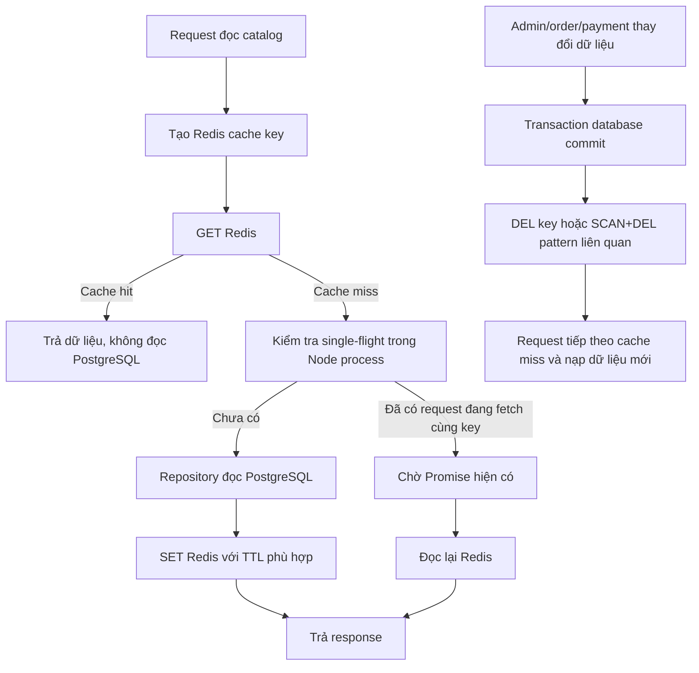

# Báo cáo chiến lược cache cho danh sách và chi tiết concert

## 1. Bài toán cần giải quyết

Trang chủ, trang danh sách concert và trang chi tiết concert là các luồng đọc công khai. Trong giờ mở bán, cùng một dữ liệu có thể bị đọc hàng nghìn lần mỗi giây, trong khi phần lớn thông tin như tên concert, địa điểm, sơ đồ ghế và mô tả nghệ sĩ thay đổi rất ít.

Nếu mỗi request đều truy vấn PostgreSQL, database phải lặp lại cùng một phép đọc và join rất nhiều lần. Điều này tiêu tốn connection pool, CPU, I/O và có thể làm các transaction đặt vé quan trọng bị chậm theo.

Yêu cầu còn lại là dữ liệu tồn kho thay đổi liên tục. Không thể cache số vé còn lại lâu giống thông tin concert, nhưng cũng không nên bắt mọi lượt refresh giao diện đọc trực tiếp database.

## 2. Kết luận về cơ chế hiện tại

Hệ thống hiện sử dụng đúng mô hình **Cache-aside với Redis**, kết hợp các TTL khác nhau theo mức độ biến động dữ liệu:

| Dữ liệu | Redis TTL thực tế | Lý do |
|---|---:|---|
| Danh sách concert | 300 giây | Dữ liệu ít đổi nhưng cần phản ánh publish/cancel tương đối nhanh |
| Chi tiết concert | 3.600 giây | Tên, địa điểm, thời gian và mô tả ít thay đổi |
| Metadata concert | 3.600 giây trong service | Chứa cả seat zone và ticket type nên ngắn hơn cấu hình 24 giờ |
| Seat map | 86.400 giây | Sơ đồ ghế gần như bất biến sau khi công bố |
| Danh sách ticket type | 300 giây | Giá, trạng thái bán và giới hạn có thể thay đổi |
| Inventory | 5 giây | `held_quantity` và `sold_quantity` thay đổi liên tục |

Ngoài TTL, hệ thống còn **invalidate chủ động** khi dữ liệu thay đổi. Đặc biệt, cache inventory bị xóa sau khi giữ vé, hủy order, order hết hạn, thanh toán thành công hoặc thanh toán thất bại.

Điểm quan trọng nhất:

> Cache inventory chỉ phục vụ giao diện hiển thị gần đúng. Khi người dùng thật sự đặt vé, transaction PostgreSQL vẫn kiểm tra tồn kho hiện tại bằng conditional atomic update. Vì vậy cache có thể chậm tối đa vài giây trên màn hình nhưng không thể làm hệ thống bán vượt số lượng.

## 3. Luồng Cache-aside hiện tại



Trong `CatalogService`, mọi public read quan trọng gọi `cacheSingleFlight()`:

```ts
return cacheSingleFlight(
  cacheKey,
  () => repository.readFromDatabase(),
  ttlSeconds,
);
```

Đây là mô hình cache-aside:

1. Ứng dụng tự đọc Redis trước.
2. Cache hit thì trả ngay.
3. Cache miss thì ứng dụng đọc database.
4. Kết quả được ghi vào Redis với TTL.
5. Request sau dùng lại dữ liệu Redis.

PostgreSQL vẫn là nguồn sự thật; Redis chỉ giữ bản sao phục vụ đọc.

## 4. Cache key và phạm vi dữ liệu

Các key hiện tại được định nghĩa tập trung trong `packages/redis/src/catalog-cache.ts`:

```text
catalog:list:<queryHash>
catalog:concert:<concertId>
catalog:metadata:<concertId>
catalog:seat-map:<concertId>
catalog:ticket-types:<concertId>:active
catalog:ticket-types:<concertId>:include-closed
inventory:concert:<concertId>
```

### 4.1. Danh sách concert

Danh sách có các tham số tìm kiếm, thành phố, khoảng thời gian, giới hạn và cách sắp xếp. Service chuẩn hóa query theo thứ tự key ổn định rồi hash SHA-256, lấy 16 ký tự đầu để tạo key.

Nhờ vậy:

- hai request có cùng tham số nhưng khác thứ tự query string dùng chung cache;
- hai bộ lọc khác nhau không ghi đè dữ liệu của nhau;
- key Redis ngắn, không chứa toàn bộ query dài.

TTL danh sách là 300 giây. Khi concert được tạo, cập nhật, publish hoặc cancel, code xóa pattern `catalog:list:*` để các biến thể danh sách được tạo lại.

### 4.2. Chi tiết và metadata concert

Chi tiết concert có key riêng theo `concertId` và TTL một giờ. Metadata cũng theo concert nhưng chứa nhiều dữ liệu hơn:

- concert;
- venue;
- seat zones;
- ticket types;
- seat map;
- artist bio.

Mặc dù `catalogCacheTtlSeconds.metadata` đang khai báo 86.400 giây, `CatalogService.getMetadata()` hiện truyền trực tiếp `3600`, nên **TTL chạy thực tế là một giờ**. Code chủ động rút TTL vì metadata chứa ticket type và seat zone, dễ bị cũ hơn thông tin concert cơ bản.

### 4.3. Seat map

Seat map dùng TTL 86.400 giây vì sơ đồ ghế và đường SVG ít thay đổi sau khi concert được cấu hình. Khi seat zone được tạo hoặc cập nhật, code xóa cả:

```text
catalog:seat-map:<concertId>
catalog:metadata:<concertId>
```

Metadata cũng phải bị xóa vì nó nhúng `seat_zones`.

### 4.4. Ticket types

Danh sách ticket type phân biệt hai biến thể:

```text
active
include-closed
```

Nếu dùng chung một key, request admin hoặc client yêu cầu gồm vé đã đóng có thể làm cache sai cho luồng public. Tách key giữ đúng contract của từng query.

TTL là 300 giây. Khi ticket type được tạo hoặc cập nhật, invalidation xóa:

- cả hai biến thể ticket type;
- inventory;
- metadata vì metadata nhúng ticket types;
- toàn bộ danh sách concert vì price range lấy từ ticket types.

## 5. Inventory: TTL ngắn và invalidation chủ động

### 5.1. Cách tính số vé còn lại

Repository đọc `ticket_types` và tính:

```text
available_quantity = max(
  total_quantity - held_quantity - sold_quantity,
  0
)
```

Response còn có `as_of` để thể hiện thời điểm snapshot và được controller đánh dấu consistency là `EVENTUAL`.

### 5.2. Vì sao TTL chỉ 5 giây?

Inventory thay đổi mỗi khi:

- order mới giữ vé;
- người dùng hủy order;
- hold hết hạn;
- thanh toán thành công chuyển `held -> sold`;
- thanh toán thất bại trả lại phần held.

TTL dài như một giờ sẽ khiến giao diện hiển thị số vé cũ quá lâu. TTL 5 giây giới hạn thời gian stale ngay cả khi một lần invalidation thất bại.

Controller còn trả HTTP header:

```http
Cache-Control: max-age=5
```

Do đó browser có thể dùng lại snapshot trong 5 giây thay vì liên tục gọi API khi component render hoặc polling quá dày.

### 5.3. Invalidation sau mọi thay đổi tồn kho

Key inventory chuẩn hiện là:

```text
inventory:concert:<concertId>
```

Các đường ghi hiện tại đều xóa đúng key theo concert sau khi transaction database hoàn tất:

| Sự kiện | Nơi invalidation |
|---|---|
| Tạo order và giữ vé | `orders/repository/order.repository.ts` |
| Hủy order | `orders/repository/order.repository.ts` |
| Hold hết hạn | `orders/repository/order.repository.ts` |
| Xác nhận thanh toán | `payments/payment.repository.ts` |
| Thanh toán thất bại và trả vé | `payments/payment.repository.ts` |
| Admin cập nhật ticket type | `invalidateTicketTypeCache()` |
| Publish/cancel concert | `invalidateConcertCache()` |

Thứ tự đúng là:

```text
Transaction PostgreSQL commit
    -> xóa Redis inventory cache
    -> request đọc tiếp theo nạp snapshot mới
```

Không nên xóa cache trước commit, vì một request khác có thể cache lại dữ liệu DB cũ trong lúc transaction chưa hoàn tất.

### 5.4. Tại sao inventory cache cũ không gây oversell?

Người dùng có thể nhìn thấy “còn 5 vé” trong khi vài giây trước người khác vừa giữ hết. Đây là đặc tính eventual consistency chấp nhận được cho màn hình.

Khi bấm mua, `POST /orders` không tin con số từ cache. PostgreSQL thực hiện:

```sql
UPDATE ticket_types
SET held_quantity = held_quantity + :quantity
WHERE total_quantity - held_quantity - sold_quantity >= :quantity;
```

Nếu tồn kho thật không đủ, UPDATE không thành công và API trả lỗi sold out. Vì vậy:

```text
Catalog cache = hiển thị nhanh, gần đúng
PostgreSQL transaction = quyết định giữ vé chính xác
```

## 6. Single-flight chống cache stampede

Một vấn đề của cache-aside là khi key hết hạn đúng lúc có hàng nghìn request:

```text
1.000 request cùng cache miss
-> 1.000 request cùng đọc PostgreSQL
-> database vẫn bị spike dù có Redis
```

`cacheSingleFlight()` dùng một `Map<string, Promise>` trong Node process. Request đầu tiên của một key tạo Promise đọc DB; các request sau trong cùng process chờ Promise đó thay vì tự query DB.

Kết quả lý tưởng trong một API instance:

```text
1.000 cache miss cùng key
-> 1 truy vấn PostgreSQL
-> 1 lần SET Redis
-> các request còn lại dùng cùng kết quả
```

Điều này đặc biệt hữu ích cho trang chi tiết của concert hot khi TTL vừa hết.

Giới hạn cần nói rõ: single-flight hiện chỉ nằm trong memory của từng Node process. Nếu có bốn API instance cùng miss một key, tối đa vẫn có thể có bốn truy vấn DB, mỗi instance một truy vấn. Tuy nhiên con số này vẫn nhỏ hơn hàng nghìn truy vấn và Redis được dùng chung nên instance ghi cache đầu tiên sẽ giúp các lượt sau.

## 7. Cache invalidation khi admin và worker thay đổi catalog

### 7.1. Invalidation theo quan hệ dữ liệu

Hệ thống không chỉ xóa key trực tiếp. Nó xóa cả các view chứa dữ liệu bị thay đổi:

| Thao tác | Cache bị xóa |
|---|---|
| Update concert | concert, metadata, seat map, ticket types, inventory, list |
| Publish/cancel | toàn bộ cache liên quan concert và list |
| Update seat zone | seat map và metadata |
| Update ticket type | ticket types, inventory, metadata và list |

Đây là điểm quan trọng vì metadata và list là dữ liệu tổng hợp. Ví dụ thay đổi giá vé không chỉ ảnh hưởng endpoint ticket types mà còn ảnh hưởng `ticket_price_range` trên danh sách concert.

### 7.2. Auto-publish

Worker auto-publish kiểm tra concert đến thời điểm publish, chuyển concert sang `PUBLISHED`, mở các ticket type từ `DRAFT` sang `ON_SALE`, rồi gọi `invalidateConcertCache(concertId)`.

Như vậy manual publish và auto-publish đều có invalidation. Tuy nhiên hiện tại chúng chỉ xóa cache; chưa thấy bước chủ động gọi lại repository để warm cache ngay sau publish.

Hệ quả:

```text
Publish commit
-> cache bị xóa
-> request public đầu tiên chịu cache miss và đọc DB
-> các request sau dùng Redis
```

Single-flight hạn chế số query trong từng process, nhưng request đầu tiên vẫn chịu cold-cache latency.

## 8. Hai lớp cache: Redis và HTTP

Ngoài Redis phía server, một số endpoint còn đặt HTTP cache header.

### Metadata

```http
Cache-Control: public, max-age=30, s-maxage=300, stale-while-revalidate=60
```

- Browser được cache 30 giây.
- Shared cache/CDN có thể cache 300 giây.
- CDN có thể trả dữ liệu stale tối đa 60 giây trong khi revalidate nền.

### Inventory

```http
Cache-Control: max-age=5
```

Browser chỉ giữ snapshot tồn kho 5 giây.

HTTP cache giúp request không tới API server; Redis cache giúp request đã tới API không vào PostgreSQL. Hai tầng bảo vệ hai tài nguyên khác nhau:

```text
Browser/CDN cache -> giảm tải API
Redis cache       -> giảm tải PostgreSQL
```

## 9. Hành vi khi Redis lỗi

Các helper cache hiện fail-open:

- `cacheGet()` trả miss nếu Redis không khả dụng;
- repository tiếp tục đọc PostgreSQL;
- `cacheSet()` hoặc `cacheDelete()` lỗi chỉ được log.

Ưu điểm là catalog vẫn hoạt động khi Redis lỗi. Nhược điểm là database mất lớp bảo vệ và có thể nhận lượng đọc lớn. Vì vậy “fail-open” tăng availability nhưng không bảo đảm khả năng chịu hàng nghìn request/giây khi Redis down.

Single-flight hiện dựa vào việc request chờ có thể đọc lại kết quả từ Redis. Khi Redis hoàn toàn không khả dụng, waiter đọc lại vẫn miss và có thể fetch DB tiếp. Do đó không nên xem single-flight hiện tại là lớp bảo vệ đầy đủ trong sự cố Redis.

## 10. Đánh giá theo đúng câu hỏi của thầy

| Yêu cầu | Cơ chế hiện tại | Đánh giá |
|---|---|---|
| Danh sách concert không query DB mỗi request | Redis cache-aside, TTL 300 giây | Đã triển khai |
| Chi tiết concert ít thay đổi cache lâu | TTL 3.600 giây | Đã triển khai |
| Seat map cache rất lâu | TTL 86.400 giây | Đã triển khai |
| Ticket type có TTL trung bình | TTL 300 giây | Đã triển khai |
| Số vé còn lại TTL ngắn | TTL Redis và browser 5 giây | Đã triển khai |
| Invalidate khi giữ/hủy vé | Xóa inventory key sau transaction | Đã triển khai |
| Invalidate khi thanh toán | Xóa inventory sau success/failure | Đã triển khai |
| Chống stampede khi TTL hết | Single-flight trong từng process | Đã triển khai, phạm vi local |
| Cache không làm sai quyết định đặt vé | Order kiểm tra PostgreSQL atomically | Đã triển khai |
| Publish làm mới cache | Invalidate manual và auto-publish | Đã triển khai |
| Warm cache ngay sau publish | Chưa thấy | Chưa triển khai |
| Distributed single-flight nhiều instance | Chưa có | Chưa triển khai |

## 11. Điểm tốt của chiến lược hiện tại

- TTL được chia theo độ biến động thay vì dùng một TTL cho mọi dữ liệu.
- Inventory vừa có TTL ngắn vừa có invalidation chủ động.
- Cache key chứa đúng chiều dữ liệu như query hash và `include_closed`.
- Invalidation hiểu quan hệ tổng hợp giữa metadata, seat zone, ticket type và list price range.
- Single-flight hạn chế cache stampede trong từng API process.
- Redis không trở thành nguồn sự thật của tồn kho.
- Manual publish và auto-publish đều xóa cache.
- Cache lỗi không làm endpoint catalog ngừng hoạt động.

## 12. Các giới hạn và đề xuất cải thiện

### 12.1. Publish-triggered warmup

Sau publish, có thể chủ động nạp các key public quan trọng:

```text
catalog:list:<popular-query>
catalog:concert:<concertId>
catalog:metadata:<concertId>
catalog:seat-map:<concertId>
catalog:ticket-types:<concertId>:active
inventory:concert:<concertId>
```

Warmup giải quyết cold cache ngay lúc concert vừa mở, thường cũng là lúc traffic tăng mạnh. Đây có giá trị hơn refresh-ahead đơn thuần đối với spike đầu tiên sau publish.

### 12.2. Distributed stampede protection

Nếu số API instance tăng lớn, có thể dùng distributed lock ngắn hoặc cơ chế stale-while-revalidate trong Redis. Tuy nhiên cần timeout và fallback cẩn thận để không biến Redis lock thành bottleneck mới.

### 12.3. Negative caching

`cacheGet()` hiện dùng `null` để biểu diễn cache miss. Nếu repository trả `null` cho concert không tồn tại, giá trị `null` được SET nhưng lần đọc sau vẫn bị hiểu là miss. Vì vậy request liên tục vào một concert ID không tồn tại vẫn có thể đọc DB nhiều lần.

Có thể lưu sentinel riêng với TTL ngắn, ví dụ 15–30 giây, để chống cache penetration nhưng vẫn cho dữ liệu mới xuất hiện nhanh.

### 12.4. Đồng bộ cấu hình metadata TTL

Constant `catalogCacheTtlSeconds.metadata` là 86.400 giây nhưng service hard-code 3.600 giây. Runtime hiện dùng một giờ và đây là lựa chọn an toàn hơn, nhưng nên sửa constant hoặc dùng một cấu hình duy nhất để tránh người bảo trì đọc nhầm.

### 12.5. Invalidation đang fire-and-forget ở controller

Một số controller gọi `void invalidate...()` rồi trả response ngay. Điều này làm write latency thấp, nhưng tồn tại một khoảng rất ngắn sau response trong đó cache cũ chưa bị xóa. Với dữ liệu catalog có thể chấp nhận eventual consistency; nếu yêu cầu read-after-write cho admin, nên `await` invalidation hoặc dùng event/outbox đáng tin cậy.

### 12.6. Đo hiệu quả cache

Nên bổ sung metrics:

- cache hit/miss theo nhóm key;
- thời gian Redis GET/SET;
- số request được single-flight deduplicate;
- thời gian repository query;
- số invalidation lỗi;
- độ tuổi `as_of` của inventory snapshot.

Không có metrics thì chưa thể chứng minh cache hit ratio hoặc khẳng định chịu được một mức hàng nghìn request/giây cụ thể.

## 13. Kịch bản nói khi quay video

### Mở đầu

“Trang danh sách và chi tiết concert là read-heavy: dữ liệu giống nhau được đọc hàng nghìn lần nhưng thay đổi ít. Em dùng cache-aside với Redis để request đọc cache trước, chỉ cache miss mới truy vấn PostgreSQL.”

### Khi mở `catalog.service.ts`

“Mỗi loại dữ liệu có cache key và TTL riêng. List là 5 phút, chi tiết một giờ, seat map một ngày, ticket types 5 phút, còn inventory chỉ 5 giây. TTL phản ánh tốc độ thay đổi của dữ liệu.”

### Khi mở `cache.ts`

“Ngoài cache-aside, em dùng single-flight. Khi một key vừa hết hạn, các request trong cùng Node process chờ chung một Promise fetch database thay vì cùng tạo hàng nghìn truy vấn.”

### Khi mở `catalog-cache.ts`

“Invalidation xóa cả các view phụ thuộc. Update ticket type phải xóa ticket type, inventory, metadata và list vì metadata chứa vé và list chứa price range.”

### Khi mở orders/payment repository

“Số vé còn lại có TTL 5 giây và được xóa chủ động sau giữ vé, hủy, hết hạn hoặc thanh toán. Tuy nhiên cache chỉ để hiển thị. Khi đặt vé, PostgreSQL kiểm tra tồn kho thật bằng atomic conditional update, nên cache cũ không gây oversell.”

### Kết luận

“Dữ liệu ít đổi được cache lâu để giảm tải database; dữ liệu tồn kho cache rất ngắn và invalidate theo giao dịch. Redis tối ưu luồng đọc, còn PostgreSQL vẫn là nguồn sự thật cho quyết định bán vé.”

## 14. Những câu không nên nói

- Không nói “mọi dữ liệu catalog đều cache một giờ”. TTL khác nhau theo loại dữ liệu.
- Không nói “inventory luôn chính xác tuyệt đối trên giao diện”. Endpoint ghi rõ eventual consistency và có thể stale vài giây.
- Không nói “đặt vé dựa vào số lượng trong Redis”. Order luôn kiểm tra PostgreSQL.
- Không nói “single-flight chống stampede trên toàn cluster”. Hiện nó chỉ deduplicate trong từng Node process.
- Không nói “metadata đang cache Redis 24 giờ”. Service hiện dùng TTL thực tế 3.600 giây.
- Không nói “publish đã warm cache”. Hiện publish mới invalidate; request đầu tiên repopulate.
- Không khẳng định hệ thống chịu được hàng nghìn request/giây nếu chưa có benchmark và cache hit metrics tương ứng.

## 15. Các file code nên mở

- `ticket-box-app/apps/api-server/src/modules/catalog/catalog.router.ts`: các public read endpoint.
- `ticket-box-app/apps/api-server/src/modules/catalog/catalog.controller.ts`: HTTP cache headers và invalidation sau write.
- `ticket-box-app/apps/api-server/src/modules/catalog/catalog.service.ts`: cache key, TTL và single-flight.
- `ticket-box-app/apps/api-server/src/modules/catalog/catalog.repository.ts`: truy vấn PostgreSQL và cách tính inventory.
- `ticket-box-app/packages/redis/src/cache.ts`: cache-aside, SCAN+DEL và single-flight.
- `ticket-box-app/packages/redis/src/catalog-cache.ts`: key, TTL và dependency invalidation.
- `ticket-box-app/apps/api-server/src/modules/orders/repository/order.repository.ts`: invalidation khi giữ/hủy/hết hạn.
- `ticket-box-app/apps/api-server/src/modules/payments/payment.repository.ts`: invalidation sau thanh toán.
- `ticket-box-app/apps/worker-server/src/schedulers/auto-publish.scheduler.ts`: invalidation sau auto-publish.
