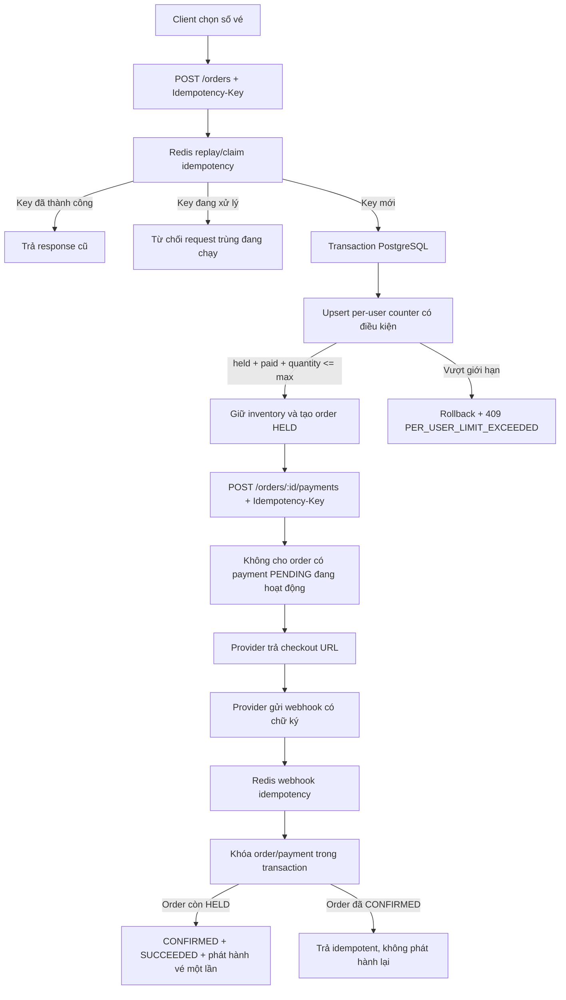

# Báo cáo giới hạn vé per-user và chống xử lý thanh toán lặp

## 1. Phạm vi và kết luận

Luồng đặt vé hiện tại giải quyết hai bài toán đồng thời khác nhau:

1. **Giới hạn vé per-user:** không cho tổng số vé một tài khoản đang giữ và đã thanh toán vượt `max_per_user`, kể cả khi tài khoản gửi nhiều request đồng thời.
2. **Chống xử lý giao dịch lặp:** dùng Idempotency Key ở API, unique constraint trong PostgreSQL, trạng thái order/payment và row lock khi xử lý webhook.

Kết luận chính:

- Giới hạn per-user được enforce tại PostgreSQL bằng bảng counter tổng hợp và câu lệnh upsert có điều kiện nguyên tử. Đây là lớp quyết định cuối cùng, không dựa vào dữ liệu frontend hay cache.
- Double-click hoặc retry cùng một `Idempotency-Key` được chặn tốt ở API bằng Redis và có fallback unique constraint cho bước tạo order.
- Webhook thanh toán gửi lặp không phát hành vé, tăng `sold_quantity` hoặc chuyển quota sang `paid_quantity` hai lần vì code khóa order/payment và kiểm tra trạng thái trong transaction.
- Cần diễn đạt chính xác: code bảo đảm **xử lý nghiệp vụ thành công một lần trong hệ thống TicketBox**. Việc bảo đảm nhà cung cấp không thực hiện hai lần charge khác nhau còn phụ thuộc việc không tạo nhiều payment attempt độc lập và idempotency contract của nhà cung cấp.

## 2. Sơ đồ tổng quát



## 3. Giới hạn vé per-user dưới tải cao

### 3.1. Nguồn dữ liệu dùng để enforce

Mỗi ticket type có trường `max_per_user`. Hệ thống không tính quota bằng cách quét toàn bộ lịch sử `orders`, `order_items`, `payments` và `tickets` mỗi khi người dùng đặt vé. Thay vào đó, bảng `user_ticket_type_counters` lưu counter tổng hợp theo khóa chính kép:

```text
(user_id, ticket_type_id)
```

Hai giá trị quan trọng:

- `held_quantity`: số vé tài khoản đang giữ trong các order `HELD`;
- `paid_quantity`: số vé tài khoản đã thanh toán thành công.

Điều kiện nghiệp vụ là:

```text
held_quantity + paid_quantity + requested_quantity <= max_per_user
```

Khóa chính `(user_id, ticket_type_id)` bảo đảm chỉ có một hàng counter cho mỗi tài khoản và loại vé.

### 3.2. Vì sao kiểm tra trên frontend là không đủ?

Frontend có thể gọi endpoint quota để hiển thị `remaining_quantity`, nhưng dữ liệu đó chỉ hỗ trợ UX. Hai tab trình duyệt có thể cùng nhìn thấy còn 2 vé rồi cùng gửi request mua 2 vé. Nếu backend chỉ tin dữ liệu frontend hoặc thực hiện `SELECT` rồi `UPDATE` tách rời, cả hai request đều có thể vượt qua kiểm tra cũ.

Vì vậy quyết định cuối cùng phải nằm trong thao tác ghi nguyên tử tại PostgreSQL.

### 3.3. Upsert có điều kiện nguyên tử

Trong `apps/api-server/src/modules/orders/repository/hold.ts`, counter được cập nhật bằng mô hình:

```sql
INSERT INTO user_ticket_type_counters (
  user_id, ticket_type_id, held_quantity, paid_quantity
)
VALUES (:userId, :ticketTypeId, :quantity, 0)
ON CONFLICT (user_id, ticket_type_id) DO UPDATE
SET held_quantity = user_ticket_type_counters.held_quantity + :quantity
WHERE user_ticket_type_counters.held_quantity
      + user_ticket_type_counters.paid_quantity
      + :quantity
      <= :maxPerUser
RETURNING ...;
```

Điểm quan trọng là điều kiện quota nằm ngay trong `ON CONFLICT DO UPDATE ... WHERE`, không phải kiểm tra ở một câu SELECT trước đó. PostgreSQL serialize các cập nhật cạnh tranh trên cùng counter row và đánh giá điều kiện dựa trên giá trị mới nhất.

Ví dụ `max_per_user = 4`, counter hiện tại là `held=2, paid=0`, và hai request đồng thời cùng mua thêm 2 vé:

1. Request A cập nhật counter thành `held=4` và thành công.
2. Request B chờ cập nhật cùng row.
3. Sau khi A hoàn tất, B đánh giá lại `4 + 0 + 2 <= 4` và nhận kết quả sai.
4. CTE không trả đủ counter row; code ném `MAX_PER_USER_EXCEEDED`.
5. Toàn bộ transaction B rollback, bao gồm order hoặc inventory tạm thời của request đó.

Kết quả: chỉ một request thành công, tài khoản không thể giữ 6 vé.

### 3.4. Đồng thời cập nhật số vé còn lại trong bảng ticket type

Giới hạn per-user chỉ trả lời câu hỏi “tài khoản này còn được mua bao nhiêu vé”. Hệ thống còn phải trả lời câu hỏi toàn cục “loại vé này còn bao nhiêu vé cho tất cả người mua”. Vì vậy khi tạo order, code cập nhật đồng thời hai phạm vi:

| Bảng | Phạm vi | Dữ liệu được cập nhật |
|---|---|---|
| `user_ticket_type_counters` | Một user và một ticket type | `held_quantity` tăng để chiếm quota của tài khoản |
| `ticket_types` | Tất cả người mua của ticket type | `held_quantity` tăng để giữ tồn kho chung |

Số vé còn có thể giữ của ticket type được tính bằng:

```text
available_quantity = total_quantity - held_quantity - sold_quantity
```

Trong CTE, inventory chỉ được cập nhật nếu counter per-user đã cập nhật thành công:

```sql
UPDATE ticket_types
SET held_quantity = held_quantity + :quantity
WHERE id = :ticketTypeId
  AND total_quantity - held_quantity - sold_quantity >= :quantity
  AND EXISTS (SELECT 1 FROM new_order_item)
RETURNING total_quantity - held_quantity - sold_quantity AS available_after;
```

Điều kiện còn đủ vé nằm ngay trong câu `UPDATE`, nên hai request đồng thời không thể cùng dựa vào một giá trị tồn kho cũ. PostgreSQL cho request sau chờ cập nhật cùng row rồi đánh giá lại điều kiện trên dữ liệu mới nhất.

Ví dụ ticket type có:

```text
total_quantity = 100
held_quantity  = 70
sold_quantity  = 25
available      = 5
```

Nếu hai user đồng thời yêu cầu 4 vé:

1. Request đầu cập nhật `held_quantity` từ 70 lên 74, còn lại 1 vé.
2. Request sau đánh giá lại điều kiện `100 - 74 - 25 >= 4`, nhận kết quả sai.
3. Request sau ném `INSUFFICIENT_INVENTORY` và rollback cả counter per-user lẫn order tạm thời.

Việc đặt counter per-user và inventory chung trong cùng transaction bảo đảm:

- không có trường hợp quota user đã tăng nhưng tồn kho chung chưa bị giữ;
- không có trường hợp tồn kho chung đã giảm nhưng quota user chưa tăng;
- vượt `max_per_user` thì không làm thay đổi `ticket_types.held_quantity`;
- không đủ tồn kho chung thì phần tăng `user_ticket_type_counters.held_quantity` cũng rollback;
- response chỉ trả thành công sau khi cả quota cá nhân và tồn kho chung đều hợp lệ.

Sau khi transaction commit, repository xóa cache inventory của concert. Lần đọc inventory tiếp theo sẽ nạp lại giá trị mới từ PostgreSQL. Cache chỉ phục vụ đọc nhanh; quyết định còn vé vẫn dựa trên conditional UPDATE trong database.

### 3.5. Trường hợp một giỏ có nhiều loại vé

Code sắp xếp ticket type theo UUID và xử lý tất cả counter trong cùng một CTE. `counterCount` phải bằng số item. Nếu chỉ một ticket type vượt quota, code ném lỗi trước khi transaction commit và rollback toàn bộ giỏ.

Nhờ đó không có trạng thái một phần như “giữ được loại A nhưng loại B vượt quota”.

### 3.6. Vòng đời counter và tồn kho

Counter per-user và tồn kho chung được chuyển đổi song song theo vòng đời order:

```text
Tạo order HELD:
user_ticket_type_counters.held_quantity += quantity
ticket_types.held_quantity += quantity

Thanh toán thành công:
user_ticket_type_counters.held_quantity -= quantity
user_ticket_type_counters.paid_quantity += quantity
ticket_types.held_quantity -= quantity
ticket_types.sold_quantity += quantity

Hủy / hết hạn / thanh toán thất bại:
user_ticket_type_counters.held_quantity -= quantity
user_ticket_type_counters.paid_quantity giữ nguyên
ticket_types.held_quantity -= quantity
ticket_types.sold_quantity giữ nguyên
```

Khi thanh toán thành công, code chuyển tồn kho chung từ `held -> sold` và quota cá nhân từ `held -> paid`. Việc này diễn ra cùng transaction với chuyển order sang `CONFIRMED`, payment sang `SUCCEEDED` và phát hành ticket.

Khi hủy, hết hạn hoặc thanh toán thất bại, code giảm `held_quantity` ở cả `ticket_types` và `user_ticket_type_counters`, nhờ đó vé được trả lại cho người mua khác và quota của tài khoản cũng được phục hồi. Code chỉ giải phóng khi order vẫn còn `HELD`, tránh một callback lặp trả tồn kho hai lần.

### 3.7. Vì sao cơ chế này phù hợp dưới tải cao?

- Không quét lịch sử giao dịch trên mỗi request.
- Chỉ tranh chấp trên counter của đúng `user + ticket type`; người dùng khác không khóa cùng counter per-user.
- Điều kiện giới hạn và phép tăng counter nằm trong cùng thao tác nguyên tử.
- Counter, global inventory, order và order item cùng transaction nên hoặc thành công toàn bộ, hoặc rollback toàn bộ.
- Database là nguồn sự thật cuối cùng dù frontend gửi nhiều request đồng thời.

## 4. Chống double-click và retry khi tạo order

### 4.1. Cách sinh Idempotency Key

Client phải sinh một key duy nhất cho **một ý định tạo order** và gửi qua header:

```http
Idempotency-Key: <UUID hoặc chuỗi ngẫu nhiên ổn định>
```

Key phải được tái sử dụng khi retry cùng nghiệp vụ do double-click, timeout hoặc mất response. Nếu client sinh key mới ở mỗi lần retry thì backend hiểu đó là một ý định đặt vé mới.

Route hiện yêu cầu key không rỗng và dài không quá 128 ký tự.

### 4.2. Nơi lưu và cách kiểm tra

Redis scope key theo module, user và key client:

```text
orders:<userId>:<idempotencyKey>
```

Middleware thực hiện:

1. `GET` response đã cache. Nếu có thì trả lại ngay, không chạy handler và không vào PostgreSQL.
2. Nếu chưa có, dùng `SET NX EX` claim key trong 60 giây.
3. Nếu request khác đang giữ claim, trả lỗi `idempotency in progress`.
4. Khi response thành công, lưu status/body vào Redis trong 24 giờ.
5. Response lỗi không được cache để client có thể sửa lỗi hoặc retry.

TTL response hiện tại là `86.400` giây, tức 24 giờ. Claim chỉ tồn tại 60 giây để tránh khóa vĩnh viễn nếu process chết.

### 4.3. Fallback tại PostgreSQL

Bảng `orders` có unique constraint:

```text
UNIQUE (user_id, idempotency_key)
```

Nếu Redis lỗi hoặc hai request lọt qua do race hiếm, PostgreSQL chỉ cho một order được insert. Request còn lại nhận Prisma `P2002`; service tìm lại order theo `(userId, idempotencyKey)` và dựng lại response.

Đây là mô hình phòng thủ hai lớp:

```text
Redis: giảm tải và replay response nhanh
PostgreSQL unique constraint: bảo đảm không có hai order cùng key
```

## 5. Chống tạo thanh toán lặp

Route `POST /orders/:order_id/payments` cũng gắn `idempotencyMiddleware('payments')`. Redis key có dạng:

```text
payments:<userId>:<Idempotency-Key>
```

Vì vậy double-click hoặc retry với cùng key sẽ nhận lại cùng response checkout thay vì gọi lại handler.

Service còn kiểm tra order:

- phải thuộc đúng user;
- phải còn trạng thái `HELD`;
- hold chưa hết hạn;
- không được tồn tại một payment `PENDING` đang hoạt động cho order.

Mỗi payment record hiện sinh một key nội bộ:

```text
retry:<orderId>:<provider>:<randomUUID>
```

và cột `payments.idempotency_key` có unique constraint. Cách này bảo đảm mỗi payment attempt có định danh DB riêng, nhưng cần phân biệt với Idempotency Key do client gửi: key client đang được quản lý ở Redis middleware, còn key nội bộ payment là UUID mới cho từng attempt.

## 6. Chống webhook xử lý hai lần

Nhà cung cấp có thể gửi lại webhook khi không nhận được ACK. Browser return và webhook server-to-server cũng có thể cùng mang kết quả của một giao dịch. Hệ thống xử lý bằng nhiều lớp.

### 6.1. Webhook idempotency trên Redis

Middleware tạo key từ provider và mã giao dịch:

```text
webhook:VNPAY:<vnp_TransactionNo>
webhook:MOMO:<transId>
```

Response webhook thành công được cache 24 giờ. Webhook lặp có thể nhận lại ACK mà không chạy lại nghiệp vụ.

### 6.2. Unique provider transaction trong database

Bảng `payments` có unique constraint:

```text
UNIQUE (provider, provider_transaction_id)
```

Một mã giao dịch của cùng provider không thể được gắn vào hai payment record khác nhau.

### 6.3. Row lock và state machine trong transaction

`confirmOrderPayment()` khóa order:

```sql
SELECT status
FROM orders
WHERE id = :orderId
FOR UPDATE;
```

Chỉ transaction thấy order `HELD` mới được:

- chuyển order sang `CONFIRMED`;
- chuyển payment sang `SUCCEEDED`;
- chuyển inventory từ `held` sang `sold`;
- chuyển counter user từ `held` sang `paid`;
- phát hành ticket và notification.

Webhook đồng thời thứ hai phải chờ row lock. Khi được chạy, nó nhìn thấy order đã `CONFIRMED` và đi theo nhánh idempotent, không tăng `sold_quantity`, `paid_quantity` hay phát hành ticket lần nữa.

Webhook thất bại cũng khóa payment `FOR UPDATE` và chỉ xử lý khi payment còn `PENDING`. Vì vậy webhook thất bại lặp không giải phóng inventory hoặc quota hai lần.

## 7. Khi mạng bị ngắt giữa chừng

### Trường hợp 1: mất response sau khi tạo order thành công

Client retry `POST /orders` với cùng Idempotency Key. Redis trả response cũ; nếu Redis chưa lưu được response, unique constraint DB ngăn tạo order thứ hai và service dựng lại response.

### Trường hợp 2: mất response sau khi tạo checkout URL

Client retry payment với cùng Idempotency Key. Nếu response đã được cache, Redis trả lại checkout cũ. Nếu request đầu vẫn đang chạy, claim ngăn request thứ hai chạy đồng thời.

### Trường hợp 3: người dùng đã trả tiền nhưng browser không quay về

Kết quả cuối cùng không nên phụ thuộc duy nhất vào browser redirect. Provider gửi webhook/IPN có chữ ký; backend xác nhận payment và phát hành vé trong transaction. Client có thể đọc trạng thái order sau đó.

### Trường hợp 4: provider gửi cùng callback nhiều lần

Redis webhook cache, unique provider transaction, row lock và kiểm tra trạng thái làm callback lặp trở thành thao tác idempotent.

## 8. Ranh giới bảo đảm và điểm cần nói chính xác

### Những gì code hiện tại bảo đảm tốt

- Một user không vượt `max_per_user` do nhiều request tạo order đồng thời.
- Cùng một user và Idempotency Key không tạo hai order.
- Retry cùng payment Idempotency Key được replay ở Redis.
- Một provider transaction thành công không xác nhận order và phát hành vé hai lần.
- Webhook thất bại lặp không trả quota hoặc inventory hai lần.

### Điểm cần thận trọng

Kiểm tra “đã có payment PENDING” hiện là một truy vấn đọc trước khi insert payment record. Schema có index `(order_id, status)` nhưng chưa thể hiện partial unique constraint kiểu “mỗi order chỉ có tối đa một payment PENDING”. Hai request dùng **hai Idempotency Key khác nhau** và chạy đúng lúc vẫn có cửa sổ race giữa bước kiểm tra và insert.

Ngoài ra, `payments.idempotency_key` hiện được sinh ngẫu nhiên cho từng attempt thay vì lưu trực tiếp client Idempotency Key. Vì vậy fallback idempotency bền vững trong PostgreSQL cho payment không mạnh giống bước tạo order.

Do đó không nên tuyên bố tuyệt đối rằng mọi tình huống đều ngăn provider trừ tiền hai lần. Phát biểu chính xác là:

> Hệ thống đã chống double-click/retry cùng key ở Redis và chống xử lý callback thành công hai lần bằng transaction, row lock và state machine. Để đạt bảo đảm end-to-end mạnh hơn khi Redis lỗi hoặc client cố tình dùng nhiều key, cần thêm database constraint/claim cho một payment PENDING trên mỗi order và truyền một idempotency key ổn định tới nhà cung cấp nếu provider hỗ trợ.

## 9. Kịch bản giải thích khi quay video

### Phần giới hạn per-user

“Frontend chỉ hiển thị quota, còn backend enforce bằng bảng `user_ticket_type_counters`. Mỗi user và ticket type chỉ có một counter row. Khi tạo order, PostgreSQL dùng `INSERT ON CONFLICT DO UPDATE WHERE` để kiểm tra tổng held, paid và số lượng mới ngay trong thao tác ghi nguyên tử. Đồng thời, bảng `ticket_types` tăng held quantity bằng conditional UPDATE để cập nhật tồn kho chung. Nếu vượt quota cá nhân hoặc không đủ tồn kho, toàn bộ transaction rollback nên hai bảng không bao giờ lệch nhau.”

### Phần Idempotency Key

“Client sinh một UUID cho một ý định mua và giữ nguyên UUID đó khi retry. Redis kiểm tra response cũ, claim request đang chạy và lưu response thành công 24 giờ. Với order, PostgreSQL còn có unique constraint theo user và idempotency key, nên Redis lỗi cũng không tạo hai order.”

### Phần webhook

“Provider có thể gửi callback nhiều lần. Backend cache ACK theo provider transaction, nhưng lớp quyết định cuối cùng vẫn là database: transaction khóa order bằng `FOR UPDATE`, chỉ order HELD mới được chuyển sang CONFIRMED và phát hành vé. Callback thứ hai nhìn thấy CONFIRMED nên không trừ inventory hoặc phát hành vé lần nữa.”

### Kết luận

“Giới hạn per-user và chống oversell đều được đặt trong thao tác database nguyên tử. Idempotency Redis giúp giảm tải và xử lý retry nhanh; unique constraint, row lock và state machine PostgreSQL mới là các lớp bảo đảm cuối cùng khi có concurrency.”

## 10. Các file code nên mở

- `ticket-box-app/apps/api-server/src/modules/orders/repository/hold.ts`: atomic per-user counter và transaction giữ vé.
- `ticket-box-app/packages/database/prisma/schema.prisma`: khóa chính counter, unique order idempotency và provider transaction.
- `ticket-box-app/apps/api-server/src/shared/middleware/idempotency.middleware.ts`: Redis replay, claim và TTL.
- `ticket-box-app/packages/redis/src/idempotency.ts`: key storage và TTL 24 giờ.
- `ticket-box-app/apps/api-server/src/modules/orders/order.service.ts`: fallback `P2002` của order.
- `ticket-box-app/apps/api-server/src/modules/payments/payment.router.ts`: idempotency middleware của payment.
- `ticket-box-app/apps/api-server/src/modules/payments/payment.service.ts`: tạo payment và xử lý webhook.
- `ticket-box-app/apps/api-server/src/modules/payments/payment.repository.ts`: row lock, state transition và phát hành ticket.
- `ticket-box-app/apps/api-server/src/modules/payments/middlewares/webhook-idempotency.middleware.ts`: webhook cache theo provider transaction.
