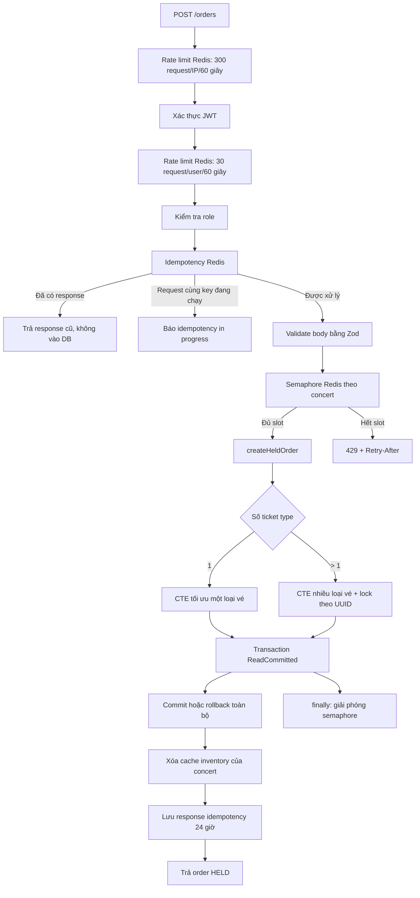

# Báo cáo cơ chế giảm tải database trong luồng đặt vé hiện tại

## 1. Luồng code từ HTTP đến PostgreSQL




## 3. Rate limit hai tầng theo IP và user

Luồng `POST /v1/orders` hiện áp dụng **hai Fixed Window Rate Limit liên tiếp**, đều lưu counter trong Redis:

1. **Tầng IP trước xác thực:** IP dùng Redis key dạng `rl:orders-ip:ip:<client_ip>`
2. **Tầng user sau xác thực:** `rl:orders-user:user:<user_id>`

Middleware dùng pipeline `INCR` + `TTL`

Khi vượt một trong hai ngưỡng, API trả lỗi rate limit và `Retry-After`; request không chạy nghiệp vụ giữ vé.


## 5. Admission control bằng distributed semaphore

Trước khi mở transaction, `createOrder()` gọi `acquireOrderAdmission(concertId)`. Key Redis là:

```text
semaphore:orders:concert:<concertId>
```

Mặc định chỉ có 10 request trên mỗi concert được đồng thời đi vào vùng tạo order. Redis dùng Sorted Set và Lua script để:

- xóa lease đã hết hạn;
- đếm số lease đang hoạt động;
- thêm lease mới một cách nguyên tử nếu chưa đủ giới hạn.

Nếu đủ 10 slot, request tiếp theo nhận `429 ORDER_CAPACITY_REACHED` và `Retry-After: 1`, thay vì tiếp tục chiếm connection pool, chờ row lock và làm transaction timeout.

Semaphore được chia theo concert, nên concert A đang hot không chiếm toàn bộ quota của concert B. Lease mặc định 60 giây; transaction timeout 55 giây để transaction kết thúc trước lease. `finally` luôn cố giải phóng lease, còn TTL tự dọn slot nếu process chết.

