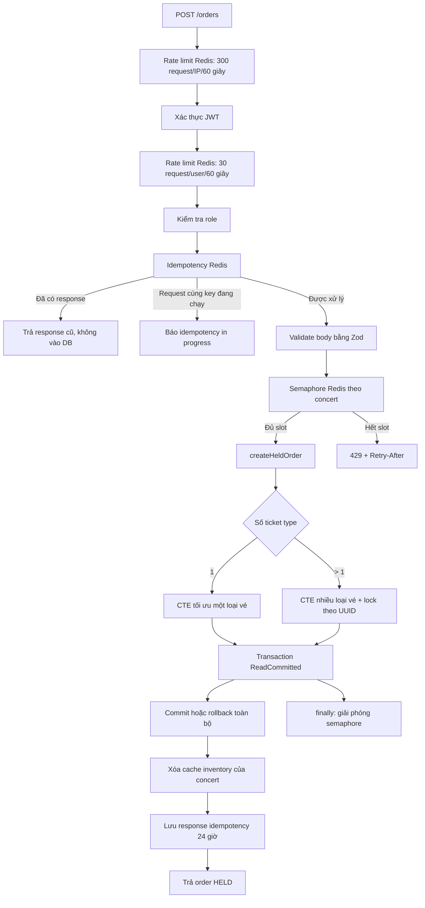

# Báo cáo cơ chế giảm tải database trong luồng đặt vé hiện tại

## 1. Kết luận ngắn gọn

Luồng `POST /orders` hiện tại không giảm tải database bằng cách bỏ qua database. PostgreSQL vẫn là **nguồn sự thật duy nhất** khi quyết định giữ vé để bảo đảm không bán vượt số lượng. Hệ thống giảm áp lực lên PostgreSQL theo mô hình nhiều lớp:

1. **Rate limit trên Redis** chặn một người dùng gửi quá nhiều yêu cầu.
2. **Distributed semaphore trên Redis theo từng concert** chỉ cho một số lượng hữu hạn request đặt vé cùng đi vào transaction.
3. **Idempotency trên Redis** trả lại response cũ và chặn hai request cùng khóa đang chạy, tránh thực thi lại transaction.
4. **Idempotency constraint trong PostgreSQL** là lớp dự phòng khi Redis lỗi hoặc có race condition hiếm.
5. **Một CTE SQL cho toàn bộ thao tác giữ vé** giảm nhiều lần trao đổi API–database xuống một lần trao đổi.
6. **Transaction `ReadCommitted` + cập nhật tồn kho có điều kiện** tránh chi phí và số lần abort cao của `Serializable`, nhưng vẫn chống oversell.
7. **Xử lý riêng giỏ một loại vé và nhiều loại vé** tối ưu đường phổ biến, đồng thời khóa nhiều hàng theo thứ tự ổn định để hạn chế deadlock.
8. **Cursor pagination và giới hạn số bản ghi** bảo vệ các truy vấn danh sách quản trị.
9. **Cache catalog/inventory cho luồng đọc** giảm truy vấn đọc lặp lại; luồng ghi chỉ xóa cache sau khi dữ liệu thay đổi.

Điểm cần nói chính xác: rate limit, semaphore, idempotency và cache trực tiếp giảm số request chạm DB; CTE và transaction ngắn làm mỗi request đã vào DB nhẹ hơn; conditional update và lock order chủ yếu giảm tranh chấp và bảo đảm đúng dữ liệu.

## 2. Luồng code từ HTTP đến PostgreSQL



Các file nên mở khi quay video:

- `apps/api-server/src/modules/orders/order.router.ts`: thứ tự middleware.
- `apps/api-server/src/shared/middleware/rate-limit.middleware.ts`: rate limit Redis.
- `apps/api-server/src/shared/middleware/idempotency.middleware.ts`: replay và claim idempotency.
- `apps/api-server/src/modules/orders/order.service.ts`: semaphore theo concert và fallback idempotency.
- `packages/redis/src/semaphore.ts`: Lua script cấp/thu hồi slot nguyên tử.
- `apps/api-server/src/modules/orders/repository/hold.ts`: CTE, transaction và conditional update.
- `apps/api-server/src/modules/orders/repository/order.repository.ts`: wrapper, cache invalidation và truy vấn đọc.

## 3. Lớp 1 — Rate limit hai tầng theo IP và user

Luồng `POST /v1/orders` hiện áp dụng **hai Fixed Window Rate Limit liên tiếp**, đều lưu counter trong Redis:

1. **Tầng IP trước xác thực:** `app.ts` gắn `orderIpRateLimit` trực tiếp vào `POST /v1/orders`, với giới hạn 300 request trong 60 giây trên mỗi địa chỉ IP.
2. **Tầng user sau xác thực:** `order.router.ts` gắn `orderUserRateLimit` trước idempotency và handler, với giới hạn 30 request trong 60 giây trên mỗi `user_id`.

Tầng IP dùng Redis key dạng `rl:orders-ip:ip:<client_ip>`. Tầng user dùng key dạng `rl:orders-user:user:<user_id>`. Middleware dùng pipeline `INCR` + `TTL`, nên việc đếm request không tạo truy vấn PostgreSQL. Khi vượt một trong hai ngưỡng, API trả lỗi rate limit và `Retry-After`; request không chạy nghiệp vụ giữ vé.

Hai tầng giải quyết hai phạm vi khác nhau:

- **Theo IP:** chặn sớm một nguồn mạng gửi quá nhiều request, kể cả trước khi xử lý JWT. Cơ chế này giảm chi phí xác thực và bảo vệ API trước bot hoặc client tạo nhiều tài khoản.
- **Theo user:** ngăn một tài khoản spam đặt vé ngay cả khi người dùng thay đổi thiết bị hoặc đi qua nhiều IP.

IP client không được tin trực tiếp từ header tùy ý. Code chỉ đọc `X-Forwarded-For` khi TCP peer là gateway nằm trong `TRUSTED_GATEWAY_IPS`; request trực tiếp dùng địa chỉ socket. Điều này tránh client tự giả IP để né giới hạn.

Ví dụ, một IP gửi request bằng nhiều tài khoản vẫn bị chặn khi tổng số request vượt 300/phút. Ngược lại, một tài khoản đổi qua nhiều IP vẫn bị tầng user chặn khi vượt 30/phút.

Ý nghĩa giảm tải: client lỗi, spam nút, bot hoặc một tài khoản độc hại không thể tạo vô hạn transaction giữ vé. Tầng IP chặn lưu lượng theo nguồn trước; tầng user kiểm soát hành vi sau khi đã xác thực.

Giới hạn cần nói rõ:

- Nhiều người dùng hợp lệ có thể dùng chung một IP công cộng, chẳng hạn Wi-Fi trường học hoặc mạng doanh nghiệp. Ngưỡng IP quá thấp có thể chặn nhầm, nên giới hạn 300/phút cao hơn giới hạn 30/phút của từng user.
- Giới hạn theo IP không thay thế giới hạn theo user vì bot có thể phân tán request qua nhiều IP.
- Khi Redis lỗi, rate limiter **fail-open**: request được đi tiếp để tránh làm sập demo. Vì vậy đây không phải lớp bảo vệ tuyệt đối khi Redis mất kết nối.

## 4. Lớp 2 — Idempotency tránh chạy lại cùng một nghiệp vụ

Client bắt buộc gửi `Idempotency-Key`. Redis key được scope theo `orders:userId:key`, nên hai người dùng có thể dùng cùng chuỗi key mà không xung đột.

Middleware thực hiện ba bước:

1. Tìm response đã lưu. Nếu có, trả ngay response cũ và không gọi database.
2. Nếu chưa có, dùng Redis `SET NX EX` để claim key trong 60 giây.
3. Khi request thành công, lưu status/body trong Redis 24 giờ; nếu lỗi thì giải phóng claim.

Đây là cơ chế giảm tải rất trực tiếp. Ví dụ người dùng double-click hoặc frontend retry vì mất response: lần sau đọc Redis thay vì tạo thêm order, order item, counter và cập nhật inventory.

PostgreSQL vẫn có unique constraint cho idempotency. Nếu Redis không khả dụng, `acquireIdempotencyClaim` trả `undefined` và request vẫn chạy. Nếu hai request hiếm hoi cùng insert, một request nhận lỗi Prisma `P2002`; service truy vấn order đã tạo bằng `(userId, idempotencyKey)` và dựng lại response. Lớp DB này chủ yếu bảo đảm đúng dữ liệu, không phải lớp giảm tải chính.

## 5. Lớp 3 — Admission control bằng distributed semaphore

Trước khi mở transaction, `createOrder()` gọi `acquireOrderAdmission(concertId)`. Key Redis là:

```text
semaphore:orders:concert:<concertId>
```

Mặc định chỉ có 10 request trên mỗi concert được đồng thời đi vào vùng tạo order. Redis dùng Sorted Set và Lua script để:

- xóa lease đã hết hạn;
- đếm số lease đang hoạt động;
- thêm lease mới một cách nguyên tử nếu chưa đủ giới hạn.

Nếu đủ 10 slot, request tiếp theo nhận `429 ORDER_CAPACITY_REACHED` và `Retry-After: 1`, thay vì tiếp tục chiếm connection pool, chờ row lock và làm transaction timeout.

Semaphore được chia theo concert, nên concert A đang hot không chiếm toàn bộ quota của concert B. Lease mặc định 60 giây; transaction timeout 55 giây để transaction kết thúc trước lease. `finally` luôn cố giải phóng lease, còn TTL tự dọn slot nếu process chết.

Khác với rate limiter, admission control **fail-closed**: nếu bật admission mà Redis không khả dụng, API trả 503. Lựa chọn này bảo vệ database khỏi một đợt request không được kiểm soát.

### 5.1. Semaphore không phải Token Bucket hay Leaky Bucket

Semaphore hiện tại phải được gọi chính xác là **distributed semaphore**, **concurrency limiter** hoặc **admission control**. Nó không phải Token Bucket và cũng không phải Leaky Bucket.

| Cơ chế | Đại lượng bị giới hạn | Khi đạt giới hạn |
|---|---|---|
| Fixed Window hiện tại | Số request của một user trong 60 giây | Trả `429` đến khi sang cửa sổ mới |
| Semaphore hiện tại | Số transaction đang chạy đồng thời trên một concert | Trả `429`; slot mở lại khi transaction kết thúc hoặc lease hết hạn |
| Token Bucket | Tốc độ request trung bình, biểu diễn bằng token được nạp lại theo thời gian | Request chờ hoặc bị từ chối khi hết token |
| Leaky Bucket | Tốc độ request được lấy ra xử lý, thường thông qua một hàng đợi | Request xếp hàng; phần vượt dung lượng hàng đợi bị loại |

Semaphore dùng Redis Sorted Set để lưu các lease đang hoạt động. Với giới hạn 10, hệ thống cho tối đa 10 transaction của cùng concert chạy đồng thời. Khi một transaction kết thúc, code giải phóng lease và request sau có thể lấy slot. Vì vậy thông lượng thực tế phụ thuộc vào thời gian transaction:

```text
10 slot, mỗi transaction mất 100 ms  -> lý thuyết khoảng 100 transaction/giây
10 slot, mỗi transaction mất 10 giây -> lý thuyết khoảng 1 transaction/giây
```

Token Bucket hoạt động khác: bucket có dung lượng token và một tốc độ refill. Ví dụ bucket chứa tối đa 20 token, nạp 10 token/giây thì có thể cho burst 20 request, sau đó duy trì trung bình khoảng 10 request/giây. Code hiện tại không có `token count`, `refill rate` hoặc phép tính token theo thời gian, nên không thể gọi là Token Bucket.

Leaky Bucket cũng khác: request thường được đưa vào một queue có dung lượng giới hạn rồi được lấy ra với tốc độ cố định, ví dụ 10 request/giây. Semaphore hiện tại không giữ request trong queue và không lấy request ra theo nhịp cố định. Khi đủ slot, code trả `429 ORDER_CAPACITY_REACHED` để client tự retry.

### 5.2. Vì sao luồng đặt vé hiện tại không chọn Token Bucket?

Token Bucket phù hợp khi yêu cầu chính là giới hạn **request/giây** nhưng vẫn cho phép một burst ngắn. Tuy nhiên bottleneck chính của bước giữ vé là số transaction đồng thời cùng tranh chấp các hàng `ticket_types`, thời gian giữ row lock và sức chứa connection pool.

Nếu chỉ dùng Token Bucket, hệ thống có thể cho phép một burst lớn đi qua trong cùng thời điểm khi bucket đang đầy. Các request đó vẫn có thể đồng thời mở transaction và cùng tranh chấp một hot row. Token Bucket kiểm soát tốc độ trung bình nhưng không trực tiếp bảo đảm rằng tại một thời điểm chỉ có tối đa N transaction đang sử dụng database.

Semaphore phù hợp hơn với mục tiêu hiện tại vì:

- giới hạn trực tiếp số transaction đang chạy;
- slot chỉ được giải phóng khi transaction thật sự kết thúc;
- tự thích nghi với thời gian xử lý: transaction chậm thì tốc độ nhận request mới tự giảm;
- tách riêng capacity theo concert, nên concert đang hot không chiếm slot của concert khác;
- dễ đặt giới hạn theo khả năng chịu tải của connection pool và mức tranh chấp hot row.

Token Bucket không phải cơ chế xấu và vẫn có thể được bổ sung ở API gateway để kiểm soát request/giây toàn hệ thống. Tuy nhiên nó không thay thế semaphore ở ranh giới trước transaction database.

### 5.3. Vì sao luồng đặt vé hiện tại không chọn Leaky Bucket?

Leaky Bucket có lợi khi muốn làm phẳng traffic bằng cách xếp request vào hàng đợi và đưa chúng ra với tốc độ đều. Luồng đặt vé hiện tại không dùng cách này vì request đặt vé là request đồng bộ, nhạy cảm với thời gian và trạng thái tồn kho:

- Request nằm trong queue quá lâu có thể hết thời gian chờ HTTP ở gateway, browser hoặc client.
- Khi request tới lượt, vé có thể đã hết hoặc cửa sổ bán đã thay đổi; người dùng chờ lâu nhưng cuối cùng vẫn thất bại.
- Hàng đợi 80.000 request cần thêm cơ chế quản lý vị trí, TTL, hủy request, retry, chống trùng và phục hồi khi worker lỗi.
- Queue trong process không phù hợp với nhiều API instance; queue phân tán lại làm kiến trúc và vận hành phức tạp hơn đáng kể.
- Nếu giữ connection HTTP trong lúc chờ, hệ thống chuyển áp lực từ database sang connection, memory và gateway.

Thiết kế hiện tại chọn **từ chối nhanh** bằng `429` và `Retry-After` khi hết semaphore slot. Cách này bảo vệ database và giữ API stateless, nhưng client cần retry với **random jitter/exponential backoff** để tránh 80.000 client cùng thử lại sau đúng một giây.

Nếu yêu cầu sản phẩm là “người mua phải được xếp hàng và nhìn thấy vị trí chờ”, hệ thống nên triển khai một **virtual waiting room** riêng ở trước API đặt vé. Đó là thay đổi kiến trúc lớn hơn, không nên chỉ đổi tên semaphore thành Leaky Bucket.

### 5.4. Kết luận lựa chọn cơ chế

Kiến trúc hiện tại kết hợp hai đại lượng giới hạn khác nhau:

```text
Fixed Window Rate Limit
    -> giới hạn hành vi của từng user theo thời gian

Distributed Semaphore theo concert
    -> giới hạn số transaction đồng thời chạm database
```

Vì vậy, khi trình bày không nên nói “semaphore là Token Bucket/Leaky Bucket”. Cách nói đúng là:

> Hệ thống sử dụng Fixed Window Rate Limiting để chống spam theo user và distributed semaphore để admission control theo số transaction đồng thời của từng concert. Token Bucket chưa được chọn vì không giới hạn trực tiếp concurrency database; Leaky Bucket chưa được chọn vì cần một hàng đợi phân tán và làm thay đổi request đồng bộ thành mô hình waiting room phức tạp hơn.

## 6. Lớp 4 — Một SQL CTE thay cho nhiều round-trip

`hold.ts` gom các bước sau vào một statement CTE:

- đọc ticket type;
- kiểm tra trạng thái và cửa sổ bán;
- tăng counter giữ vé theo user;
- tạo `orders` trạng thái `HELD`;
- cập nhật `ticket_types.held_quantity`;
- tạo `order_items`;
- trả về dữ liệu cần thiết cho response.

Comment trong code ghi rõ nhánh một loại vé giảm từ khoảng 6 round-trip tuần tự còn 1 round-trip. Lợi ích:

- giảm độ trễ mạng giữa Node.js và PostgreSQL;
- giữ connection trong thời gian ngắn hơn;
- giảm số lần parse/dispatch câu lệnh;
- giảm khoảng thời gian transaction giữ lock;
- tăng số request mà cùng một connection pool có thể phục vụ.

CTE không có nghĩa là mọi bước tự động thành công. Kết quả CTE được kiểm tra ngay **bên trong callback transaction**. Nếu thiếu vé, vượt quota hoặc dữ liệu không hợp lệ, code ném lỗi trước khi callback hoàn tất, khiến toàn bộ thay đổi của CTE rollback.

## 7. Lớp 5 — `ReadCommitted` và conditional atomic update

Điểm quyết định chống oversell là câu lệnh có dạng:

```sql
UPDATE ticket_types
SET held_quantity = held_quantity + :quantity
WHERE id = :ticketTypeId
  AND total_quantity - held_quantity - sold_quantity >= :quantity
RETURNING total_quantity - held_quantity - sold_quantity;
```

Đây không phải mô hình “đọc còn 5 vé ở câu SELECT, sau đó mới UPDATE”. Điều kiện còn đủ vé nằm ngay trong cùng câu UPDATE. Ở `ReadCommitted`, nếu hai transaction cùng cập nhật một hàng, PostgreSQL cho transaction sau chờ transaction trước rồi **đánh giá lại điều kiện WHERE trên dữ liệu mới**. Nếu vé không còn đủ, UPDATE không trả hàng nào và code ném `INSUFFICIENT_INVENTORY`, transaction rollback.

Thiết kế cũ dùng `Serializable` dễ sinh lỗi `40001` khi nhiều người cùng tranh một ticket type nóng. Thiết kế hiện tại dùng `ReadCommitted` để giảm abort/retry và giảm áp lực do chạy lại toàn bộ transaction, nhưng vẫn giữ điều kiện chống oversell trong database.

Tên helper `withSerializableRetry` là tên lịch sử. Transaction hiện tại thực sự cấu hình `ReadCommitted`; helper vẫn hữu ích để retry tối đa 3 lần khi gặp `40001`, `40P01` hoặc Prisma `P2034`, với exponential backoff và jitter. Không nên nói trong video rằng hệ thống hiện vẫn chạy isolation `Serializable`.

## 8. Tối ưu riêng cho một loại vé và nhiều loại vé

### 8.1. Giỏ có một ticket type

Nhánh `createHeldOrderSingleItem()` là fast path:

- không dùng `SELECT ... FOR UPDATE` tường minh khi đọc ticket type;
- quota dùng `INSERT ... ON CONFLICT DO UPDATE ... WHERE` để kiểm tra và tăng counter nguyên tử;
- inventory dùng conditional UPDATE;
- toàn bộ nằm trong một CTE.

Đây là đường nhẹ nhất cho trường hợp phổ biến: ít lock hơn và một round-trip.

### 8.2. Giỏ có nhiều ticket type

Nếu một order có nhiều loại vé, hệ thống phải tránh tình huống transaction A khóa loại 1 rồi chờ loại 2, trong khi B khóa loại 2 rồi chờ loại 1. Code xử lý bằng cách:

1. sắp xếp item theo `ticketTypeId`;
2. `FOR UPDATE` tất cả hàng ticket type theo cùng thứ tự UUID;
3. xử lý quota, order, inventory và order item trong một CTE;
4. kiểm tra số hàng thành công phải bằng số item; thiếu một item thì rollback cả giỏ.

Lock vẫn tồn tại vì đây là nghiệp vụ ghi lên cùng hot row. Cơ chế này không “xóa lock”, mà làm thứ tự lock nhất quán, giảm xác suất deadlock và giữ tính all-or-nothing.

## 9. Counter tổng hợp tránh truy vấn lịch sử mỗi lần đặt vé

Bảng `user_ticket_type_counters` giữ sẵn `held_quantity` và `paid_quantity` theo cặp `(user_id, ticket_type_id)`. Khi kiểm tra `max_per_user`, code upsert trực tiếp counter này thay vì mỗi request phải quét và cộng lại `orders`, `order_items`, `payments` hoặc `tickets` trong lịch sử.

Điều kiện quota cũng nằm trong `ON CONFLICT DO UPDATE ... WHERE`, nên hai request đồng thời của cùng user không thể cùng vượt giới hạn. Đây vừa là denormalization để giảm chi phí đọc, vừa là atomic guard bảo đảm đúng nghiệp vụ.

## 10. Cache inventory: giảm tải luồng đọc, không quyết định giữ vé

Sau khi giữ, hủy hoặc hết hạn order thành công, repository gọi:

```text
cacheDelete(catalogCacheKeys.inventory(concertId))
```

Mục đích là xóa dữ liệu inventory đã cache để request đọc tiếp theo nạp lại dữ liệu mới. Cache giúp các trang catalog/inventory không liên tục đọc PostgreSQL, nhưng `POST /orders` vẫn kiểm tra tồn kho thật trong transaction PostgreSQL.

Đây là ranh giới nhất quán quan trọng: **cache phục vụ đọc nhanh; database quyết định có giữ được vé hay không**. Nếu nói “đặt vé trừ tồn kho trên Redis” là sai với code hiện tại.

## 11. Các cơ chế hỗ trợ khác

### Cursor pagination

`GET /admin/orders` dùng cursor `(created_at, id)` và giới hạn tối đa 100 bản ghi. Code lấy `limit + 1` để biết còn trang sau. So với offset lớn, cursor pagination tránh database phải bỏ qua một lượng lớn row ở các trang sâu và giữ thời gian truy vấn ổn định hơn.

### Hold có hạn và trả vé nguyên tử

Order mặc định giữ vé 900 giây. Khi hủy hoặc worker làm hết hạn, `releaseHeldOrder` trả lại `held_quantity` trong transaction và thao tác là idempotent với order không còn `HELD`. Việc giải phóng đúng hạn ngăn inventory bị chiếm vĩnh viễn; nó cải thiện khả dụng của tồn kho hơn là trực tiếp giảm số query.

### Đo thời gian từng vùng

`createOrder()` log `admission_ms`, `tx_ms`, `response_map_ms`, `total_ms`. Có thể dùng các trường này để chứng minh nghẽn nằm ở Redis admission, transaction DB hay phần khác, thay vì chỉ nhìn tổng thời gian API.

## 12. Bảng phân loại để tránh trình bày nhầm

| Cơ chế | Có giảm request vào DB? | Có giảm chi phí mỗi transaction? | Có bảo đảm đúng dữ liệu? |
|---|---:|---:|---:|
| Rate limit Redis | Có | Gián tiếp | Không phải mục tiêu chính |
| Idempotency Redis | Có | Có | Có, ở lớp ứng dụng |
| Semaphore theo concert | Có khi quá tải | Có, giảm chờ/pool pressure | Không thay DB constraint |
| Token Bucket | Chưa triển khai | Có thể giới hạn request/giây | Không giới hạn trực tiếp transaction đồng thời |
| Leaky Bucket | Chưa triển khai | Có thể làm phẳng traffic bằng queue | Cần waiting room/queue phân tán |
| Một CTE/một round-trip | Không giảm số order hợp lệ | Có, rất trực tiếp | Có khi đặt trong transaction |
| `ReadCommitted` | Không | Có, giảm abort so với Serializable | Kết hợp conditional update |
| Conditional UPDATE | Không | Có, bỏ read-then-write | Có, chống oversell |
| Lock theo UUID ở multi-item | Không | Giảm deadlock/retry | Có, giữ atomicity nhiều item |
| Counter tổng hợp per-user | Không | Có, tránh quét lịch sử | Có, chống vượt quota |
| Cache inventory | Có ở luồng đọc | Có | Không dùng làm nguồn sự thật |
| Cursor pagination | Không | Có cho danh sách lớn | Không phải mục tiêu chính |

## 13. Kịch bản nói khi quay video

### Mở đầu

“Trong luồng đặt vé, mục tiêu không phải là bỏ database, vì tồn kho vé cần một nguồn sự thật mạnh để chống oversell. Thiết kế hiện tại dùng Redis để lọc và điều tiết request trước, sau đó tối ưu transaction PostgreSQL để mỗi request hợp lệ xử lý ngắn và nguyên tử.”

### Khi mở `order.router.ts`

“Request trước tiên bị giới hạn 300 request mỗi IP mỗi phút, sau đó mới xác thực và áp dụng giới hạn 30 request mỗi user mỗi phút. Tầng IP chặn sớm nguồn mạng bất thường; tầng user chống một tài khoản spam dù đổi IP. Tiếp theo, idempotency và validate loại request trùng hoặc sai trước transaction.”

### Khi mở `order.service.ts`

“Service lấy một semaphore theo concert. Mặc định chỉ 10 request của cùng concert được đồng thời vào transaction. Khi concert hot, hệ thống trả 429 kèm Retry-After thay vì để tất cả request chiếm connection và chờ cùng một hàng inventory.”

“Semaphore này không phải Token Bucket hay Leaky Bucket. Token Bucket giới hạn tốc độ bằng token được refill theo thời gian; Leaky Bucket làm phẳng traffic bằng một hàng đợi. Semaphore của hệ thống giới hạn trực tiếp số transaction đang chạy, phù hợp hơn để bảo vệ connection pool và các hot row của inventory.”

### Khi mở `hold.ts`

“Nghiệp vụ tạo order, tăng quota, trừ tồn kho và tạo order item được gom vào một CTE, nên chỉ một round-trip tới database. Transaction chạy ReadCommitted. Điểm chống oversell là UPDATE có điều kiện còn đủ vé; PostgreSQL sẽ đánh giá lại điều kiện sau khi chờ concurrent update.”

### Khi chỉ nhánh single-item và multi-item

“Một loại vé dùng fast path không khóa đọc tường minh. Nhiều loại vé phải khóa các hot row, nhưng code sắp theo UUID để mọi transaction lấy lock cùng thứ tự, giảm deadlock. Nếu một loại không đủ vé, toàn bộ giỏ rollback.”

### Kết thúc

“Tóm lại, Redis giảm lượng và độ đồng thời của traffic đi vào database; CTE giảm round-trip; ReadCommitted cùng conditional update giảm tranh chấp nhưng vẫn chống oversell; cache giảm tải đọc nhưng không được dùng để ra quyết định giữ vé.”

## 14. Những câu không nên nói

- Không nói “hệ thống dùng Redis làm tồn kho chính”.
- Không nói “transaction hiện dùng Serializable”. Code hiện dùng `ReadCommitted`.
- Không nói “không có lock”. UPDATE vẫn lấy row lock; multi-item còn dùng `FOR UPDATE` chủ động.
- Không nói “semaphore xếp hàng chờ”. Khi đầy, code hiện trả 429 để client retry.
- Không nói “semaphore là Token Bucket hoặc Leaky Bucket”. Ba cơ chế giới hạn ba đại lượng khác nhau.
- Không nói “cache inventory làm POST /orders không cần đọc DB”. Transaction vẫn đọc và cập nhật PostgreSQL.
- Không nói “mọi route order đều được cache”. `GET /orders/:id` và quota cá nhân đặt `Cache-Control: no-store` vì cần dữ liệu theo user và trạng thái mới.

## 15. Cấu hình mặc định liên quan

| Biến | Mặc định | Ý nghĩa |
|---|---:|---|
| `ORDER_HOLD_DURATION_SECONDS` | 900 giây | Thời gian giữ vé |
| `ORDER_ADMISSION_ENABLED` | true | Bật semaphore trước transaction |
| `ORDER_ADMISSION_CONCURRENCY_PER_CONCERT` | 10 | Số transaction order đồng thời mỗi concert |
| `ORDER_ADMISSION_LEASE_MS` | 60000 ms | TTL của semaphore lease |
| `ORDER_ADMISSION_RETRY_AFTER_SECONDS` | 1 giây | Hướng dẫn client retry khi hết slot |

Các giá trị trên là mặc định trong `config/env.ts`; runtime có thể bị ghi đè bởi biến môi trường.
