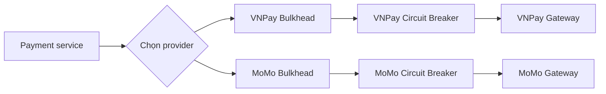
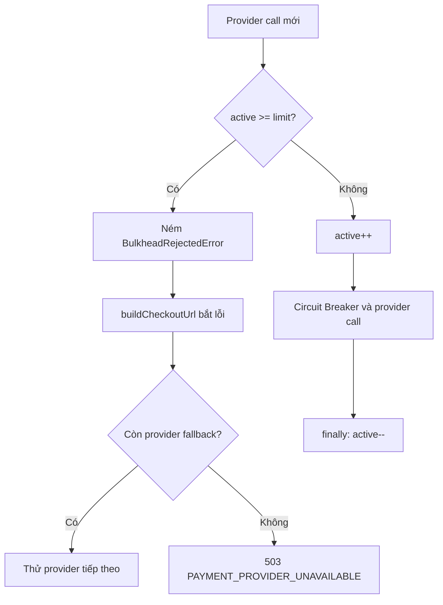
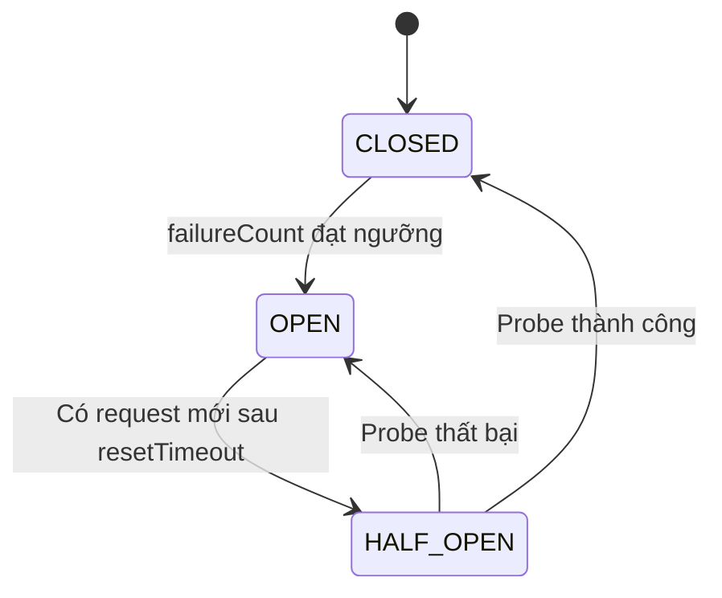
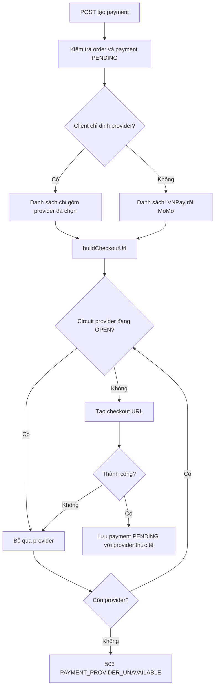

# Báo cáo triển khai Bulkhead và Circuit Breaker của module Payments

## 1. Phạm vi kiểm tra

Báo cáo này mô tả code hiện tại trong `ticket-box-app/apps/api-server/src/modules/payments/`, đồng thời đối chiếu với cấu hình tại `ticket-box-app/config/env.ts` và `.env` hiện tại.

Các điểm tích hợp chính:

- `payment.service.ts`: quyết định provider, fallback và bọc lời gọi provider.
- `bulkhead/payment.bulkhead.ts`: giới hạn số lời gọi đồng thời.
- `circuit-breaker/payment.circuit-breaker.ts`: cô lập provider đang lỗi.
- `gateways/*`: xác định thao tác nào thực sự gọi mạng.
- `payment.health.ts`: công khai trạng thái quan sát được.

## 2. Kiến trúc hiện tại

Mỗi provider `VNPAY` và `MOMO` có một Bulkhead và một Circuit Breaker độc lập. Sự cố của MoMo không trực tiếp chiếm slot hay mở circuit của VNPay và ngược lại.



Thứ tự wrapper trong `callProvider()` là:

```text
bulkhead.execute(() => circuitBreaker.execute(providerCall))
```

Do đó request phải lấy được slot Bulkhead trước, sau đó mới được Circuit Breaker kiểm tra trạng thái.

State của cả hai cơ chế được giữ trong biến của Node.js process, không lưu Redis/DB và không đồng bộ giữa nhiều API instance. Khi process restart, số slot và trạng thái circuit trở về ban đầu.

## 3. Bulkhead

### 3.1. Cơ chế

`PaymentBulkhead` giữ một biến `active` cho từng provider:

1. Khi `active >= limit`, request bị từ chối ngay, không xếp hàng.
2. Nếu còn slot, `active` tăng 1 trước khi chạy provider call.
3. Slot được giữ trong toàn bộ thời gian Promise chạy.
4. Khối `finally` luôn giảm `active`, kể cả khi thành công, timeout hay ném lỗi.

Lỗi quá tải là `BulkheadRejectedError` với:

- HTTP dự kiến: `503`.
- Mã lỗi: `PAYMENT_PROVIDER_UNAVAILABLE`.
- Thông tin nội bộ: provider, số slot đang dùng và giới hạn.

Timeout trong `postJson()` dùng `AbortController`, nhờ đó một request mạng bị treo không giữ slot vô thời hạn.

### 3.2. Cấu hình

| Provider | Biến môi trường | Mặc định trong code | `.env` hiện tại |
|---|---|---:|---:|
| VNPay | `VNPAY_BULKHEAD_LIMIT` | 20 | 20 |
| MoMo | `MOMO_BULKHEAD_LIMIT` | 20 | 20 |

Giới hạn này là trên **mỗi API process**, không phải giới hạn toàn hệ thống. Ví dụ chạy 3 instance với limit 20 có thể tạo tối đa khoảng 60 lời gọi đồng thời đến cùng provider.

### 3.3. Flow khi hết slot



Bulkhead rejection xảy ra trước khi Circuit Breaker chạy, vì vậy việc hết slot không làm tăng `failureCount` của Circuit Breaker.

## 4. Circuit Breaker

### 4.1. State machine

Circuit Breaker có ba trạng thái:



- `CLOSED`: cho phép gọi provider; lỗi hạ tầng liên tiếp làm tăng `failureCount`.
- `OPEN`: fail-fast bằng `CircuitOpenError`, không gọi provider.
- `HALF_OPEN`: chỉ cho đúng một probe chạy tại một thời điểm; request khác bị từ chối.
- Cần 5 probe thành công liên tiếp để trở về `CLOSED` (`halfOpenSuccessThreshold = 5`). Mỗi thời điểm vẫn chỉ có một probe được chạy.

Lỗi circuit mở cũng dùng HTTP `503` và code `PAYMENT_PROVIDER_UNAVAILABLE`.

### 4.2. Lỗi nào được tính vào Circuit Breaker

Được tính là lỗi hạ tầng:

- Timeout/abort.
- Lỗi mạng.
- HTTP upstream 5xx.
- Exception kỹ thuật khác không phải `ProviderBusinessError`.

Không được tính là outage:

- HTTP upstream 4xx, được `postJson()` đổi thành `ProviderBusinessError`.
- Provider trả lời hợp lệ nhưng từ chối nghiệp vụ, ví dụ MoMo trả `resultCode != 0` hoặc không có `payUrl`.
- Webhook hợp lệ báo thanh toán thất bại. Code gọi `recordSuccess()` vì provider vẫn đang phản hồi bình thường.

Khi một lời gọi thành công trong `CLOSED`, `failureCount` được reset về 0. Vì vậy ngưỡng hiện tại là số lỗi **liên tiếp**, không phải tỷ lệ lỗi trong một cửa sổ thời gian.

### 4.3. Cấu hình

| Provider | Failure threshold | Reset timeout mặc định | HALF_OPEN success threshold | `.env` hiện tại |
|---|---:|---:|---:|---:|
| VNPay | 5 | 30 giây | 5 | 5 lỗi, 10 giây, 5 probe thành công |
| MoMo | 5 | 30 giây | 5 | 5 lỗi, 10 giây, 5 probe thành công |

`VNPAY_CB_ERROR_THRESHOLD` và `MOMO_CB_ERROR_THRESHOLD` được đọc trong config nhưng **không được Circuit Breaker hiện tại sử dụng**. Code không triển khai error-rate threshold; chỉ dùng số lỗi liên tiếp.

### 4.4. Flow theo trạng thái

**CLOSED và provider thành công**

1. Bulkhead cấp slot.
2. Circuit cho phép gọi.
3. Provider trả kết quả thành công.
4. `failureCount` về 0.
5. Bulkhead trả slot.

**CLOSED và provider lỗi hạ tầng**

1. Circuit tăng `failureCount` và ghi `lastFailureTime`.
2. Khi đạt `failureThreshold`, state chuyển sang `OPEN`.
3. Lỗi gốc vẫn được ném ra cho `buildCheckoutUrl()` xử lý fallback.

**OPEN, chưa hết cooldown**

1. `buildCheckoutUrl()` gọi `isOpen()` và bỏ qua provider.
2. Nếu caller đi trực tiếp qua `callProvider()`, `execute()` ném `CircuitOpenError`.
3. Provider thật không bị gọi.

**OPEN, đã hết cooldown**

1. `isOpen()` trả `false`, cho phép service thử provider này.
2. Trong `execute()`, state chuyển từ `OPEN` sang `HALF_OPEN`.
3. Một request được chọn làm probe.
4. Mỗi probe thành công tăng `successCount`; đủ 5 lần mới về `CLOSED`. Bất kỳ probe nào lỗi đều mở lại `OPEN` và bắt đầu cooldown mới.
5. Các request khác đến khi probe đang chạy bị `CircuitOpenError`.

## 5. Flow tạo payment và fallback

Endpoint tạo payment:

```text
POST /orders/:order_id/payments
```

Trước lớp resilience, endpoint còn đi qua authentication, role guard, idempotency middleware và request validation. Service cũng kiểm tra order có thể retry và không có payment `PENDING` đang hoạt động.



Quy tắc fallback:

- Client chỉ định `VNPAY` hoặc `MOMO`: không tự động đổi cổng. Nếu lỗi, client nhận 503 và có thể chọn cổng khác rồi gửi lại request.
- Client không chỉ định provider: thử VNPay trước, sau đó MoMo.
- Payment record chỉ được tạo **sau khi** đã lấy được checkout URL. Nếu mọi provider đều lỗi, không tạo payment record mới.

### Khác biệt quan trọng giữa hai gateway

- MoMo `createCheckout()` luôn gọi mạng, nên luôn đi qua Bulkhead và Circuit Breaker.
- VNPay sandbox/production tạo signed redirect URL cục bộ, nên bước tạo checkout không đi qua hai cơ chế này.
- VNPay chỉ đi qua resilience ở bước checkout khi có `VNPAY_MOCK_PREPARE_URL`, vì mock mode gọi `/prepare` qua mạng.
- `queryPaymentStatus()` của cả VNPay và MoMo đều đi qua Bulkhead và Circuit Breaker.

Vì vậy trong production, Circuit Breaker/Bulkhead không bảo vệ thao tác tạo URL VNPay cục bộ; chúng chủ yếu có tác dụng với VNPay QueryDR và các thao tác VNPay thực sự gọi mạng.

## 6. Webhook tác động đến Circuit Breaker

Webhook không đi qua Bulkhead và không gọi `circuitBreaker.execute()`. Sau khi xác minh chữ ký và xử lý payment:

- Webhook thanh toán thành công gọi `recordSuccess()`.
- Webhook hợp lệ nhưng thanh toán thất bại cũng gọi `recordSuccess()` vì đây là kết quả nghiệp vụ, không phải provider outage.
- Chữ ký sai, amount sai hoặc thiếu dữ liệu không được ghi nhận là lỗi hạ tầng của Circuit Breaker.

Lưu ý triển khai: `recordSuccess()` chỉ reset lỗi khi state là `CLOSED`, hoặc hoàn thành probe khi state là `HALF_OPEN`. Nếu circuit đang `OPEN`, một webhook thành công **không đóng circuit ngay**. Circuit vẫn chờ một request sau cooldown để chuyển sang `HALF_OPEN` và probe.

## 7. Health endpoint

Endpoint công khai:

```text
GET /payments/health
```

Response chứa cho từng provider:

- Circuit: `state`, `failureCount`, `lastFailureTime`, `nextRetryAt`.
- Bulkhead: `active`, `limit`, `available`.
- `available`: hiện được tính bằng `state !== 'OPEN'`.

HTTP status:

- `200 ok` nếu ít nhất một provider không ở state `OPEN`.
- `503 degraded` nếu cả hai provider đều ở state `OPEN`.

Một điểm cần hiểu khi quan sát: hết `resetTimeout` không tự đổi state sang `HALF_OPEN`. Việc chuyển state chỉ xảy ra khi có request mới chạy qua `execute()`. Vì vậy health endpoint có thể vẫn hiển thị `OPEN` và `available: false` sau `nextRetryAt`, cho đến khi có một probe thực tế.

## 8. Đánh giá hiện trạng

### Điểm phù hợp

- Cô lập riêng VNPay và MoMo.
- Bulkhead fail-fast, không tạo hàng chờ làm tăng tải và latency.
- Slot luôn được giải phóng bằng `finally` và network call có timeout.
- Circuit chỉ đếm lỗi kỹ thuật; lỗi nghiệp vụ không làm provider bị cô lập sai.
- HALF_OPEN chỉ cho một probe tại một thời điểm và yêu cầu 5 probe thành công liên tiếp, tránh phục hồi ồ ạt.
- Có fallback khi caller không khóa provider.
- Có endpoint health để quan sát state và concurrency.
- Client nhận cùng một contract `503 / PAYMENT_PROVIDER_UNAVAILABLE`, không phụ thuộc lỗi xuất phát từ Bulkhead hay Circuit Breaker.

### Giới hạn và điểm cần lưu ý

1. State chỉ nằm trong memory của từng process; nhiều replica có circuit và concurrency limit độc lập.
2. Restart process làm circuit trở lại `CLOSED`, kể cả provider vẫn đang lỗi.
3. `errorThreshold` đang là cấu hình thừa; không có sliding window hoặc error-rate calculation.
4. Health endpoint không chủ động kích hoạt probe và có thể hiển thị `OPEN` sau khi cooldown đã hết.
5. Health đánh dấu provider available chỉ dựa trên circuit; Bulkhead đang đầy vẫn không làm `available` thành `false`.
6. `recordSuccess()` từ webhook không phục hồi trực tiếp circuit đang `OPEN`.
7. Wrapper Bulkhead nằm ngoài Circuit Breaker: request bị circuit từ chối vẫn lấy rồi trả một slot rất ngắn; ngược lại, khi Bulkhead đầy thì request bị chặn trước và không đi đến circuit.
8. VNPay checkout production là thao tác local, nên không thể dùng flow này để kết luận Circuit Breaker đã bảo vệ mọi tương tác VNPay.
9. Endpoint health hiện là public diagnostic và công khai chi tiết trạng thái resilience; cần cân nhắc phạm vi truy cập trong môi trường production.

## 9. Kết luận

Triển khai hiện tại là mô hình Bulkhead + Circuit Breaker theo từng provider, fail-fast và có fallback ở service. Cơ chế phù hợp để ngăn một cổng thanh toán chậm/lỗi chiếm toàn bộ tài nguyên của process và để chuyển sang cổng còn lại khi client không chỉ định provider.

Contract lỗi bên ngoài đã được chuẩn hóa thành `503 PAYMENT_PROVIDER_UNAVAILABLE`. Tuy nhiên đây là resilience cục bộ theo process, dựa trên lỗi liên tiếp; chưa phải circuit breaker phân tán hoặc theo tỷ lệ lỗi. Khi vận hành nhiều replica, số liệu health và giới hạn concurrency phải được hiểu theo từng instance.
